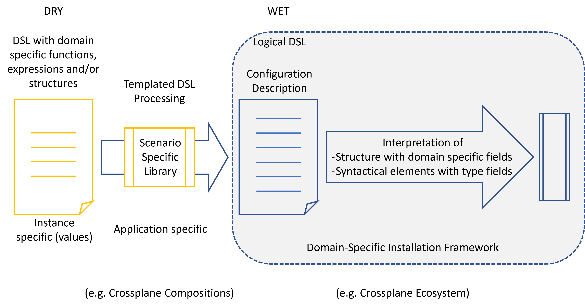
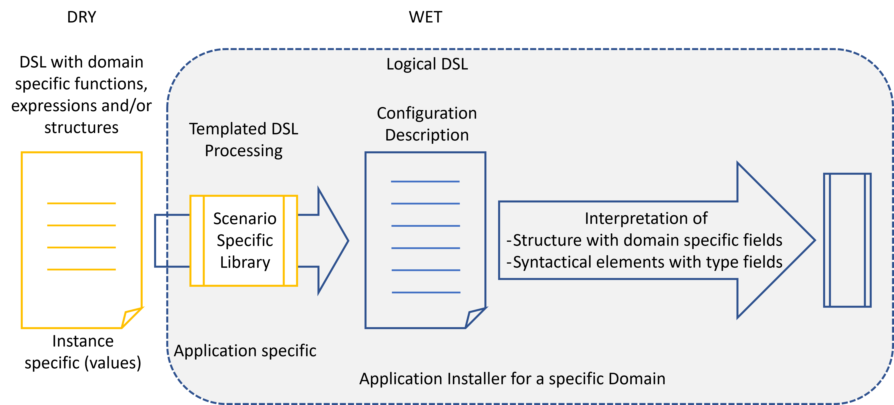

# Configuration and Installation Reconsidered

Any kind of software installation, update or generally lifecycle management
involves a setup and/or update procedure and the parameterization of this
(installation) procedure.
There are plenty of such environments like [*Terraform*](https://www.terraform.io), [*Chef*](https://www.chef.io), [*Ansible*](https://ansible.com),
package managers like [*APT*](https://wiki.ubuntuusers.de/APT), [*Crossplane*](https://www.crossplane.io) or even [*Kubernetes*](https://kubernetes.io) (we will see later why
this appears in this list).
Configuration is used to adapt the installation process to the needs of
particular applications or application installations.

There are several approaches to simplify the description used to control the
installation process and simplify the creation of installers at all,
from templating used to apply patterns or rules to avoid
duplicate information to complete general or product specific DSLs used to
express complex configuration descriptions closer to the problem domain than
simple value structures. Those DSLs can be generalized by frameworks
to shift the installer development from a general purpose language to 
the composition of DSL elements.

In the following we will describe how configurations could look like and how it
interacts with or relates to different concepts for installation procedures.
And we argue that the optimization of configurations and configuration DSLs
does not solve the problem with complex installations. Instead, the crucial element
is the abstraction level between the configuration elements focusing on
the problem domain and the finally maintained elements and the target environment.

### The Problem

Basically the installation problem decomposes into two similar problems, the
initial setup of a 
product or application and its update. These parts look very similar, especially
because typically an attempt is made to describe solutions for both problem flavor
in a uniform manner. But there is a large
difference in complexity. Setting up a new installation is relatively simple compared 
with an update to a newer version. During the setup no existing state of an
installation has to be considered, which just required to describe and finally create
the required implementation element in a target environment. In contrast to this, an 
update in its general form has to handle the migration of an existing implementation
structure towards a potentially different one arising from revised or evolved
design decisions. This not only could require the migration of data structures but also
to preserce abstract state distributed over multiple implementation elements.

The term *installation* will be used in the following as a synonym for both *setup* and 
*update*. If required, the term update will explicitly be used.

### General Layout

All installation approaches finally follow the same general layout.
There is an installation or update code in some general purpose programming
language whose task is to provide or update a dedicated installation of some
particular product or component in a target environment. For this it uses an
API provided by the target environment to manage elements offered this
environment. The procedure is product specific. To apply to constraints
for a particular installation instance it consumes some installation
configuration, which is used to specify information used to concretize
variation points supported by the installation procedure valid for this
particular installation instance.

This configuration is typically always data centric, it does not contain 
code used to define the installation process.

Optionally the installation procedure may keep some state about the actual
installation state, which is used to complete configuration data when
updating or deleting an existing installation.

Let's consider the configuration description, first.

### Configurations Reconsidered

In the most simple case configuration is described by some general possibly structured
data definition format, like [YAML](https://yaml.org), [JSON](https://www.json.org), [XML](https://www.w3.org/TR/xml) or [INI](/https://docs.fileformat.com/system/ini).
The installation code looks for dedicated fields in the configuration to assign 
a particular meaning. This could be single fields or complete structures whose meaning
is identified by some kind of special type field or its path in the document structure.

By this interpretation by the installer code even simple data formats are used to
effectively describe a DSL, a logical DSL simply defined by structure and type fields.
This shows that it is not necessarily required to define DSL with an own syntax to
describe configuration tailored for a particular problem domain.

Formats for purely defining structures values, like JSON typically lack the feature 
of supporting values derived from other settings or rules for common value layouts.
At this point in time templating engines enter the scene, they are used to close this gap.
Here, often standardized tools like [Go-templates](https://pkg.go.dev/text/template), [ytt](https://carvel.dev/ytt), [cue](https://cuelang.org) or [spiff++](https://github.com/mandelsoft/spiff), but keep the input
(and the parsing) for the installation procedure simple.

Templates typically support expressions to solve the problem of derived values, but
they can also be used to introduce explicitly named and parameterized elements, which
can act as syntactical elements in the finally maintained description. It provides
the possibility to offer formal DSLs on top of simple structured value formats.

This is achieved by providing libraries usable for every particular installation
parameterization. It can either be provided by the installer itself to support generic 
application definitions or as part of the installed product.

In the first case the result is some kind of installer framework generally usable
for an intended application domain, whose basic installation capabilities are defined
by the installer coding.

An example for such an environment can be [Crossplane](https://www.crossplane.io)
(providing an extensible core framework) and compositions used to describe dedicated
application scenarios. Another example is [Terraform](https://www.terraform.io), which
provides core installation features used to create
installation descriptions by orchestrating those basic elements to describe a particular
implementation scenario.

The second case will provide a framework, which is used to
provide an application specific installer in some application domain with a simplified
configuration for such an application instance.

Here the library implemented with some kind of intermediate DSL is used
to describe the DSL available for the configuration values maintained by a product operator.
The *intermediate* DSL used to express the library might again be an explicit DSL used
to combine the operator configuration and the product specific settings to finally feed 
the installation procedure. The concrete installation procedure is formulated in the 
DSL of the installer framework, not in a general purpose programming language. The 
final product installer is the combination of the original installer (framework) and
its product specific configuration or better instrumentation. It is some cascading
scenario for creating installers.

The next step is to integrate the DSL parsing into the installer code.
Following the first scenario from above, the result is an integrated
installer framework for dedicated application domain. Examples are
[Terraform](https://www.terraform.io)
with [HCL](https://github.com/hashicorp/hcl) or [KCL](https://www.kcl-lang.io).

All the previous scenarios are always based on some kind of effective 
configuration value set evaluable prior to an installation. The effective
input for the installation procedure is a simple value set according to 
the first scenario.

Such integrated DSLs now offer the possibility for a feedback cycle from the
concrete installation process. It is possible to describe a value flow incorporating
results from other installation steps or even inside the parameterization of a
single step as long as a value for an attribute is 
required only after some partial step has been executed to provide the
described effective value.

An example for such a configuration DSL is *Terraform* with *HCL* or even the *Pod* manifest
used by the *Kubernetes* *kubelet* to configure *Pods* with referential field expressions.

With this last scenario we leave the pure configuration description, and we have to have
a closer look at the installation procedure itself.

### Installations Reconsidered

The installer is coding responsible to map a configuration description
to an appropriate set of elements in the target environment for the
concrete installation described by the configuration. The installer itself is
product or application specific, while the configuration describes information
intended for the actual installation instance.

The last scenario in the previous section already shows a dedicated
variant of an installer, which can act to interfere installation steps with provided
configuration. This always requires a dedicated functional interpretation of values
provided by the configuration description (e.g. an expression describing such a
value reference). As such, it is a hybrid concept combining installation
functionality with configuration descriptions.

Orthogonally to this interwoven behaviour between installation ond configuration,
it is possible to distinguish two different flavors:

- A installer can explicitly be called to execute an installation or an installation update.
- It can be an ongoing process aligning changes in the configuration with changes in the target environment. This kind of drift-control is called reconcilation or reconcilation-loop and is well-known from the *Kubernetes* ecosystem.

The next flavors describing an own orthogonal dimension arise when considering
the internal structure of the installer.
The most simple one consists of explicit coding specialized for the intended
installation scenario, including the evaluation of the configuration description.

This is basically a direct implementation of the general layout shown previously.
The typical application of this pattern are ad-hoc installers using scripts to
provide a quick tool to set up something before it is productively used.

In a next iteration an installation framework is used to embed the application
specific installation/update procedure. The framework typically 
covers two functionalities:
- it provides access to the configuration values in a formalized way by evaluating the syntactical elements of the configuration format.
- it controls the execution of the application specific code.
- if multiple installers are involved it handles the dependency management.

Typical applications of this pattern are operating system level packages handled
by a package manager, like [APT](https://wiki.ubuntuusers.de/APT). But also [Kubernetes](https://kubernetes.io) basically follows this pattern, the
configuration description is the resource manifest, the specialized code is the
controller or operator. Kubernetes takes the role of the framework by handling the
configuration description, coordinating the requests to the controller to execute
updates and even to run the controllers.

In many cases this framework is able to
handle multiple specialized installers for different kinds of installation
steps. The configuration description may describe multiple,
now typed, elements according to those types. Every type has assigned
special code, which is responsible to map the described elements of this
type to elements in the target environment.
The data plane/control plane concept of *Kubernetes* is an example for this pattern.

But the most common use-case of this pattern in the domain of installers is to
provide some kind of DSL, which
can be used to describe multiple interdependent installation steps to describe the
installation of an application. The installer for a particular application is
developed with the DSL provided by the framework by orchestrating instances of
the predefined installation types. To still offer the possibility to describe particular
installation instances for the described application, the framework again provides
the support for a separated specification of configuration values, which can be
used to parameterize the elements described by the DSL.

Now, the DSL part used to describe the installation elements is used to *implement*
the installer and the installation instance specific  value configuration is used to 
concretize the variation points offered by the application installer. 
The final installer consists of a dedicated product specific DSL orchestration and
the application independent generic installer framework. It is some kind
of cascaded application of the initial installer layout. The idea behind this
concept is to simplify and standardize the development of installers.

The price is
to decompose the installation problem into low-level fine granular elements
offered by the (extensible) installation framework. A typical example for such an
environment is *Terraform* with *HCL* as configuration DSL or even *Crossplane*
enriched by extensions for various kinds of target
environments offering the management for the elements provided by those environments
(e.g. IaaS layers offering elements like VMs, networks, VPCs or volumes).

This approach has typically four constraints for the design of the DSL:
- to be as flexible as possible for describing installations and to avoid the
  creation of own general purpose code, the elements
  offered on the DSL level are as close as possible to the elements of the target
  environment.
- therefore the extensible installer code provides a fixed one to one, or 1:n (where n is very small) mapping to elements of the target environment.
- the framework must also handle the deletion of elements if it disappears from the concrete DSL manifestation.
- to provide higher level abstractions, elements like compositions or modules are supported,
  offering an own parameterization.

Unfortunately, this has the consequence, that the installer at the DSL
level looses the control over the coordination of element creation and
deletion. And it looses the possibility to handle
migrations which could avoid loss of information
(e.g. deleting a database and creating a new one is never
a good idea, if the database contains data).

For the setup part of an installation this is not really a problem, because
it typically only requires some basic
ordering and value dependencies among the created implementation elements.
But it will cause problems for update procedures, because migrations have to
be considered.

This becomes even more evident, if the framework keeps state about the
mapping of described elements, which is bound to or identified by
the structuring of those elements in the DSL. A structural migration and
therefore the evolution of the installation or implementation (of the application)
structure ss hardly possible.

A typical sign here can be seen for *Terraform*: it is highly recommended
to carefully examine the output of the plan statement, before really
applying a change.

All approaches to circumvent those problems are typically
- highly specialized for particular problem flavors
- require the embedding of general purpose code combined with complex synchronization mechanism to connect it with the implicit handling by the framework.

All this makes it very complicated, confusing and error-prone
to work with such installer DSLs, if it is possible at all.

### Git Ops versus Configuration/Installation

A popular operational model to handle installations is
[*GitOps*](https://www.gitops.tech). You might wonder why
it has not been covered yet as part of the installation process.

The reason is that basically *GitOps* is not part of the technical installation process.
It is a separate process orchestrated around the pure installation process. 
Its task is to handle the process of bringing together configurations stored in
versioning repositories with the execution of the installation steps based on
those configurations, but it does not describe the installation process itself.

So, *GitOps* finally just embeds and wraps a configuration and installation process as
described by the previous sections.

Nevertheless, *GitOps* systems like [Flux](https://fluxcd.io/) or
[ArgoCD](https://argoproj.github.io/cd/) might also enrich such a
process by tooling generating the configurations used, e.g. using [Kustomize](https://kustomize.io/) 
to template and modify *Kubernetes* manifests (as resource configurations) prior to 
handing them over to the execution environment (the *Kubernetes* data plane).

### Conclusion

First of all, we see that DSLs are present everywhere, where configuration is interpreted.
Even with simple data formats it is possible to express rules, commonalities and derived values.
The expressive power comes from the evaluation logic as part of the installation code.
Explicit specialized DSL can be seen as syntactical sugar to improve the readability.

A tiny step forward is the possibility to incorporate reflection of the target environment
into the parameterization of a configuration description.
But a completely new quality only comes with the possibility to describe reactions
on the actual target state compared with the described desired state.
This not only means the evaluation of configuration values derived from installation steps
or the actual target state, but the synchronization of installations
steps and even deciding on
installations steps because of configuration changes or, even more important, because of
changed implementation decisions. This means that the installer might choose
a changed mapping of the installation to elements into the target environment.
This might cause additional actions, like data migrations, which must be synchronized
with the other installation steps.

All this requires code provided by the product or application, but the human operator
still has to use his basic (simple) configuration setting for the particular
installation instance.
Even with the described scenario separating configuration values from configuration element 
settings (as done by *Terraform* or *Crossplane* compositions) using an intermediate DSL, this
kind of coding is required, because the set of mapped elements in the target environment might
completely change after an update. An *intermediate* DSL able to express all those cases is 
typically again a turing complete language, with synchronization, steps and explicit calls
to the API of the target environment.

Because of this, in most cases, it more convenient for an installation developer to implement
everything in the programming language he is used to. The only support by an installation
framework should cover the access to the configuration values and potentially
the execution and configuration of the installation process implementation itself.

So, we are finally
back to the very first picture by reducing the configuration description to the
demands of the semantic of the installation, but never the concrete layout or the concretely 
maintained elements in the target environment. We can see that the flexibility for
designing update procedures can only be increased by also increasing the abstraction
level between  the configuration description and the elements required in the target domain.

The conclusion therefore must be, that the flexibility really required to support
necessary update steps and to decouple them from the
configuration expected from the human operator in the long term can only be achieved
by a very high abstraction between the configuration description and its final
mapping to a composition of elements in the target environment. The description purely
focuses on *what* should be achieved (the intent), but not *how* it could
be achieved (the required implementation elements). Only this can assure, that the 
implementation can freely be chosen by the installer.

When bringing all together, ongoing-drift control, extensibility, abstract
configuration and full control of the implementation mapping, we end up in
a framework, which looks as follows:

It is able to handle multiple, potentially different installations by 
explicit free coding able to execute any manipulation of a target environment.

An example for such a framework can be the [Kubernetes Resource Model](https://github.com/kubernetes/design-proposals-archive/blob/main/architecture/resource-management.md) architecture,
which provides a framework for running operators written in arbitrary general
purpose programming languages extending an extensible data plane hosting arbitrary
abstract resource configurations in a simple configuration format for pure data
and responsible for mapping those configured abstract resources to any
implementation in possibly any target environment.

Because all operators have access to the data plane they can evaluate resource
references as part of their resource manifests to access appropriate manifests
of other (used) resources, which reflect additional information about required 
runtime attributes. Following the reconcilation approach dynamic dataflow can be 
achieved among different kinds of resources.

Because of the nature of those resource declarations only fixed values are
possible in the manifests, so it does not support the DRY approach. But there
is a rich tool ecosystem handling such mechanism at the level of *GitOps*.

This typically supports basic expression and template functionality but no
feedback loop based on expressions. If this is required in special cases the
resource manifest format must be used to implement an appropriate DSL by providing
values recognizable as expressions.
The particular operator then has to implement this DSL. This way any kind of
feedback loop, including the access to attributes of other resource kinds can be
implemented.

