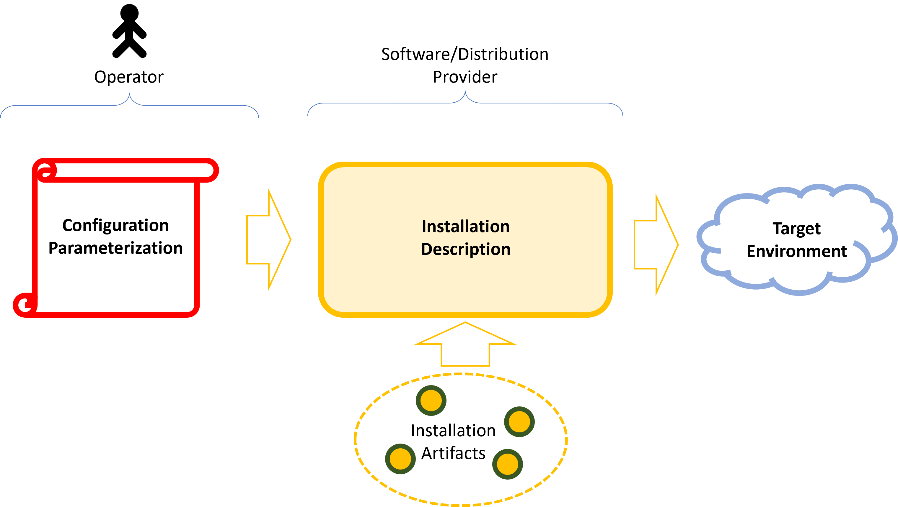
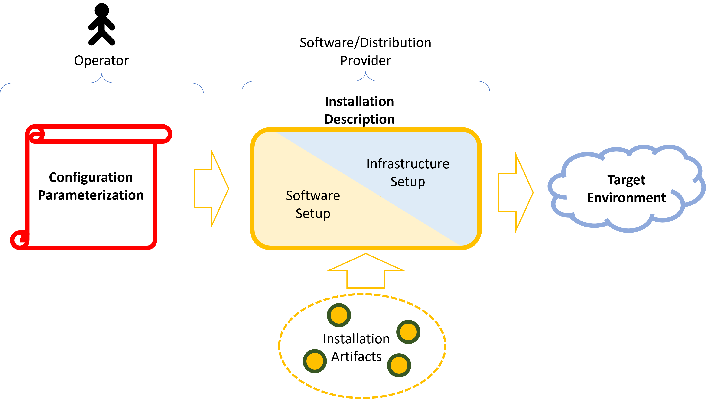
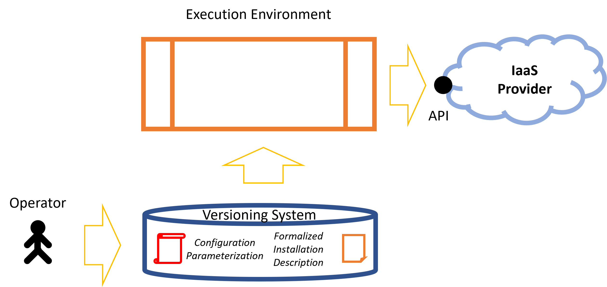
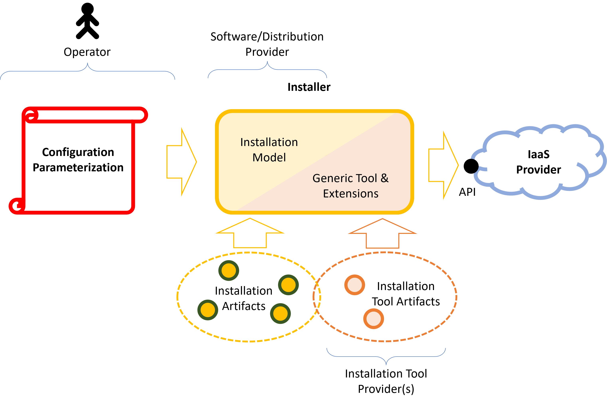
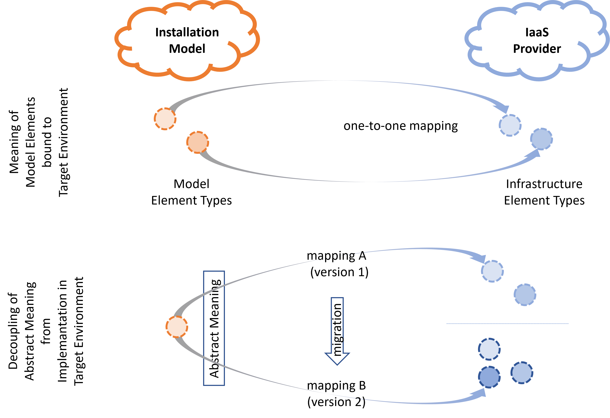
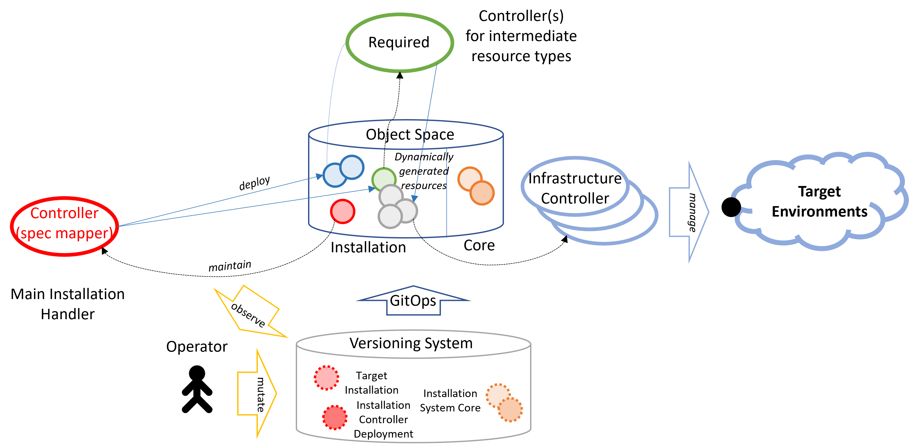

# Infrastructure as Code and Data revisited

After the hype around Infrastructure-as-Code (IaC) in the area of software installation the next hot topic is Infrastructure-as-Data (IaD).
In this paper I will work out what these terms mean and show why most tools pretending to support those paradigms
will eventually fail to keep their promise to solve the installation problem.

Installing software can basically be described by four elements:

- To run applications the application software is required: software artifacts provided by software providers typically with a release channel
  providing a sequence of new versions.
- A set of configuration parameters provided by the operator of a concrete software installation specific to this installation
- An installation procedure provided by the software or distribution provider
- A technical environment, which should be used as target for the installation.

The most simple *installer* is just a description listing the required parameters and steps with their parameterization, which
need to be executed by a human operator to set up a new, or update a given installation of a software product.
For sure, this is clumsy, error-prone and does not scale for a larger number of installation.

Therefore, automation is the mechanism of choice. So, what parts of the description can be automated?
Having a closer look at typical installation procedure descriptions shows that they can be separated into
two basic categories of steps:
1. setting up the technical environment required for the software installation. This means providing the machines, their network connectivity and potentially elements like load balancers to multiplex incoming requests to different instances as part of the software system installation (requiring intricate internal details for the configuration of external elements). 
2. installing the software packages into such a prepared environment.

At least the second step seems to be easily automatable; already since decades installers are used to install
software onto a machine, with standard configurations or with input parameters for the actual installation.

The first category is more difficult to handle.
When dealing with physical hardware, machines, which must be bought and provisioned into a data center
setup, the first part is often a manual process as long as no robots can handle the physical operations.

But with virtualizated environments for data centers (with software defined networking, storage, compute, and everything) even those parts can be handled more and more like software installations. Hyperscalers, but also technical environments for local data centers (e.g. OpenStack) introduced APIs for Infrastructure-as-a-Service (IaaS). 

Sounds simple, now we just can provide software installers as before, but not only handling the software installation
(second part) as before, but also the provisioning of the required technical environment.

The real technical provisioning of the virtualizing infrastructure is not visible anymore and completely decoupled
from the installation of a concrete software system. Basically, such an environment is a separate software system,
whose maintenance can potentially be handled in a similar way, but with more basic configuration and potentially again
with manual steps.

But let's return to our general system installation problem. Is it solved with the availability of APIs for
all the required steps? So, why such a hype around IaD and IaC?

To approach to an answer of this question we have to have a closer look at those paradigms. Let's start with Infrastructure-as-Code.

## Infrastructure-as-Code

A nice introduction to this paradigm can be found at [freecodecamp.org](https://www.freecodecamp.org/news/infrastructure-as-code-basics).
In contrast to its name, it does not necessarily mean using programmatic code to implement the installer. Instead, the basic idea is
to handle installations procedures like regular code, with all the benefits coming with such an approach in combination with automation.
It overcomes manual execution of installations steps and formalizes the description, which can then be executed and especially developed
like the software, which should be installed. This gives you all the benefits of using code to create your infrastructure,
like version control, faster and safer infrastructure deployments across different environments, and having up to date documentation
of your infrastructure.

So, remembering the approach from the introduction, where we figured out, that API-driven infrastructure environments allow implementing
installers for infrastructure setup similar to the well-known installers for software on a machine, it does not really seem to
be something new. The only new element is the mental transfer of the concept of software installation
to the infrastructure setup. As has been shown in many other areas, overcoming metal borders is often a difficult process.
In fact, the effectively new elements are the infrastructure-as-a-service (IaaS) environments, opening the possibility to API driven infrastructure provisioning.
IaC is just a logical consequence. 

The idea to describe installation like code is also the basis for GitOps scenarios, where changes to a system are not directly done via API calls or manual steps, but changing the description stored in a versioning system (the desired state). Combining this with an automated process checking for version changes and then triggering the execution of the installation description provides an auditable, traceable and reproducible way to manage an installation.

But this is not the only aspect of IaC. We have to distinguish between declarative and imperative IaC environments.
Just using the API to write programs for the infrastructure setup is some kind of imperative IaC, regardless whether scripting languages
like shell, python or pearl is used or regular native programming languages are used. But in this are a lot of tool arises, trying to simplify the
development of an installer offering a more declarative approach. Such tools (like terraform or cloud formation (AWS))
abstract from direct usage of the API in a programming language by introducing DSL as declarative abstraction layer. This layer enables to
describe a formal textual model containing elements describing the parameterization of required infrastructure elements, which is then evaluated and executed by the tool.  Additionally, 
the flow of data arising from the creation of elements into the configuration of other elements can be described. For example, a created network has an identity,
which must be passed to the description element fora virtual machine, which should be connected to this network.

Such kind of high-level code if much easier to understand and maintain as code in regular programming languages working on API level, even if appropriate
high level procedures are provided as library. In this sense the `code` now is a parameterized model or blueprint for the desired infrastructure
setup.

Typically, the same way the installation of software can be described, there are such tools not only coverering the setup of infrastructure
but complete software installations including the infrastructure setup and software setup on a machine. May be, a better phrase for the acronym IaC should be
*Installation-as-code*, and then it looks much less magical.

A prominent representative of such a tool is Terraform.
It can easily be extended to support the formal description of any kind of installable/creatable element, and is therefore applicable
to any kind of environment.

As a result, the installer now departs again into two parts, but different ones than before. Instead of distinguishing between
infrastructure and software installation steps, now we have to distinguish between the installation type specific model and the
code for the (extensible) tool. This differentiation also comes with another responsibility.
We now have the operator, the model creator, which is the software or solution vendor, and the installation tool provider.
The real (programming language) code is now independent of a concrete installation scenario.
It must be applicable for a wide range of installation scenarios in order to avoid the development of special code and to achieve the desired simplification for the development of an installer.
To achieve this goal, it just models the technical elements,
which should be maintainable as part of the description model. The potential elements and their mapping to a target environment
are handled in a static manner by the used tool and optional plugins or extensions. The installer *implementation* provided by
the manufacturer of the software system is then restricted to the orchestration of such predefined element types.

The price for this abstraction is lack of flexibility, because
only supported elements can be used. Additionally, those tools use the wiring information to generate an ordered sequence of
operations required to bring the describe model into life. This limits, or even prohibits the possibility to control the operation flow.

This perfectly fits for initial setup scenarios, but as we will see later this will cause severe problems for upgrade procedures.

But let's first come back to our IaC and IaD paradigms. Those formal models mostly already look more like data than code. So, what the hack
should be the difference to IaD?

## Infrastructure-as-Data

In contrast to IaC, IaD is a much more fluffy term. You will find many more or less (more less) explanations for this term.
The described core features range from declarative infrastructure definition, over reconciliation and control-loop, if the term is used in the context of Kubernetes,
over higher abstraction to the more abstract idea of decoupling specification of description elements from their implementation.

If ChaGPT is asked, you probably get some answer like this:

- IaC (Infrastructure as Code)\
  Definition: Infrastructure as Code is the practice of managing and provisioning computing infrastructure through machine-readable configuration files rather than manual processes or interactive configuration tools.\
  Focus: Automating infrastructure provisioning (e.g., servers, networks, databases).\
  Tools: Terraform, AWS CloudFormation, Ansible, Pulumi, Chef, etc.\
  Benefits: Version-controlled infrastructure, reproducibility and consistency, easier collaboration and testing
- IaD (Infrastructure as Data)\
  Definition: Infrastructure as Data is a newer concept where infrastructure configurations are treated as data models rather than imperative scripts or static files. It emphasizes declarative, data-driven approaches for infrastructure management and enables smarter automation through interpretation of structured data.\
  Focus: Using structured data (like JSON, YAML, or even domain-specific schemas) to describe infrastructure intent, which systems then interpret.\
  Tools/Concepts: Still emerging—can include tools like Crossplane, Kratix, and systems built on Kubernetes CRDs (Custom Resource Definitions).
  Benefits: Higher abstraction over infrastructure, supports policy-based and intent-driven automation, enables infrastructure governance and control planes
- Key Differences

  | Aspect      | IaC                        | IaD                                  |
  |-------------|----------------------------|--------------------------------------|
  | Paradigm    | Code to manage infra       | Data to describe infra intent        |
  | Abstraction | Low-level (e.g., scripts)  | High-level (declarative, modeled)    |
  | Execution   | Typically run imperatively | Often interpreted by a control plane |
  | Examples    | Terraform, Ansible         | Crossplane, Kratix                   |

This definition is quite non-distinctive, especially when considering the examples. Terraform is often used as representative for
IaC and Crossplane for IaD. But when having a closer look at those tools the differences are nearly vanishing. Both are declarative,
they declare what should be achieved, not how (or when).
Also, the abstraction level is basically identical. The base elements describe one-to-one elements in the managed infrastructure (like VMs),
both with minor improvements by combining tightly coupled elements like security groups and rules for those groups. Both provide some
cascading for predefined blueprints, modules in terraform and compositions in Crossplane. So, this kind of abstraction cannot be the
crucial differentiating aspect.
So, what is the difference? Even if considering the reconcilation aspect (Terraform is seen as imperative (explicitly executed), while
Crossplane is using Kubernetes- and controller-based drift-control). We can see, that repetitive calls to terraform does
exactly the same, it determines the difference between the described desired state and the actual state in the infrastructure and
calculates the required operations to align both states. This is drift-control. And the usage of a control plane as mentioned by ChatGPT
is an implementation aspect offered by Kubernetes as implementation platform. Is it a required feature of IaD?

IMHO, the central point here is the abstraction, but with a different focus as implied above. It has been formulated for example by
[Kjetil Valle](https://blogg.bekk.no/infrastructure-as-data-768b806e45bb): Abstraction in the sense of strictly decoupling the
meaning of the specification from its implementation. The crucial term here is *implementation*. What does it mean?
At first glance, this could be the implementation of the mapping of the parameterization/specification to the element(s) in the
infrastructure. This sounds obvious, but is typically achieved by all tools and both paradigms. Therefore, it is not the relevant
factor in our problem domain. What do we want to achieve? We want to map a desired behaviour given by the specification to elements in the target environment.
Accordingly, *implementation* of a specification should mean the orchestration of the resulting elements in the target infrastructure,
not the process of doing so. The specification describes the intent, what should semantically be achieved, and its implementation
are the elements and their wiring in the target environment. Hereby, it should not foresee or directly describe the implementation elements. 
For example, instead of describing a security group (AWS) and specific rules,
the specification just declares what should be able to access a service on a machine. This abstraction level allows to choose completely different 
infrastructure setups for different kinds of infrastructures.

This provides a new perspective for the interpretation of the term abstraction and high-level in the scope of installations. The crucial
point here is, that higher abstraction should mean, that the specification is not tightly coupled to a specific and fixed layout
of elements in the target environment. And in this sense all the hyped tools eventually fail to keep their promise. Why?

The supported resource types are typically based on the technical elements in the target environment, to be generic enough to cover all
kinds of installation scenarios.
Because the available describable elements are related to the elements in the target environment, the orchestrator still has to
think in elements of the underlying infrastructure. This set may be extensible, but there is still a fixed mapping of those elements
used as low-level building blocks for the complete installation process. One might argue that Crossplane supports more dynamic
mappings here by offering compositions, which might be based on different implementations for different target environments working
on the same specification. But this polymorphism eventually always ends up with a fixed blueprint for an orchestration of
lower-level elements. (By the way, even with terraform, modules have a parameterization interface and the implementation could
be adapted to different scenarios just by fading in other module instances, but I admit, that this is not directly supported on the
model level of terraform).

The advantage of this kind of decoupling is to keep the freedom for the mapping process to revise the mapping from version to version
to support upgrades. But this means the need for migration support, which 
is not possible with most of those tools.

What all this hype overlooks is the fact that our first scetch for the layout of an installation process already perfectly
depicts this form of abstraction. Regardless, what tools and processes we look at, there is always a high-level
parameterization specific for the concrete system installation scenario at the beginning. This specification typically never describes
implementation elements, but features and attributes for the system to be installed. This is already a specification completely
decoupled from the implementation of the system in the target environment. In this sense all those installers already follow the IaD
approach.

So, problem solved? Just implement an installer based on the APIs provided by the infrastructure management environment,
probably based on drift-control . Yes, but it is not this simple.
The reason for all those paradigms and tools is just to try to simplify the development of such installers and to avoid the need to write low-level
programmatic code at all, or at least as far as possible. But the way, this is done provides severe problems, which would not
arise with the initial approach. Therefore, we require a paradigm that takes both aspects into account, abstraction and simplicity.

## Common Problems with those approaches

This lack of abstraction or the way it is handled is the common root cause for most of the problems arising with those existing tools, regardless whether they pretend to be IaC or IaD tools,
because of the eventually always fixed blueprint-based mapping of the specification to a set elements in the target environment, either directly or by instantiating a potentially cascaded set
of blueprints (with again a fixed set of nested elements). Everything works fine for static implementation structures in the target environment,
for the initial installation setup or even minor version upgrades, which preserve this
basic layout of the implementation (in the sense of target elements). But they fail or at least run into ugly workarounds, if structural
changes are required. Handling structural changes of a blueprint typically
required coordinated operations, which do more than creating, updating or deleting of an element in the target environment.

## Towards an Installation System

When discussing or examining tools in the area of IaC and IaD, the focus typically lies on technical details, what can be expressed, and how, the syntax or expressiveness of the used DSL, maintenance operations for
such specification documents,
and how the description is mapped to an implementation in the target environment, instead of focusing on the involved elements and the responsibilities
for different parts of the system. Between all the details we lose sight of the original problem.

Instead of loosing ourselves in comparing tools, we should answer completely different questions arising from our initial problem: how should an
installation environment work to resiliently provide and maintain system environments, keeping them consistent and reliably execute updates in
an as far as possible automated manner.

The most relevant questions to answer to judge on the value provided by an installation system should be:
- What is the relation between the elements described by the system admin and the elements on the infrastructure side and how is this gap bridged?
- Who is responsible (maintenance/development) for those parts of the installation system?
- What are the involved installation description levels and how are the organized?
- How specialized is the description provided for those levels for the system intended to be installed, and how are they created?
- What observation possibilities exist, and how can change be tracked.
- And last but may be most important, how can structural updates be handled?

Let's evaluate those questions and see what would be required. Tools like Terraform support modularization, which offers the possibility to split and distribute the responsibility for parts
of the complete installation mapping (remember it is still a static mapping). The developer of an installation for a particular system layout
can use higher level elements provided by other manufactures to base its installation on higher level elements instead of using only core
elements of the used tool (and potential extensions). The same is true for tools like Crossplane. So one important feature required is the ability to fall back to pre-maintained
building blocks. The guiding principle here is divide-and-conquer, or sitting on the shoulders of giants.

The second question is tightly coupled with the first one. The cascaded approach must allow to distribute the responsibility (for their development) over many providers. And it must be simple and automatable to bring them together.
So, the used sub-elements and their implementation are software components, like the components intended to run the system and they must be deliverable and installable together with your software.
This basically means, that the installation process must be capable to also install parts of its own toolset. The dependencies of those part must be locally handled, they should be some-how self-contained. Installing an extension must also install the required extensions. Here, terraform uses its own runtime and the used modules are described by the
installation model and are automatically downloaded when the model is evaluated. Crossplane uses the extensibility feature of a Kubernetes cluster to deploy. The installation description is a set of Kubernetes manifests
which are deployed into a Cluster running Crossplane. With specialized resources the system can be extended. Problematic here is the order of those deployments. Resources can only be deployed,
if the appropriate resource definitions are already available. Therefore, a process is required around the deployment of the installation description, which keeps track of such an ordering. Typically, the extension mechanism is used to provide new types of core elements, but they could probably also be used to offer new more high-level building blocks.
Therefore, the next requirement for an installation process is to be able to describe and execute a self-descriptive installation process without the need for further external coordination mechanisms.

This leads to the third question. How are the cascaded levels organized? In plain IaC tools like Terraform, the installation is divided into at least two phases: First the evaluation of the installation description, exploding all nested levels and providing the required extensions. The result is complete and closed description based on the final low-level description elements. This description is then executed in a closed batch. In Crossplane, this is handled fundamentally different. There is no closed description to evaluate. Instead, every element, including the cascaded ones,
are independently (and potentially in parallel) handled. Nested compositions are exploded on demand into the same dataplane used for the initially deployed manifests.

This is a feature provided by the Kubernetes runtime, which will become imported, as we'll see later.

Following the initial installer layout, the top-level element for an installation is given by the specification values for the intended installation. This element should be the only element maintained by the operator of the installation following the decoupling idea from the IaD section. It should an element (and handled) like any other building block of the installation system. A uniform model is helpful to support arbitrary aggregations, even if not forseen by the developer of a building block. The definition of this level is provided by the distribution provider (or directly by the manufacturer). It defines the installation parameters for the top-level element and breaks it down to the next lower level. This could be directly the API of the target environment, but this would mean to concentrate the responsibility in one single hand.
As we have seen, it is highly recommended to offer some kind of modularization to enable distributed responsibility. Those elements should be first class elements like all the other installation descriptions. For the sake of observability, even the lowest level elements, directly describing elements in the target environment, should also be described by first-class installation elements, like the initial specification and modularized cascaded elements. Every level maps elements it is reponsible for to elements of the next level, which might again be mapped accordingly. The recursion base are final low-level elements as provided by the Crossplane ecosystem, which are directly mapped to API calls for the underlying infrastructure elements. A (human or automated) operator is able this way to find a complete digital twin of the involved installation elements as part of the installation description model.

To simplify the complete environment, all those elements, regardless of their levels,  should be first-class installation elements and include information about the element, for which they have been created. This makes it easier for an operator to understand the overall system setup. To offer such a uniform model, the required extensions must be installation elements, also. To avoid the need for an upfront global knowledge about the required extensions, every module, or element and its mapping implementation must be self-contained and be able to provision its own requirements. This kind of separation-of-concern is important to be able
to freely compose modules just according to their specification without knowledge about their implementation. This is urgently required to stick to the decoupling feature requested for the IaD paradigm. 

Basically every level acts formally the same way, it maps its specification elements to implementation elements, this may again be specification elements (of another type) or final API calls in a target environment (core elements).

But this has severe consequences for the overall model. It must be self-reflective. The mapping implementation of every element must be able to maintain any kind of other element in the same installation domain. Not only this, the mapping cannot be just the instantiation of a blueprint describing a parameterized set of other elements, like compositions in Crossplane.
Instead, it must be possible to provide real code, able to examine and modify the set of existing installation elements besides the desired state or the target environment, to consciously coordinate the maintenance of mapped elements, which may be installations elements, again, or API calls to a target environment.

The availability of elements of all cascading levels and their mapped elements in a uniform element space provides the desired observability. An operator can browse the complete elements down to the core elements acting as digital twins of infrastructure elements. Execution-based tools like Terraform just provide this information as part of the execution log or provide explicit command to determine this flat list with their dependencies 
on demand. Because Crossplane used a Kubernetes dataplane the complete set of decomposed set is always available in form of Kubernetes resources.

But observability is not enough, we also need to be able to track what change at which level has been done and why. 
Because of the highly distributed nature of such a system, this information 
should be available at the every element, which is mapped.
In today's systems this is typically only supported in form of logs provided by the execution of the tool (Terraform-like tools), or the controller (Crossplane-like tools). In Kubernetes-like environments events in the particular resources could also be used, but they are not persistent. 

So what is required is a mechanism which provides this information for every element, and keep it, even if the element has already been deleted.
Based on a root object, the information should be aggregatable and browsable.

Now to the last question, how to handle structural changes. Whoever has ever used terraform should know how difficult the update to a new version could be. There is a *plan* action by reason, which shows
what would be done if the latest description is applied. Because of the pure formal and static element setup and automated delta management, it might happen that the tool decides to delete elements and recreate existing or create new elements. The operator is well advised to carefully examine these cases, to avoid undesired destructions of existing elements with unexpected effects.
For example, to migrate from one database into another, it is not sufficient to create the new one and delete the old one. This step cannot be automated, and even worse, the problem cannot
be circumvented or solved using the tool. Even the provider of the installation description cannot handle this, because there is no hook for such actions provided by the tool.

Structural migrations typically require the coordination of explicit operations, and all the current tooling had the goal to exactly avoid the need for such steps.
Especially such a coordination is not possible for blueprint based installation tools, like Terraform or even Crossplane, but also Helm (for Kubernetes). But it is in particular an intrinsic consequence of the separation between specification and implements (in the target environment),
and in general a requirement for updating existing installations. If this is not supported, the first throw determines the structure for all future versions, which should not be acceptable. Therefore, another crucial requirement for an installation environment is, that every mapping (of a specification) to its implementation (in the sense of generated elements) must potentially be under the full control of specialized coding, similar to our initial installation scetch. This is basically the same requirement we already found as part of the extensibility feature.

Let's summarize: In addition to the basic features already covered by the IaC paradigm the following features are required:
-  Supporting separation-of-concern by offering self-contained module-like elements as installation elements.
-  A uniform descriptive model for all kinds of installation elements, including extensions and modules.
-  An extensible set of installation element types.
-  Observability concerning used installation elements, their status and identities. This especially means, that atomic elements of the target environment should always be modeled as separate installation elements (no API calls for higher-level resource types),
- The system must persistently track mapping decisions and changes on every level
-  Self-reflectiveness, the mapping process of installation elements must be able to maintain other such elements
-  Flow- and drift-control as part of the mapping process.

## A solution

All those requirements arise from the wish for separation-of-concern, which is crucial for simplifying the overall installation setup. A single monolithic installer code would
meet all the technical requirements for installations and updates, but would be quite confusing and difficult to maintain.

Fortunately, there is already a technical environment fulfilling nearly all of those non-installation related requirements: Kubernetes. Although developed for the very special use case of providing a distributed computational runtime, its architecture is well-suited for other application-domains, also:
- It provides an extensible set of declarative resources, which may describe any semantic without any relation to an implementation
- All kinds of resources are equivalent first-class citizens.
- All resources are maintained in a uniform extensible object space (the data plane of a Kubernetes cluster)
- Any resource may be created, modified or deletes at any time during the system lifetime.
- The controller pattern enables full control over the reconciliation process, which implements an on-going drift control between desired state and generated elements.
- The target of a controller may again be the object space hosting the resource (self-reflectiveness) (see [logical controller pattern](../kubeconcept/README.md#logical-controller)))

This way, the Crossplane system, which itself does not fulfill all the requirements for a desired installation system, can be seen as a building block for a more comprehensive
environment.

- The distribution provider offers an own resource type for the installation featuring the required installation parameters in the realm of the intended system and independently of the implementation of the system. This way it can be kept stable, even if the complete system architecture changes, or if the installation should be done in different technical environments.
  Different technical environments can be supported following the *implementation sharding pattern*.
- The controller for this resource has full control over the installation process like in out initial scetch.
- But it can fall back to sub-level installation steps provided by own resources, provided by the software providers or other distribution providers.
- For this purpose it can handle the deployment of those resource types and required controller using Kubernetes, again, in the same dataplane used for the installation with the same kind of resources.
- Examining the complete set of resources in the object space enables the operator to observe a complete picture of the installation elements and their orchestration
- It is even possible to enrich the process by organization-defined upstream resources

What is missing is the necessary tracking feature. This cannot be provided by a GitOps application, because this only tracks changed to the initial top-level element, the installation.
All the other intermediate cascading level are completely handled in the data plane of Kubernetes. And here we don't have such a feature. A Kubernetes based installation system acting this way must therefore provide an own
tracking system, fed by all the controllers working together on installation elements. The resulting architecture should be integrated with Kubernetes,
being able to provide the information at the level of every object, as well as aggregated view on a complete graph of installation elements.

If this is achieved, the result is a fully flexible installation environment, which allows combining decomposition, wherever possible, with the programmatic control over migration processes, where required.
But the price is, that controllers are used for the mapping of specifications to implementations, which in many cases goes beyond the
formal instantiation of a parameterized blueprint for a set of implementation resources. But its modular architecture allows combining specialized complex parts to fall back to probably simpler and more basic resources.
This is a good compromise between the complete freedom but complexity of a pure-programmatic installer and a completely formalized blueprint-like environments like today's Terraforms and Crossplanes.

