# Basic Kubernetes Concepts as Guidance for a general Cloud-Aware Design

*Kubernetes is a prototype for a cloud native environment as well as a new kind of
architecture. Therefore, it is worth a second look to derive guidance
for own cloud aware service/product architectures. Although Kubernetes
is intended to act as distributed runtime for computational workload a
central aspect of its architecture is a new way of API design, the
Kubernetes Resource Model. This kind of API model is basically completely
independent of the functionality it is intended to provide and can be
applied to any other environment.*

## The Kubernetes Resource Model

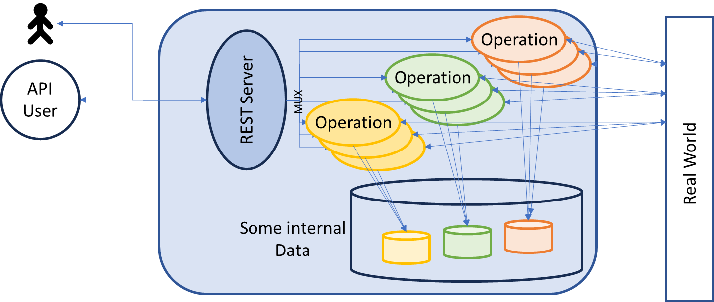

A common design for APIs
provided by servers intended to be consumed remotely over a network is
the REST pattern usable by regular http(s) calls.

The traditional REST server provides REST endpoints for various
functions. It multiplexes the calls to multiple backends implementing
the desired operations. Those operations typically use some storage to
maintain their internal state and finally modify an external
environment, here called *real-world*, to reflect the intended action.

In this typical design the service bundles the REST API endpoints with
the functionality behind it. This could be a useful design for services
with a closed functionality, but it requires new software versions if new
endpoints have to be added. In many cases the endpoints are
operation-centric, but there are also designs, where operations are used
to maintain the internal state, only, which is often object centric.

Kubernetes has made popular a completely different approach for designing
REST-based API, the *Kubernetes Resource Model* (KRM). It
completely separates the functionality behind the API from the API
management handled by a REST server.

Instead of handling payload operations the Kubernetes REST server
restricts itself to operations required to manage textual resource
documents representing the state of a software system. The resource
documents are basically digital twins of intended elements in the
real-world and describe the desired state. The REST server, called
*API-Server*, does not know anything about the meaning of those managed documents. It just manages
typed resources. Additionally, it contains functionality required to
provide a permission system used to control the access to those
resources by callers of the REST API. But related elements are also
described by resource documents. This way it just focuses on the infrastructure and functionality required to maintain types documents.
It just manages an *object space* for hosting resource documents, called the *data plane* of a Kubernetes cluster.

The implementation of the functionality is moved from the backend of the
REST server to the frontend-side. It is implemented as regular
application, called *controller*, using the REST API like normal users of the functionality.
Basically, there is no difference anymore between an API user and the
implementation of the functionality. The task of those controllers is to align the desired
state it gets from the object state described by the documents managed by the API server with the
actual state in the real-world. This process is called drift-control or
reconciliation. The resource document describes the desired state
provided by its maintainer or owner and some status information provided by its
controller used to reflect additional external state found for this
digital twin. This way the resource document can really be seen as a
digital reproduction of some element of the real-world. Applications
can examine and manipulate the real-world object by reading or writing
the resource document without direct access to the real world.

In this design the API user never triggers dedicated operations like in typical REST scenarios;, he just
declares the desired state. The necessary operations are determined by
the resource implementation by comparing the desired state from the resource document with the
actual state in the real-world. This process works in both directions.
Changes to both the desired state and the actual state may trigger
operations executed by the resource implementation. It basically
consists of a reconciliation loop triggered by state changes in the
object space as well as in the real-world. The required operations are automatically derived from the observed delta.

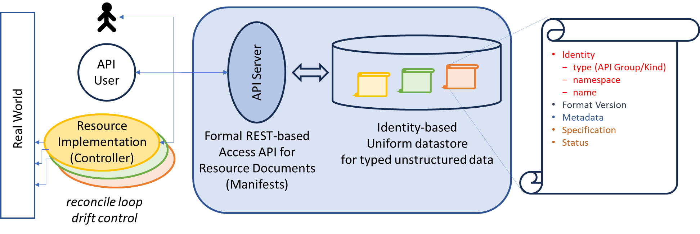

The complete architecture of Kubernetes is based on such a central API
machinery that just controls the handling of typed resource documents,
called manifests, describing the desired target state of dedicated kinds
of objects in a declarative manner. This includes access control,
validation, automated modifications and streaming of object versions.
This way it acts as the heart of a Kubernetes system. This basic concept
divides the Kubernetes API into two layers:

1.  First, there is a technical access API, the API server providing a
    REST API for manipulating object manifests. But this is not the
    Kubernetes API really controlling the behavior of a cluster.

2.  Second, there is the functional API controlling the behavior of the
    Kubernetes cluster. It consists of a predefined set of resource
    types, like *Pods*, *Nodes*, *Services* or *Deployments*. The
    instances of such types then describe the target state of the
    complete system.

Using only the API machinery nothing really happens. To really get
something done a second type of component is required to complete the
architecture: the *controllers*. A controller is an active entity
(process) that has a responsibility for a dedicated set of objects or
object types. It scans the object store using the REST API for instances
matching its responsibility and compares the desired target state with
the real-world state, for example the existence of a container set for a
*pod* on a dedicated *node*. Its task is to assure that the real-world
state matches the desired state and to do everything required to achieve this. The real-world environment is the *work-plane* of a controller.

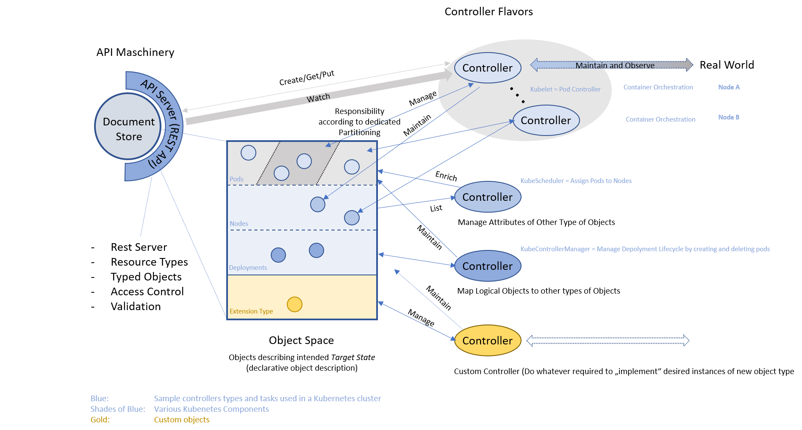

Responsibility here may mean very different things. It could mean
responsibility for all objects of a dedicated kind or a subset of those
objects, according to their attribute set. For example, a *kubelet*
(running on a *node*) is a controller responsible for *pods*, but only
those pods intended to be running on the dedicated *node* the kubelet is
running on. 

Kubernetes comes with a predefined set of such resource
types and the appropriate controllers intended to offer a distributed
environment for computational workload. All those controllers work together to provide an execution environment for computational workload. The summary of all involved technical environments build the execution environment for containers and is often also just called work plane.

But Kubernetes additionally comes with an extension concept. It provides the
possibility to extend the set of available resources types. This is a pure API concept supported by the API machinery and it not technically related to the cluster. Adding
controllers working with objects of such types could then add any
desired new functionality for the cluster or even for any environment
outside a cluster. For example, the Gardener project introduces a
cluster type to manage complete Kubernetes clusters. Any kind of
environment, infrastructure, configuration or service could be offered
in such a declarative manner by applying the controller concept.

This kind of architecture basically optimally fits to the needs of
self-healing cloud-aware environments. Even more, not only the basic
architecture can be re-used for other environments. Because this heart,
the API machinery, offers the usage of arbitrary types, it can be used
completely without a Kubernetes cluster just by ignoring the built-in
types and using it only with own types and controllers. This way it
could even act as heart not only for a Kubernetes cluster, but for all
other kinds of environments intended to manage technical elements, also.

The API concept as such can be considered separately from the
functionality provided by a Kubernetes system to be applicable for any
kind of managing software system. There is indeed a project, KCP, which
just provides the API machinery known from Kubernetes, but without all
the Kubernetes-related resource types not related to the sole management
of the object space.

## Classification of Controller Types

A controller could do more things than just manipulating some external
API, it could also modify objects of any type in the object space again
by modifying their manifests just by using the generic REST API without
knowing anything about the implementing controller. This can be done
according to the availability and attributes of other objects or even
kinds of objects. For example, the Kubernetes *scheduler* looks for
desired *pods* without an assigned *node* and finds a *node* meeting the
requirements of the pod looking at the available *nodes* by reading
their manifests. If found, it assigns the node by adding a reference to
the *node* object to the *pod* manifest which implicitly triggers the
*kubelet* to instantiate the *pod* on the desired *node*.

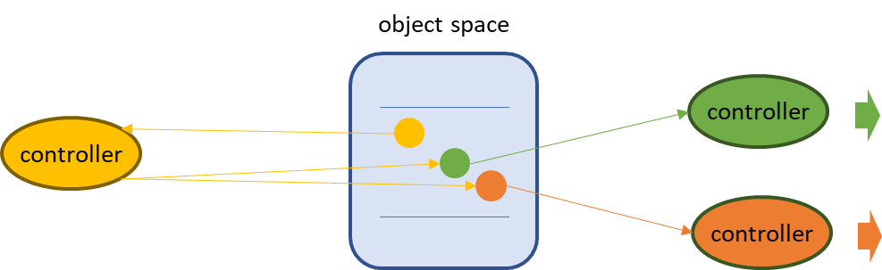

The complete architecture
based on this controller concept is highly recursive and allows to
"implement" abstract kinds of objects by falling back to already
available primitives or other lower-level elements. There might even be
controllers not managing real world objects, but orchestrating complete
object meshes of any other kinds according to the needs of particular objects
of a kind it is responsible for. It implements its objects solely by
maintain a set of other objects. For example, a *deployment* controller
orchestrates *replicasets* and rolling version updates for a dedicated
deployment description, which again are finally mapped to *pod* objects.
This again triggers controllers responsible for those objects to do what
has to be done to achieve the desired target state. This way the
implementation of objects may be cascaded in any depths.

Those maintained objects may be located in the same object space used to host
the managed objects, but also in other object spaces. This way the API
model itself can be cascaded over multiple environments. Both kinds of
cascading are orthogonal and can be combined in any combination.

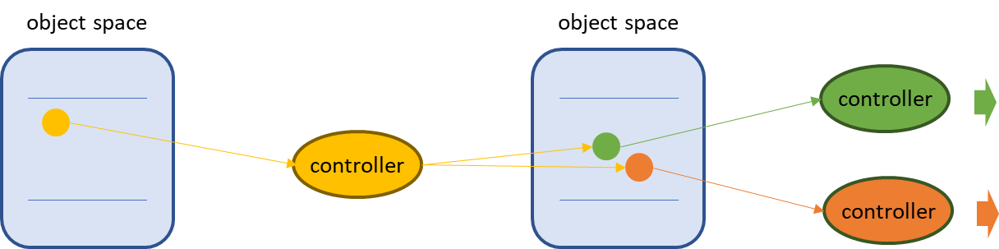

Besides these kinds of cascading, it is possible to distinguish among
several behavioral types of controllers:

- *Resource Controller*

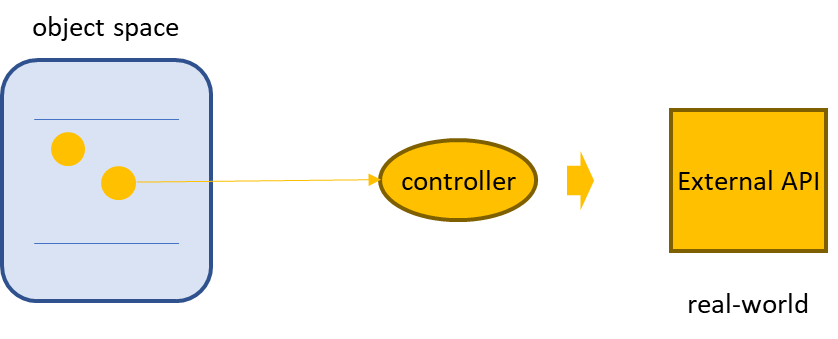

A resource controller is
responsible for a resource and implements it by using some external API

- *Aspect Controller*

An aspect controller manages an aspect of another resource, this might
be any set of attributes in the specification or status of a resource.
Or it can also be some external element additionally required for the
implementation of a resource. For example, the kube-scheduler assigns a
node to a pod, which is not yet assigned to a node, or a cloud-controller
manages an external load-balancer if requested by a Kubernetes service
resource.

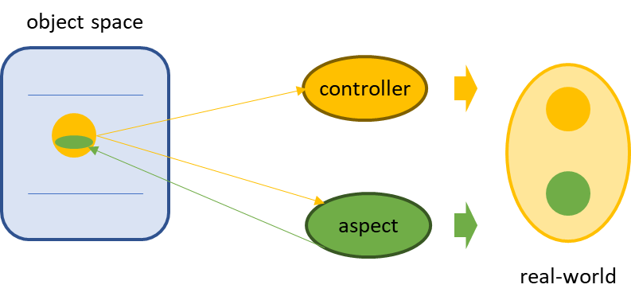

- *Logical Controller*

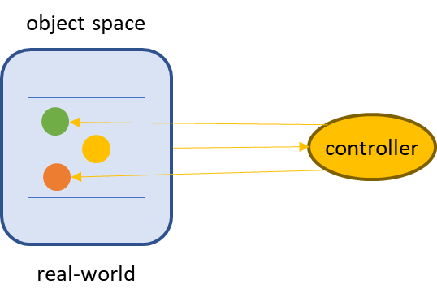

A logical controller
implements its functionality by maintaining other resource objects. The
real-world is again the object space.

- *Sharded Controller*

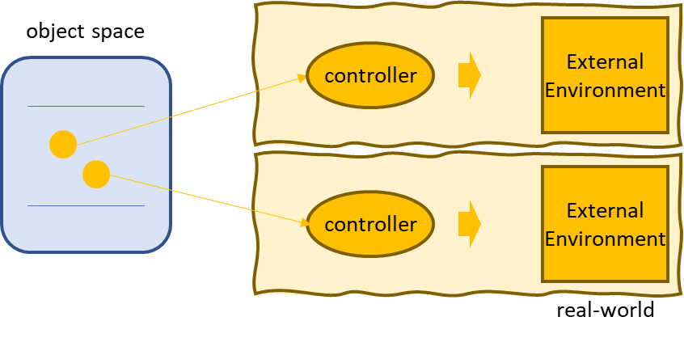

For a typical resource there is a single instance of its controller
responsible for handling the implementation of all instances of a resource type. This is required to avoid
inter-process synchronization to coordinate the processing of a single 
resource among different controller instances. But if the resource itself
provides some responsibility realm as part of its specification there
may be one controller instance responsible for a particular value in
this realm. For example, a Kubernetes Pod is assigned to a dedicated
node and for every node a kubelet is running exclusively working on pods
for this node. Because of the unique sharding criterion no external
synchronization is required. This pattern typically involves the
controller instance to run on different runtimes, often related to its
responsibility realm. For example, the kubelet runs directly on the node
it is responsible for. Or the Gardener project uses a *gardenlet*
running on various *seed* clusters used to run the control and data
plane of managed Kubernetes clusters.

This sub pattern will be called *environment sharding*. All instances of the controller are typically of the same type. A second scenario
appears, if the same kind of resource can be implemented in different ways
, for example for different kinds of technical environments. The various flavors are handled by different controllers. This will be called *implementation sharding*. Here, different instances typically have different types (or better, they use different implementations).

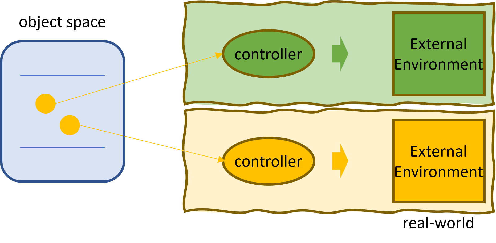

For both scenarios the resource must 
provide information used to control the sharding. In addition to the resource type this information is used by the involved controllers to uniquely decide whether they are responsible for a particular resource or not.

This classification or those patterns are not exclusive. For example, a
Logical controller may be a resource controller or an aspect controller.
If a logical controller acts on a remote environment, which can be
replicated, it can also be a sharded controller, with one particular
instance per remote environment. If those environments may be of different technical types, for example different IaaS layers, environment sharding may be combined with environment sharding.

## Wrapping Legacy APIs

To migrate from a traditional REST API to a KRM-based API does not
necessarily mean to rewrite an application. Any legacy API can just be
wrapped by the Kubernetes API model by placing an API server in front of
the legacy API, providing appropriate resource types and the matching
controllers, which map the resource object changes to API calls of the
legacy API.

This is basically what all the Kubernetes controllers do, when they work
with the APIs of IaaS environments like AWS or Openstack to implement
elements required to implement the distributed runtime. The only
difference is the organization of the API server. In Kubernetes all
those resources and controllers work with the same object space. In the
wrapping scenario, there is a dedicated API server for the backend.

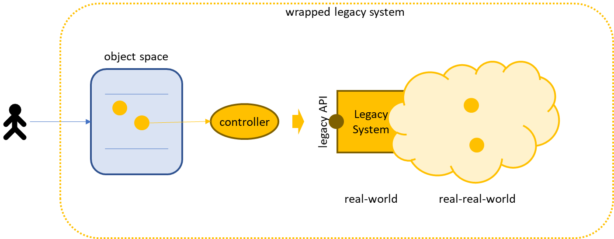

But there are also hybrid solutions like Crossplane. Crossplane provides
an extensible framework for providing resources and controllers for any
kind of external API in one central object space. It can then be used to
access all the connected APIs from one environment. Crossplane comes
with a wide and increasing range of already supported external systems.
