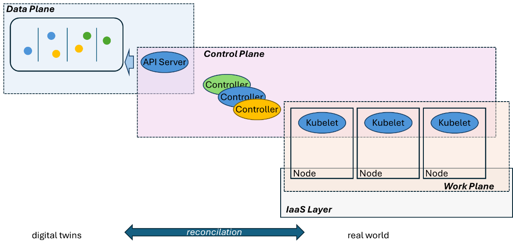
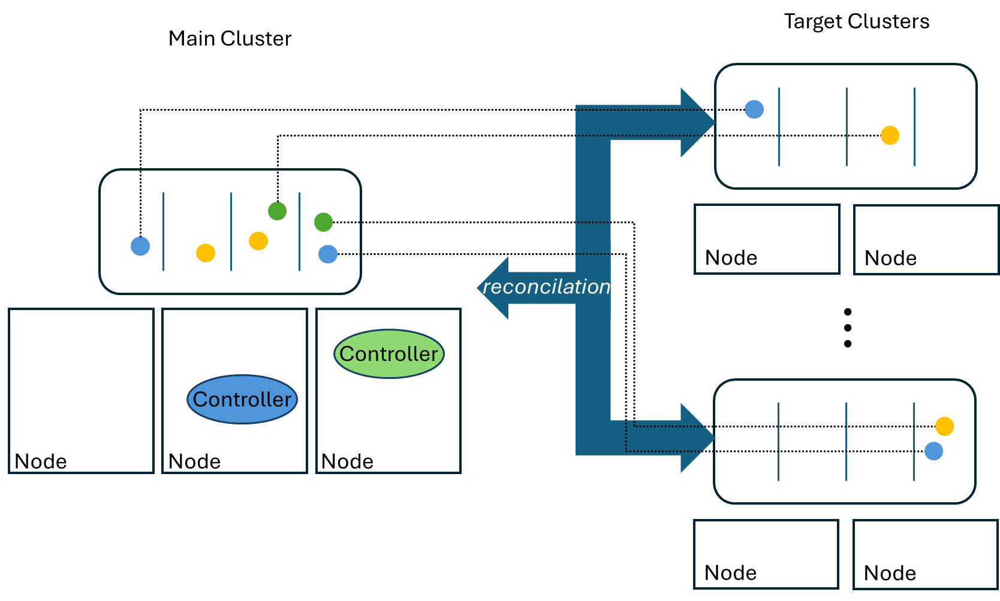
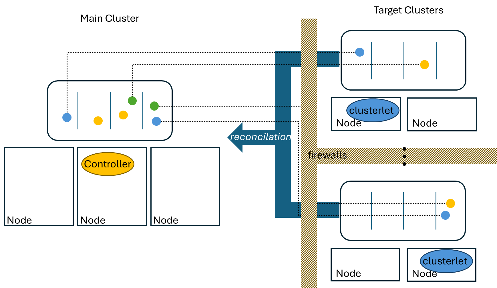
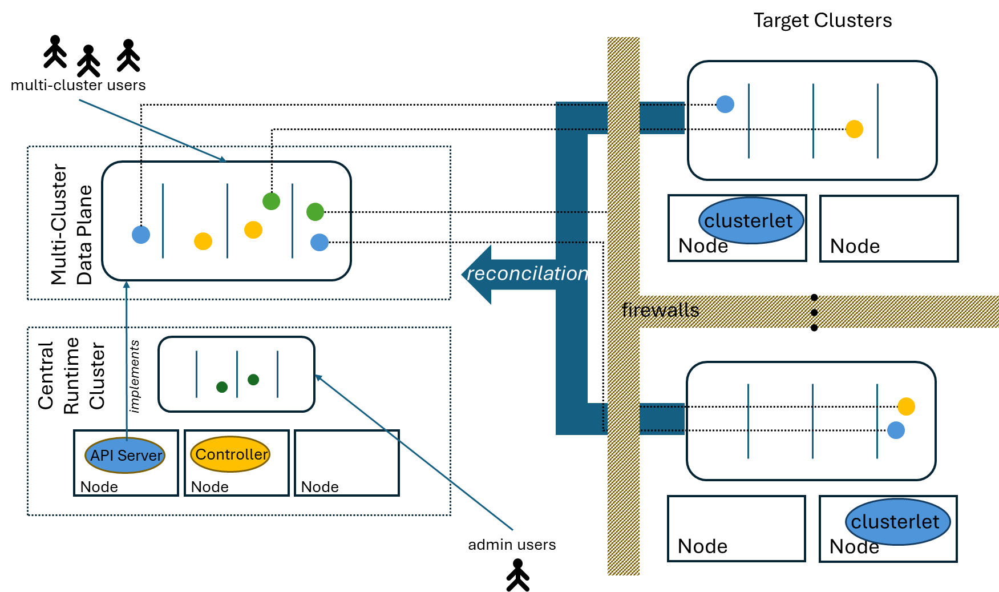
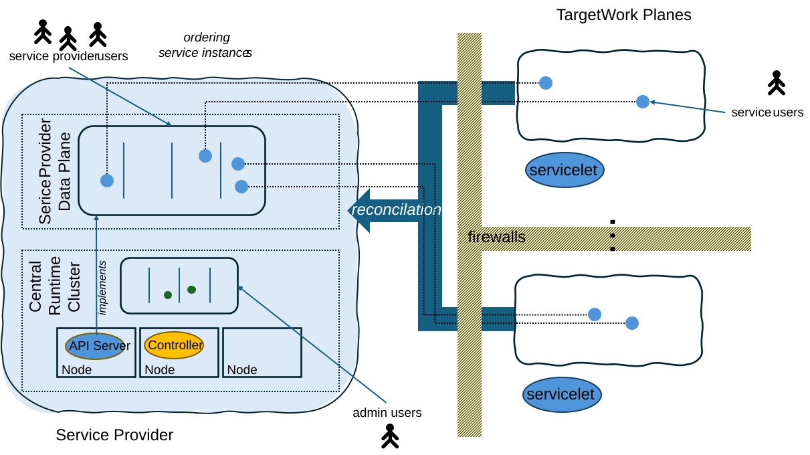
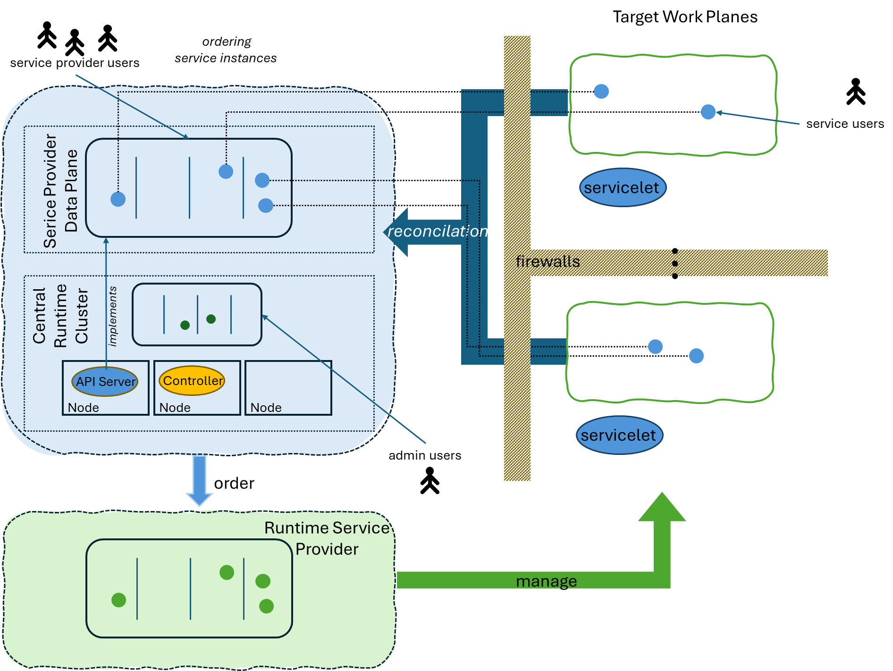

*This paper describes the basic traditional approach to for Kubernetes
based multi-cluster solutions and works out some major draw backs of
this approach. Following basic Kubernetes patterns, it shows how these
draw backs can be avoided and generalized the resulting design principle
to be applicable for a wide range runtime scenario not only restricted
to Kubernetes.*

# The Kubernetes Planes

The main purpose of a
Kubernetes cluster is to provide a distributed runtime for computational
workload represented as pod. To do this it uses a unique architecture
based on a new operating model called Kubernetes Resource Model (KRM).
It is based on a declarative digital twin model for its API describing
the desired state of intended elements as textual resource documents in
the cluster instead of supporting an operation-based API. The required
operations are determined automatically by so-called controllers, which
read the desired state of the resources they are responsible for and
compare it with the actual state found in the real-world environment
used to implement the described elements. Their task then is to align
the actual state with the desired state. This process is called
reconciliation. It works on both directions, also changes in the real
world might be corrected if they violate the desired state.

Therefore, the architecture of Kubernetes is organized in three planes:

- The *data plane*: It is implemented by an API Server whose task is
  solely to implement a REST API usable to manage the textual resource
  documents used to describe the digital twins. It is completely content
  agnostic. It does not now anything about the meaning of the typed
  resources, besides some resource types used to organize the data plane
  itself, like custom resource definitions, namespaces or resources
  intended for access control of other resources.

- The *control plane*: It describes the active part of a Kubernetes
  System, the controllers, responsible to implement the functionality
  behind the resource types used in a Kubernetes data plane.

- The *work plane*: The task of a Kubernetes cluster is to run
  computational workload. The work plane therefore consists of the
  environment able to provide the nodes of the Kubernetes cluster, which
  are typically implemented as VMs or bare metal machines, finally used
  to execute the workload defined in the data plane.

> The active components of a Kubernetes Cluster, the controllers, are
> also requiring a runtime. In typical Kubernetes setups they are
> running on the nodes comprising the cluster. Kubernetes provides
> dedicated mechanisms for bootstrapping this self-recursive structure.
> But most of the controllers even don’t need to run on the nodes of the
> cluster itself, they may run somewhere else and need only access to
> the data plane and the work plane they are acting on.
>
> Dedicated controllers, like the Kubelet has to run on the Node it is
> responsible for. Kubelets play a special role in a Kubernetes cluster.
> They have a sharded responsibility, all kubelets together share the
> responsibility for the Pod resources found in the data plane, but each
> kubelet is only responsible for the pods assigned to the node they are
> running on. Their task is to implement the runtime elements (the Pods)
> assigned to their node in form of containers. This pattern will be
> relevant later in this paper.
>
> Another important aspect is the resource/controller design. Kubernetes
> come with a set of predefined controllers used to manage the typical
> Kubernetes resources and workload (like Deployment /ReplicatSet or
> DaemonSet). But the data plane is not limited to work with those
> resources, the API model is flexible enough to be dynamically
> extendable by introducing other resources by dedicated resources of
> type CustomResourceDefinitions. This can be used to enrich a
> Kubernetes system by more resource types and controllers working with
> work planes different from the Kubernetes’ one. This can also be used
> to control a set of Kubernetes clusters from a central one.

# Traditional Multi-Cluster Approach

Although the Kubernetes cluster itself is already a scalable execution
environment for computational workload (by adding more nodes to a
cluster), there are several reasons why it can be useful to distribute
the workload over multiple Kubernetes clusters:

- The number of nodes of a single cluster is limited

- To be efficient the nodes of a cluster should run on the same
  infrastructure, but it might me necessary to distribute workload over
  multiple infrastructures or regions.

- A better isolation of workload is required for different scenarios
  (for example for different webhooks)

The usual approach towards such a solution is to provide a central
cluster used to define the workload for any number of remote clusters,
the payload clusters. It is also used to run the controllers required to
manage the workload on the remote clusters. Hereby, the work plane for
those controllers is the set of remote clusters, or better the data
planes of those clusters.

This design typically works fine by has several draw backs:

- Backup/Restore  
  If you want to make a backup of your workload you have to make a
  backup of the data plane of the main cluster. This backup is basically
  a backup of a complete Kubernetes cluster. This means that it is
  tightly coupled to the runtime of the cluster. It also contains all
  cluster related resource documents. If The cluster is lost for some
  reason, you cannot just create a new cluster and restore the backup,
  because it will clash with the resources describing the new cluster.
  The only elements you would really require for this is the payload
  information for the multi-cluster, not all the resources bound to your
  runtime aspect of the main cluster, but both is bundled within the
  same backup data.

- *The users maintaining their workload for the payload clusters have
  access to your control cluster for the multi-cluster, especially to
  its runtime.*

If the main cluster is not intended as runtime usable for payload users
it must be secured somehow for those users not being able to maintain
workload on the main cluster.

- *Controllers have to keep connections to all the remote clusters*

- *Credentials for all execution clusters required centrally*

Because the controllers managing the remote workload must be able to
access the remote cluster\`s data planes and they are running on the
main one, the required credentials must be available on the main
cluster. This might result in security problems, because breaking into
this cluster would potentially expose the access to the complete set of
remote clusters.

- *Access to all execution clusters required from main cluster*

Because the controllers are running on the main cluster there must be a
network connectivity to all remote clusters. Because of the previous
problem, this might be a security risk, the remote clusters cannot live
behind a firewall.

# Reversing the Access Direction

There are several things we can learn from the Kubernetes architecture
to improve the situation. First of all, there is the kubelet design of a
Kubernetes cluster.

Kubelets are controllers with a sharded responsibility. They are
responsible to bring computational workload into life on a dedicated
node. To be able to do this, they have to run directly on the node they
are intended to manage. This way they have direct access to the node’s
operating system and can spawn containers using the local container
runtime interface (CRI).

The same architecture can be
chosen for the controllers managing the remote clusters. Instead of
using a single controller running in the central cluster, there are
dedicated controllers running on each remote cluster (similar to the
daemon sets in Kubernetes) accessing the central data plane to lookup
their digital twins they are responsible for.

To simplify the design, we bundle all the controllers required to manage
payload into one controller manager, which will be called *clusterlet*,
similar to the name kubelet.

The clusterlets announce their payload cluster at the central data plane
with separate resources, like kubelets register their nodes via Node
resources. Once announced the payload resource may refer to its intended
cluster by establishing a resource reference to one of those cluster
objects.

This has several advantages:

- They can use in-cluster authentication to access their cluster data
  plane, no credentials are required on the central one. Their
  permissions on the central one can be limited to the elements they
  have to access to do their local tasks.

- The complete remote clusters can live behind a firewall, because no
  access from the outside is required. The access direction is always
  inside-out and never outside-in.

- The central cluster therefore never has access to the remote ones.

# Separating the Multi-Cluster Data Plane

If all the controllers required to implement the multi-cluster are moved
to the payload clusters, there is no need anymore for a computational
workload on the side of the central cluster. The only element required
is the data plane. It is used by the end users to maintain their payload
and by the clusterlets running on the payload clusters to retrieve their
work packages.

So, only the API server is
required, potentially without all the resource definitions required for
the Kubernetes cluster scenario. There is such a project, called KCP,
for providing clusterless pure data planes providing the extension
mechanisms to add any kind of new resource types, like the ones required
for the users to define their payload on the remote clusters. But even
without such tools like KCP, it is possible to just establish a
node-less Kubenetes Cluster without all those controllers.

Even if there are still controllers required on the central side
handling global aspects of the payload resources, like schedulers
assigning payload objects to remote clusters with sufficient resources,
it makes sense to separate the multi-cluster data plane from the runtime
cluster used to run those controllers. Controller may run on any
runtime, not necessarily on the same Kubernetes cluster they are working
with.

As runtime an own Kubernetes cluster can be used, which runs the
multi-cluster data plane (aka API Server and etcd) and potentially
required other central controllers.

This cluster does not need to be accessed by users of the multi-cluster
but only by administrators. Therefore, end users never get access to it.
They only access the multi-cluster data plane, which is completely
isolated from the runtime cluster.

As another consequence of this design the multi-cluster data plane now
only contains the payload resources and is not bound anymore to the
runtime cluster. Backups can be created for the multi-cluster payload,
only.

If the runtime cluster is lost, just a new one can be created, the data
store of the multi-cluster data plane is restored from its backup and
everything continues to work as before, even if there is a completely
new runtime cluster.

If payload clusters can be created on-demand, also, like nodes for a
Kubernetes cluster, payload for those clusters can also be dynamically
recreated like pods for deployments. A payload scheduler will then
discover a new payload cluster and assign the payload accordingly.
Payload clusters can be handled as cattle (instead of pets) like nodes
for Kubernetes clusters. This way a completely dynamic, resilient and
scalable infrastructure can be established, where everything, even whole
payload clusters can vanish, fail or being replaced without disturbing
the payload if they are implemented accordingly.

# Other Scenarios

The design pattern worked out in the previous two sections is not only
applicable for multi-clusters intended for Kubernetes. It can as well be
used for all kinds of runtimes used by computational workload as for
more specialized workloads managed in any kind of infrastructure.

One such scenario is a
service provider. The task of a service provider is to manage service
instances of dedicated kinds, for example databases or even whole
application modules.

Like in the general multi-cluster scenario users order their resources
via digital twins in the service provider data plane. The work planes
for implementing the service instances (the concrete database) may be
Kubernetes clusters (similar to the multi-cluster scenario), but
potentially any other technical environment, which might even exist as
multiple technical environments. Each such environment, for example
installations on dedicated regions, run a *servicelet* (similar to the
kubelet or clusterlet) managing the service instances in the environment
it is responsible for, reading their work packages from the central data
plane.

If there is second service
provider capable to provide the required work planes, for example again
Kubernetes clusters similar to the multi-cluster scenario, any service
provider using such a runtime provider may spread itself over all
technical environments (for example IaaS providers or their regions)
supported by this runtime provider. The result is a resilient and
scalable architecture managed by a single point of administration, the
central service provider data plane.

Like controllers and their managed resources can be cascaded in a data
plane, service providers and their data planes can be cascaded in a
service provider mesh.

This design pattern will therefore be the central design pattern for
managed service providers defined in the Apeiro Reference Architecture.
