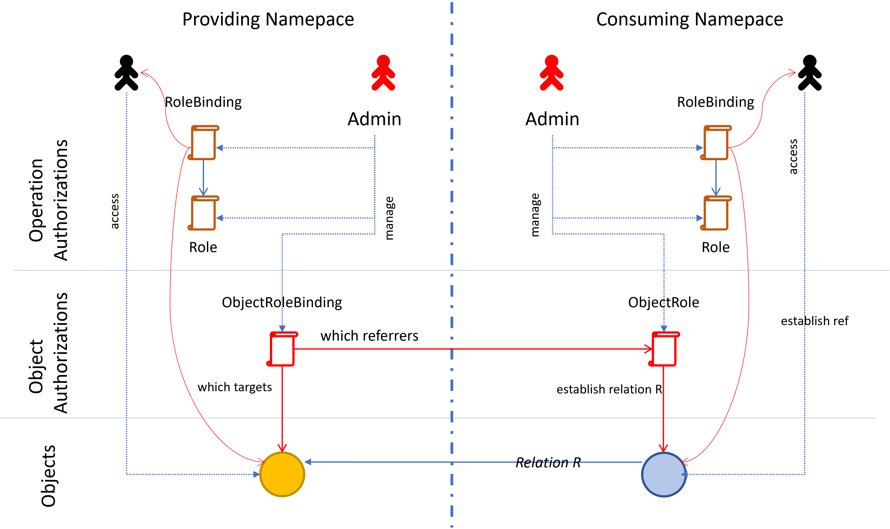

# Authorizing Object Relations in Kubernetes

Kubernetes comes with powerful mechanisms for authorizing actors like users, tools, applications or controllers to execute operations on resources on its data plane as well as for validating changes of resources done by those actors.
But despite all these mechanisms, it is not possible to enable or prevent the establishment of relationships between objects in a meaningful and controllable way. In the next sections we will see what this concretely means, why it is required, what is possible today and how the problem could be solved.

## Object Relations

An important concept in Kubernetes is the possibility to establish relations between two objects. This is typically done by preparing the manifest structure of a resource type to include referential information to another object. With its resource type (kind and api group), a namespace and an object name, every object in a Kubernetes data plane has a unique identity over space (not time). The same name could be reused later in time to create a new object after the old one has been deleted.  Additionally, it features an UID, which is also unique over time.
Typically, the named identity is used to describe such referential fields. A typical example is an object acting as a digital twin for a real-world object requiring some credentials to be used.

> In Kubernetes itself, the most prominent example is using a `Secret`, for example, by a `Pod`, which uses container images loaded from an image repository. As this may require credentials, the Pod has a specification field `imagePullSecrets`.

Such a referential field might have several manifestations:
- it must at least describe the name of the used object. This is possible if the resource type is implied by the meaning of the field (for example, the image pull secret reference is always a reference to a `Secret` resource.)
- if objects of different types should be addressable, the type information must be included
- if the object is namespaced and cross-namespace references should be possible, a namespace field must be included. Because of security reasons, references are typically restricted to the local namespace (of the object holding the reference).
- If uniqueness over time is required, an object UID can be used.

Typically, the UID is not used because this would require adapting all using objects if accidentally the referenced resource has been deleted and recreated.

> Kubernetes even provides with `k8s.io/api/core/v1.ObjectReference` a standard type for the layout of a reference specification.

>```yaml
> secretRef:
>    apiVersion: v1       # API version of the referenced Secret
>    kind: Secret         # Kind of the referenced object
>    name: my-secret      # Name of the Secret
>    namespace: default   # Namespace
>    uid: 12345678-90ab-cdef-1234-567890abcdef
>```

So, what we can see, an explicit object relation in the Kubernetes Resource Model (KRM) is typically established by a field in the using resource. It is a tuple *(s,r,t)*, where *s* is the source object, holding the reference, *r* is the *relation type*, the meaning or *purpose* the referenced object should be used for by *s*, and *t* is the *target* object of the relation, the referenced object.

More complex n-ary relations are not used, although an object featuring multiple binary relations could be seen as an n-ary relation *(s,t<sub>1</sub>,...t<sub>n</sub>)*, where the relation type is implied by the position of *t* and the resource type of *s*. So, it is sufficient to deal with binary relations extended by a relation type.

### Why restricting object relations.

A controller responsible for a resource type uses the given referenced object to implement the object in the real work (or its target environment) using the content of the referenced resource or its real world instance, It does not know, and it cannot know whether this should be allowed or not. Therefore, there must be a way to prevent establishing a relation, which should not be possible, which prevents the controller from establishing an appropriate mapping into the real world. THis does not necessarily mean that the referenced object is not accessible, it just means that it must not be used for the implementation of the manged resource.

For example, a secret describes the access to a technical environment, which should not be usable by all objects of a resource type describing a relation to such an environment. The controller must not use this secret, and therefore the managed resource cannot be implemented.

### Isn't it a regular authorization problem?

The first impression is that this could be the task of the
authorization environment used to authorize modification (or creation) operations on objects. Only selected actors (principals in authorization systems or subjects in Kubernetes) should be able to establish particular relations by setting the reference field accordingly. This assumption may be true within a trust domain, but not when objects from multiple trust domains are involved. An object should be usable from a particular sets of other namespaces, but not accessible for users in those namespaces, regardless whether they have admin privileges or not. This does not contradict the usage of operational permissions, because appropriate modifications of the referencing object do not imply access permissions of any kind for the referenced object. But there are problems concerning the responsibility for managing appropriate permissions.

In Kubernetes a namespace is a trust-domain for authorizations on namespaced resources. Let's assume we are mainly talking about such resources and just ignore cluster-scoped objects. One idea of such a trust domain in Kubernetes is that authorizations can be managed by domain-local administrators (principals with the permission to manage authorization objects in that namespace). This is fine, as long as both involved objects, the referenced and the referencing one, live in the same namespace. The admin could explicitly grant permissions for establishing particular relations for selected users, or no user, if the relation should generally not be possible. The only requirement is to have such a fine-grained access control. With *Validating Admission Webhooks*, this would basically be possible even today, but not out-of-the-box.
[Later](#operation-authorization-and-resource-validation-in-kubernetes) we will see what is possible and what not. But our problem is especially not limited to objects in a single namespace.

If we try to solve the general problem with authorizations in a single trust domain, the domain admin would be able to enable the usage of any object in any namespace, because only the referencing object and local authorizations are involved in such permission checks. But this is definitely not intended. We need a separation of responsibility.
The trust domain of the potentially usable object must be the authorization domain for granting the possibility to use objects of this domain by other domains (here namespaces). And the admin of the using domain should be responsible to enable particular actors to establish such a relation, but only if it has been granted by the providing domain. THis is basically some kind of two-way handshake,
both sides must agree to enable establishing a cross-domain relationship.

So, it can be observed that the release of an object to be referencable is not an operational authorization problem, it is more a [value validation](#separation-of-operation-authorization-and-value-validation) problem. And in both involved domains the operation authorization handles who can release on object to be usable, or who can finally configure such a relation for a particular object, but not whether it should be possible at all.

One may be tempted to solve the problem by using permissions to grant appropriate permissions required to establish such relations. But this will lead into a dead end, because:
- the resulting authorizations will become incredibly complicated.
- they are cross-domain, which means that they cannot be managed inside a domain, but by a system administrator.
- and finally, those authorizations are not expressive; they would not express the intention by means of the problem domain.

Because of these problems, often cross-namespace references are not supported by the resource type (or by the controller). If urgently required for a particular kind of resource, a typical solution is to introduce proxy resources working as indirection.
For example, a `SecretRef` resource whose sole task is to reference 
a secret in another namespace. With RBAC the creation or modification is prohibited by namespace users and admins. If a secret should be reusable, the cluster admin has to create such an object in the intended target namespaces. But the price is not only to require the cluster admin to enable the usage by creating such a proxy object, but the controller must be prepared for this, also. They have to support references (in their managed resources) to the direct object type (for example secrets), and the proxy resource type, also. This might be a solution for some special cases, but it is not a practical solution for the general use case.

## Operation Authorization and Resource Validation in Kubernetes

Let's first have a look at the existing mechanism in Kubernetes
and see what can be done with it.

### RBAC

First of all, there is RBAC, which is an acronym for Role-Based-Access-Control. It is solely meant for authorizing operations on objects stored in the Kubernetes data plane or for objectless operations in a cluster. Principals, called *subjects* in Kubernetes, may be users, service accounts as representatives for machine users, applications or controllers, or any actor whose identity can be expressed as string. It is possible to grant permissions for data plane operations like GET, LIST, WATCH, PUT and DELETE on particular resources, whole resource types and or namespaces. Operation targets are described by role objects, which can be bound to subjects by binding objects. To enable namespace local authorization management, there are cluster-wide versions of those resources and namespace-local ones. A cluster admin can grant permissions for managing namespace-local roles and bindings to specific actors by cluster-wide versions. But there is no mechanism to avoid undesired privilege escalation.

This mechanism does not support permissions depending on features of an object, like annotations, labels or fields. There are projects dealing with extensions enabling such possibilities, for example, the [cedar authorizer](https:://github.com/upbound/kubernetes-cedar-authorizer)

Those extensions would enable to restrict the usage of particular references for modifications of an object.

### Validating Admission Webhooks.

Once a modification request is authorized, validating webhooks are used to check whether a requested modification of a resource (including creation and deletion) is valid. Therefore, the hook provides access to the old manifest version together with the requested new one, and the hook implementation can accept or reject the requested change.
It can be used to check for valid field values or the consistency of correlated fields as well as allowed changes (for example, for read-only attributes).

The focus here lies on the validation of the given resource manifest. This is important for non-standard resource types (whose validation is not done by the API server), which can be declared by CRDs (Custom Resource Definitions). Providing such a webhook can be added to provide type-specific checks. As with Kubernetes v1.25, many such checks can already be described by CEL expressions as part of the OpenAPI Schema specification.

> Kubernetes added `x-kubernetes-validations` as an extension to OpenAPI v3.
> ```yaml
>    kind: CustomResourceDefinition
>    metadata:
>      name: widgets.example.com
>    spec:
>      group: example.com
>      names:
>        kind: Widget
>        plural: widgets
>      scope: Namespaced
>      versions:
>      - name: v1
>        served: true
>        storage: true
>        schema:
>          openAPIV3Schema:
>            type: object
>            properties:
>              spec:
>                type: object
>                properties:
>                  size:
>                    type: integer
>                  maxSize:
>                    type: integer
>            x-kubernetes-validations:
>            - rule: "self.size <= self.maxSize"
>              message: "spec.size must not exceed spec.maxSize"
>  ```

But the admission API also provides information about the requesting subject. This way it can not only be used for manifest validation, but it can also reject modifications not allowed for the requesting user. Therefore, validating admission webhooks can de-facto also be used to implement operation authorizations. But because they are only called for modifications, read-authorizations cannot be handled.

This kind of hybrid-functionality is therefore not sufficient to really implement an authorization system based on attribute based conditions, it is basically only valid for value validation, and it [mixes validation with authorizations](#separation-of-operation-authorization-and-value-validation).

Another possibility to gain full control over such an extensive validation is to implement an API group by an extension api server (or aggregated API server) instead of a set of regular controllers. It has full control over the complete resource lifecycle. But this is not an appropriate mechanism to generally handle the restriction of object-to-object relations in a uniform and type-agnostic way. It can typically only cover special scenarios (like the node-authorizer directly part of the API server, which restricts the access possibility of a *kubelet* responsible for a particular `Node` object).

### Validation Admission Policies

As of version v1.30 Kubernetes supports Validation Admission Policies. They were introduced to replace the need for coding for Validation Admission Webhooks by a standardized declarative approach configured via regular resources.

It is based on two new resources `ValidatingAdmissionPolicy` and `ValidatingAdmissionPolicyBinding`, both are cluster-scoped.
A policy declares validation rules on some resource types.

> ```yaml
> apiVersion: admissionregistration.k8s.io/v1
> kind: ValidatingAdmissionPolicy
> metadata:
>   name: require-team-label
> spec:
>   matchConstraints:
>     resourceRules:
>       - apiGroups: [""]
>         apiVersions: ["v1"]
>         operations: ["CREATE","UPDATE"]
>         resources: ["pods"]
>   validations:
>     - expression: "has(object.metadata.labels['team'])"
>       message: "All Pods must have a 'team' label"
> ```

And a binding binds a policy against some objects and/or namespaces.

> ```yaml
> apiVersion: admissionregistration.k8s.io/v1
> kind: ValidatingAdmissionPolicyBinding
> metadata:
>   name: require-team-label-binding
> spec:
>   policyName: require-team-label   # The policy to bind
>   # Apply only in specific namespaces
>   matchResources:
>     namespaceSelector:
>       matchExpressions:
>       - key: environment
>         operator: In
>         values: ["prod", "staging"]
> ```

<a id="vap-excursus"><a/>

Additionally, a parameterization is supported. A policy can declare arbitrary parameters, which will be bound to values by bindings. A policy ´can be reused by different bindings applying different value sets. Hereby, the value may be taken from any kind of resource, found in a specific namespace or in the namespace of the object for which the policy is checked. This can be used to reuse a policy in a context-specific way with context-specific values. The context thereby is given by the combination of binding and parameter resource, which might again be namespace-specific (if no namespace is given). With this, it is possible to influence the policy inside a namespace by namespace-local resources.

At first glance this looks like a possible solution for our cross-namespace usage scenario. It could look like this: A policy checks whether the secret name (describing the reference resource, secret is just an example) is in a list of allowed names.

> ```yaml
> apiVersion: admissionregistration.k8s.io/v1
> kind: ValidatingAdmissionPolicy
> metadata:
>   name: enforce-allowed-secrets-myres
> spec:
>   # Define the type of parameter resource the policy expects
>   paramKind:
>     apiVersion: v1
>     kind: ConfigMap
>   
>   # Target the hypothetical MRES resource
>   matchConstraints:
>     resourceRules:
>     - apiGroups: ["mygroup"] # Adjust for your CRD
>       apiVersions: ["v1"]             
>       operations: ["CREATE", "UPDATE"]
>       resources: ["myres"] 
> 
>   # The concise CEL validation rule
>   validations:
>   - expression: "object.metadata.namespace == 'namespace1' && object.spec.secretRef.name in params.data.ALLOWED_SECRETS.split(',')"
>     message: "The Secret name referenced in MYRES.spec.secretRef must be one of the allowed names defined in the 'allowed-secret-list' ConfigMap."
> ```

And the binding binds the policy to a concrete validation resource containing the allowed names.

> ```yaml
> apiVersion: admissionregistration.k8s.io/v1
> kind: ValidatingAdmissionPolicyBinding
> metadata:
>   name: all-resources-binding
> spec:
>   policyName: enforce-allowed-secrets-myres
>   validationActions: [Deny]
>   
>   # Link to the specific ConfigMap parameter resource
>   paramRef:
>     name: allowed-secret-list
>     
>   matchResources:
>     # 1. Match All Namespaces (using an empty selector)
>     namespaceSelector: {} 
>     
>     # 2. Match All Resources, All Groups, All Operations
>     resourceRules:
>     - apiGroups: ["*"]    # Wildcard for all API Groups (core, apps, networking, your.api.group, etc.)
>       apiVersions: ["*"]  # Wildcard for all API Versions (v1, v1beta1, etc.)
>       operations: ["*"]   # Wildcard for all Operations (CREATE, UPDATE, DELETE, CONNECT)
>       resources: ["*"]    # Wildcard for all Resources (pods, deployments, configmaps, myres, etc.)
> ```

Finally, the namespace provides an appropriate parameter resource (here a `ConfigMap`):
> ```yaml
> apiVersion: v1
> kind: ConfigMap
> metadata:
>   name: allowed-secret-list
>   namespace: namespace2
> data:
>   ALLOWED_SECRETS: "secret1,secret2"
> ```

This way a namespace can enable the usage of secrets from other namespaces by a config map in its own namespace.
But this is not the requirement because it is taken from the domain of the using object. Fortunately, the namespace of a
parameter resource can be fixed to the providing namespace (namespace1).
It then can use a local object to release, for example, a secret to other namespaces by listing the grants.

The policy now checks whether the requested relation is enabled by evaluation the allow-list coming from the providing namespace. The specification now lists all allowed namespaces for a secret.

> ```yaml
> apiVersion: v1
> kind: ConfigMap
> metadata:
>   name: secret-namespace-map
>   namespace: namespace1
> data:
>   # Key is the Secret name, Value is a comma-separated list of allowed Namespaces
>   tls-prod-cert: "namespace2,namespace-prod,namespace-staging"
>   database-credentials: "namespace2,namespace-db-admins"
>   registry-secret: "namespace-build,namespace-ci"
> ```
> 
> 
> ```yaml
> apiVersion: admissionregistration.k8s.io/v1
> kind: ValidatingAdmissionPolicy
> metadata:
>  name: enforce-secret-ref-ns-list
> spec:
>  paramKind:
>   apiVersion: v1
>   kind: ConfigMap
> 
>  matchConstraints:
>   resourceRules:
>    - apiGroups: ["mygroup"]
>      apiVersions: ["v1"]
>      operations: ["CREATE", "UPDATE"]
>      resources: ["myres"]
> 
>  validations:
>   - expression: |
>      // 1. Define variables
>      let referencedSecretNs = object.spec.secretRef.namespace; 
>      let secretName = object.spec.secretRef.name;
>      let paramNs = params.metadata.namespace; // Dynamic namespace of the parameter
>      let currentResourceNs = object.metadata.namespace; // Namespace of the MyRes object
> 
>      // --- Core Pass-Through Logic ---
>      // If the referenced Secret's namespace is NOT equal to the parameter's namespace, 
>      // the policy returns TRUE (PASS / No opinion).
>      referencedSecretNs != paramNs 
>      ? true 
>      : 
>      // If the namespaces ARE equal (policy is active), perform the list validation:
>      (
>        // Condition A: The Secret name must be a key in the ConfigMap (safety check)
>        !has(params.data[secretName])
>        ? false
>        :
>        // Condition B: The current resource's namespace MUST be in the allowed list 
>        //              defined by the Secret's key in the ConfigMap.
>        currentResourceNs in params.data[secretName].split(',')
>      )
> 
>     message: "The Secret reference is invalid. When referencing a Secret in the parameter namespace ('{{params.metadata.namespace}}'), the resource's namespace ('{{object.metadata.namespace}}') must be explicitly listed as allowed for that Secret."
> ```

The binding thereby connects the generic policy with a particular providing namespace.

> ```yaml
> apiVersion: admissionregistration.k8s.io/v1
> kind: ValidatingAdmissionPolicyBinding
> metadata:
>  name: secret-namespace-map-binding
> spec:
>  # Links to the policy definition
>  policyName: enforce-secret-ref-ns-list
>  validationActions: [Deny]
> 
>  # Links to the specific parameter ConfigMap instance
>  paramRef:
>   name: secret-namespace-map
>   namepace: namespace1
> 
>  matchResources:
>   # 1. Match all namespaces (the restriction is handled by CEL)
>   namespaceSelector: {}
> 
>   # 2. Match all resources (or you can restrict to only "myres" here for efficiency)
>   resourceRules:
>    - apiGroups: ["*"]
>      apiVersions: ["*"]
>      operations: ["*"]
>      resources: ["*"]
> ```

This looks great, the providing namespace can explicitly release a secret for dedicated use cases. Maybe, with even more complex rules, taking a value `*` into account or specifying more resource kind for holding secret references. This should be done by a dedicated parameter resource type, which
does not need to encode the allowed combinations in a string.

But unfortunately, it has some fundamental drawbacks:
- The binding must relate to a fixed namespace to take the parameter resource from and to be passed to the policy to bind together a parameter resource and secret ref namespace the policy should be used for.
 Basically, this information is known by the object checked (the namespace of the referenced secret), but a binding neither has access to the checked object nor is there a way back from the policy to the binding.
  Therefore, every providing namespace requires a separate binding, which cannot be established by the namespace itself.
- Because the structure of different resources containing a secret reference is typically different, a separate policy is required for every consuming resource type (holding a resource reference).
- The release information must be in a single parameter resource, because if the binding matches more than one parameter resource, the policy must match always all parameter resources. Therefore, it is not possible to distribute the information about multiple independent resources if we don't want to switch from *allow* to *deny* rules described by the parameter resource. But we require explicit *allow* rules, because namespaces are not known in advance and creating a new namespace should not automatically enable access.

A possible solution would be to introduce a new declarative layer and an appropriate controller, which generates all the required bindings and policies, But this is basically already a new mechanism, which is implemented by reusing an existing mechanism.

It should be obvious that this approach ends up in a proliferation of complex policies and bindings, which all must be centrally declared and do not directly express the original intent anymore. Even with an own declaration layer, the resulting resources must be understandable and analysable by human operators, because they are mixed with explicitly maintained ones.


## Separation of Operation Authorization and Value Validation.

Instead of trying to reuse, extend or adapt existing technical solutions, we should carefully examine the problem space and clearly distinguish between different meanings.

Only because a problem can be (partly) solved by a similar solution implementation, this does not necessarily mean that the same description methodology should be offered for a user.
It could require different attributes to describe a request, or, even more important, different responsibilities could be involved.

On the other side, this also does not necessarily mean that behind the scenes no
common implementation or policy engine may be used, called by different frontends.

So, let's have a closer look at the problem space and today's mechanisms in Kubernetes.

First of all, there are obviously two different tasks:
- *Value Validation*: validate whether fields and field values of an object and their combinations are valid
- *Authorization Validation*: validate whether a requested operation if allowed for the requesting principal and the concerned object.

It is something completely different, whether a particular user is allowed to set a dedicated value combination for a field set or whether this combination is possible at all.

<a id="rgbexample"></a>
For example, a component of an RGB color must be in the range of [0,255], regardless of the permission for a user to set any integer value for an integer field used to implement this attribute. This is a technical constraint implied by the meaning of the field. 

### Value Validation

The sole task of value validation is to avoid the setting of field/value combinations of an object, which is not valid or possible.

But having a closer look, this is not a single task; it can be divided into two different sub-realms. Whether a field/value combination is valid may depend on two different kinds of constraints arising from two different responsibilities:

- *Domain Validation*: The resource type has a particular meaning, which determines the meaning of fields in its resource manifest. And this meaning implies constraints for value and field combinations. In our [RGB example](#rgbexample) this has nothing to do with the context the color should be used, it is completely defined by the meaning behind the element (although it might technically be an integer). Or those constraints might be given by the underlying elements of the real world finally represented by the resource object.
- *Context Validation*: A particular resource object might be used in a concrete context. This context is typically identified by some label, annotation or field setting defined by an application or group of users in a namespace. There may be any number of such contexts per cluster, with different logical constraints. The task here is to be able to limit field/value combinations according to requirements of this usage context. Those limitations are not intrinsic to the resource type. For example, in out RGB example, in a particular context only shades of blue should be valid.

As we can see, both kinds of limitations are subject to different areas of responsibility. While the constraints for the domain validation are arising from the resource type itself and are enforced for every object for every application of this resource type in any cluster (data plane), the context constraints are arising from the usage of particular resources in a particular cluster, namespace or even more finer-grained context.
So, responsible for the first flavor is the provider of a resource type, and for the seconds flavor some principals in a particular cluster. In the first case, all objects are (and must be) affected, in the second only objects that belong to a specific context.

This differentiation must be reflected in the API used to declare such validations.
The first one is usually part of the schema definition of the resource type wherever possible. More dynamic checks, for example, checking value transitions, can be done by more expressive elements. In this area Validating Admission Webhooks and Validating Admission Policies can be used. They are valid cluster-wide and can be centrally configured, for example, together with the controller and CRD deployment. *They are defined by the provider of a resource type.* But they should not check context constraints.

The second kind of constraints must be declarable by principals
responsible for particular usage contexts, typically inside a namespace. *They are provided by users of a resource type.* And here we can easily see that Validating Admission Policies cannot be used because they are cluster-scoped resources. And this although, concerning their expressiveness, they would be able to describe such constraints. They could only be used for this purpose under the constraint of a single cluster-wide context, or, with parameter resources, for homogeneous contexts represented as namespaces.

So, the design of this new mechanism is not applicable for a common use case according semantics of the problem domain, it is just an adaptation of the already existing mechanism of Validating Admission Webhooks. To use it to solve the context problem, you have to leave your trust-domain and require cluster privileges or live with tight constraints.

For sure, those two kinds of constraints have nothing to do with 
the wish to restrict users in a context or trust domain to set specific values or value combinations. For example, only selected users should be able to set a high priority. All technically valid values, including those special ones, are valid in the context, but not all users may be allowed to set those values.
And furthermore, the possible set of values or value combinations applicable in a context is always a subset of the possibilities allowed by the domain validation.

A basic takeaway is that it would be a good practice to use some *Policy* resources only for context-related constraints. And handling of such resources must be authorizable locally to the related namespace. This expresses the local character of such constraints in contrast to constraints intrinsic to a particular resource type. Furthermore, this validation is different from the authorization to do particular changes, although this is also a context-local decision.

Returning to our initial problem with cross-namespace references, we can see the following:
- the resource structure and the domain validation should allow and accept such references because there is no technical constraint against it. Basically, all resources featuring references should structurally allow for cross-namespace references but still restricted by cross-namespace authorizations.
- it can be split into two parts_
  - the possible resource kinds for a reference belong to the domain validation. The Author of a resource type determones what kinds of references are possible.
  - the possible conrete objects are determined by the context validation by a context admin.
- The context validation part cannot completely be solved inside a namespace because one element is missing. The referenced object may belong to a different trust domain or at least usage context, and we need something that authorizes a foreign context to use it, which is described in the context (or namespace) of the referencable object. By the way, this could even be useful inside a single namespace if it hosts multiple usage contexts. But again, the usage of an object must still be released by the owning side with authorizations in its trust domain, not by the consuming one. So even inside a namespace, with regular authorization mechanisms, a principal is required which has cross-context privileges to maintain permissions for contexts.

### Authorization

In the last sections we have seen that value validation is formally a different task than authorization validation.
While value validation is responsible to answer the question,
*what* is valid in a particular context, authorization is responsible to answer the question, *who* may configure/use it.

An authorization system for a multi-trust-domain environment must at least meet some basic requirements:
1. a principal may never grant permissions he does not have to other users.
2. there must be cross-domain permissions, which enable a cross-domain admin to grant permissions to a principal to play the role of an admin for a single trust domain.
3. Trust-domain admin permissions mean that a principal with those permissions can control the access to objects in his trust-domain.
4. a trust-domain admin should never need to know users having permissions in other trust domains nor manage permissions of other trust-domains (despite this has been granted by explicit permissions to do so (multi-domain admins))
5. a trust-domain admin (even not being a multi-domain admin) must be able to control the potential usage of objects located in his trust-domain by other trust domains, without knowing about the permission/user structure in those domains.

Especially the combination of 3 and 5 is important for our usage scenario.
These basic requirements must be reflected in the design of the description layer for managing permissions, because their maintenance must be authorized like the maintenance for all the other objects.

What should be describable for authorizations and how should those descriptions be organized? Let's have a look at the existing mechanisms.

RBAC is able to answer the question, *who* is able to execute a particular operation (*what*) on an object. Here, only the operation type (like GET,PUT,...) and the identity of the concerned object is taken into account. The RBAC system uses `Role`s to describe permissions for objects inside a namespace and appropriate `RoleBinding`s to assign those roles to subjects. Both kinds of resources live in a namespace.  `ClusterRole`s and `ClusterRoleBinding`s are cluster-scoped objects and used to maintain cluster wide permissions
on cluster-scoped or namespaced objects. This structure allows assigning namespace-only permissions to dedicated subjects and therefore meets the above requirements 2-4 (point 1 is not considered here in detail). Point 5 is not covered at all.

To maintain authorizations in finer granularity than referring to namespaces and objects within is not really possible, and is (for now) generally considered a non-goal by Kubernetes Special Interest Group Auth (based on SIG meetings and closed issue requests).

With Validation Admission Webhooks only modifying requests can be handled, but no read, watch or list requests. Basically, they were only intended to be used to handle (domain) value validation, but can technically be used for implementing write authorization models, because the implementation gets access to the subject requesting the operation. They don't have a description layer, they are just specific implementations, requiring the deployment of a particular service (the webhook).

Validating Admission Policies are a dedicated implementation of a Validation Admission Webhook and therefore are subject to the same constraints. Their task is to offer a formal declarative configuration layer with resource objects to describe again, value checks as well as write authorizations. They allow describing modification authorizations based on labels, annotations and fields and their values of modified objects using CEL expressions. But there are several more severe constraints:
- it is not possible to follow relations between objects. For example, you cannot grant permissions for establishing only a reference to a secret with a particular label value.
- in contrast to RBAC roles and bindings, such policies cannot be maintained under the control of a namespace, their maintenance always requires a cluster admin. All description types are cluster-scoped.

This is basically fine for value validation but only for domain validation. Context validation is technically possible but requires cluster-scoped permissions. As the [excursus above](#vap-excursus) has shown, using parameterization allows delegating policy parameter management to namespaces, but it always requires a dedicated preparation on the cross-namespace level. Therefore, the minimal requirements for a description layer are not fulfilled.

Because of those limitations, there are projects trying to
introduce a generic authorization engine like Cedar.
But POCs in this area are always limited by the constraints of admission webhooks, which are typically used to hook into the authorization process. And as we have seen, this mechanism is not generally suitable for solving authorization problems. Following references could be implemented by caching relevant objects, but this would require some formal information about the reference structure.
But this caching would require a global read-access for the complete object space granted to an webhook.
And furthermore, read permissions would still be a problem.

But even under the assumption that attribute-based conditional authorizations (Cedar does support even to follow references) would be available, would it be possible to resolve our referencing object problem?

Here, we have to see that regular authorizations always authorize principals to do something at the time the operation is issued, for example, setting a reference field to a dedicated value. But as we have seen in the previous section,
the problem is primarily not related to the question, *who* may establish a reference,  whether such a reference allowed at all; it's some kind of value validation.

It is not a restriction for operations at a given *point in time* (their execution time), but for the desired state *over time*, even after changed permissions.

### Solving object relation constraints with traditional Authorizations

But even if we would be satisfied with such an authorization solution, we still have the problem with the responsibility. Authorizations
of such kind are either maintained in a namespace for objects in this namespace or by cluster wide settings, which require some cluster-wide permissions. This is definitely not what the problem domain requires.

So, some kind of authorization seems to be missing. Indeed, there are two kinds of authorizations:
- *operational authorizations* control who may execute which operation on a target object.
- *relational authorizations* control which relation between objects is allowed in the context of a data plane, independently of modification permissions.

In general context validation is always limited by the (global) domain validation, which describes 
the overall set of technically (or semantically) possible values. This is also true for relational authorizations.

Relational authorizations could be seen as authorizations where the principal role is fed by an object and the operation is the kind of relation. But this is an implementation point of view. As usual, the problem arises with the responsibilities.

Let's assume we just extend RBAC to allow principal identities describing an object identity and the operation to describe arbitrary relation names. This does not change anything for the
responsibilities for the maintenance of roles and bindings. They are either cluster-wide or namespace-local. This means inside a namespace only roles are observed hosted by this namespace, or better the other way around, roles and bindings may refer only to namespace-local objects. Even if this is weakened and bindings (or even worse, roles) could refer to objects from other namespaces, the providing namespace would lose control over its objects.
And this is exactly what should be avoided in the required scenario. The release of objects to be usable in another namespace must be under the control of the providing namespace, not of the consuming one, and the control over the subjects which may establish such relations must be under the control of the consuming namespace.

So, we need something where the providing context must be able to describe authorization resources authorizing foreign contexts to be able to use a local object (the target side of the relation); and the referencing context (hosting the object with references) must describe in its namespace which using object might be affected and then who may establish such a relation.
This means, sticking to the operational Role and Binding concept, the binding now must describe the (target) object part and the role the consuming (principal) part, their terms subject and resource do not match anymore, because subject should somehow denote who initiates something. And for object relations, this is the using object, because it describes what object it wants to use (not the other way around). The roles are reversed.

Therefore, independently of the chosen underlying implementation,
another declaration layer has to be introduced, which meets the requirements of object relational authorizations.

## Possible solutions

One possible solution idea has already been mentioned before with introducing a new description layer and just generate validating admission policies and bindings. As described, this has several drawbacks, and we should try to find something better.

### Preconditions

As we have seen, using the traditional authorization system, even with the possibility for attribute-based conditions, are not suitable for describing constraints for object relations.
Because of this, the introduction of conditions is not a precondition for the support of relational object authorizations. Those tracks can be followed separately. Once there is an engine able to handle this,
it could very likely also be used later to implement the basic authorization checks for object relations (using objects also as principal).
But this is not required, neither for the description layer nor for the way those checks have to be executed. The description layer can be extended to offer appropriately extended policies, and the check execution does not (need to) know anything about the policy declaration.
For sure, the rule descriptions must be aligned in a final solution covering both parts, but the basic mechanisms should not interfere with each other.
There is another crucial point, which is more important than this alignment. If relations should be validated, it must be possible to identify those relations at the place they are defined, the resource manifest. If we don't want to fall back to the need of describing rules with values of arbitrary and uncorrelated fields with simple data types, we need a more logical relation view in our description layer. The API model must be able to describe the structure of references:
- what fields hold a reference
- how is it specified, and
- what is its purpose (the relation kind). 

Only this way it is possible for the API server to map the logical view, object X uses object Y with purpose R, to field values in a resource manifest.

This is also a problem for the generative approach from above, it would have to be still 
field/value-based.

### Declaration Layer

The declarative resources should be expressive in the problem domain. So, they should denote relations, given by the hosting object and the feature of such an object to declare a relation with a particular purpose to another object, regardless of the formal representation of such a reference in its manifest structure. It should be related to the purpose of the relation in the context of using resource, not its representation in the resource manifest.

To get started simple, we can use the layout of the RBAC resources. But it must reflect the fact that the roles of subject and resource are reversed.

So, instead of `ClusterRole` and `Role`, we have a  `ClusterObjectRole`and `ObjectRole`. But they now describe the referencing objects (formally the principal) and the relation type or purpose of the required relation.

For example:
> ```yaml
> apiVersion: relationalaccesscontrol.k8s.io/v1alpha1
> kind: ObjectRole
> metadata:
>   name: ingress-dns-access
>   namespace: application
> rules:
> - apiGroups:
>   - ""
>   resources:
>   - ingress
>   resourceNames:
>   - *
>   relations:
>   - use
> ```

They are managed in the namespace of the consuming object.
They describe which of the local objects should be able to consume
some resource object. This decision is completely handled in the local trust-domain.

On the other side there are the bindings. `ClusterObjectRuleBinding` and `ObjectRoleBinding`.  Those resources are maintained on the side of the provided object and are used to enable the usage of some local object.

For example:

> ```yaml
> apiVersion: relationalaccesscontrol/v1alpha1
> kind: ObjectRoleBinding
> metadata:
>   name: ingress-dns-access
>   namespace: dns-system
> targets:
> - apiGroups:
>   - loadbalancer.gardener.cloud
>   resources:
>   - dnsprovider
>   resourceNames:
>   - clusterdns
> roleRef:
>   apiGroup: relationalaccesscontrol.k8s.io
>   kind: ObjectRole
>   namespace: application
>   name: ingress-dns-access
> ```

<p align="center">

</p>

The usage context the access is granted to is hereby represented by the referenced role. For object roles those references in the bindings must always be namespaced because they have to be able to grant access to contexts outside the own namespace.

This is a very basic model similar to RBAC, let's call it OBAC (Object Based Access Control).
If later a new general authorization engine is used, it can also be fed by those rules. If conditions are possible, the extension can be done similar to the extension done to RBAC (or an appropriate replacement).

Another model could use two other kinds of resources:
- granting foreign usage permissions: a namespace provides permissions to use particular local objects as references for a particular purpose in some other namespaces.
- a context local resource enables the use of a foreign object as reference in some local objects for a particular purpose.

> ```yaml
> apiVersion: relationalaccesscontrol/v1alpha1
> kind: TargetPermission
> metadata:
>   name: ingress-dns-access
>   namespace: dns-system
> targets:
> - apiGroups:
>   - loadbalancer.gardener.cloud
>   resources:
>   - dnsprovider
>   resourceNames:
>   - clusterdns
>   purposes:
>   - use
>   referenceContext:
>   - namespace: application
> ```

> ```yaml
> apiVersion: relationalaccesscontrol.k8s.io/v1alpha1
> kind: ReferencePermission
> metadata:
>   name: ingress-dns-access
>   namespace: application
> rules:
> - resources:
>   - apiGroups:
>     - ""
>     resources:
>     - ingress
>     resourceNames:
>     - *
>     relations:
>     - use
>   referenceTargets:
>   - namespaces:
>     - dns-system
>     apiGroups:
>      - ""
>     resources:
>     - ingress
>     resourceNames:
>     - *
> ```

This would be a more decoupled model, both sides do not need to know any authorization resources on the other side. They are completely independent. For a reference to be usable, permissions must be granted on both sides. Here, we don't have some kind of representation of a usage context. Technically, the namespace is the usage context; there cannot be a finer granularity for granting permissions on the provider side.

We should avoid to be too fast with OBAC and do not introduce features not available to operational access control, to be able to do such an extension in a uniform way for both, operational and relational access control.

### Permission Enforcement

The declaration layer part is the easiest part of some relational authorization system. The much harder part is the enforcement of the described permissions.

First of all, it must be part of the validation system of the API server.
When creating an object or updating an object, the API server must enforce
that all constraints induced by relational authorizations are met.
In this sense it is handled like regular operational permission checks. This would also work with our generative approach.

But operations are checked at the time they are issued, only, so permission checks can be done directly for a particular operation. Once a permission is rejected later, the next operation execution would be checked against the now updated authorizations. Therefore, once a user with an appropriate permission has changed an attribute and the permission is rejected later, this has no influence on the object state.

Unfortunately, this must be different for relational authorizations. They must be observed over time, also. This kind of authorization does not restrict operations at a given point in time, but the desired state of on object according to the authorizations at the time of usage. So, a desired state that was valid at a point in time may be invalidated once a permission is rejected later. By the way, this should be valid for all context-related validations. Domain-level validations are more durable and context validations are more volatile.

Therefore, the API server can only enforce that no invalid states are created, but not that the once configured state is always valid later. There may be objects in the data plane with a configuration, which are not valid, despite API server modification checks, if the permissions are changed later.

This finally means authorization enforcement always involves the controller implementing this resource type. Here we have to observe the meaning of such a reference. Accessing the object with a not allowed relation must not necessarily be a problem.
The configured resource reference is not a problem as such, it only becomes a problem if the information of the referenced object is used.
There are two possibilities for such a usage:
It is read by some principal. In general this is no problem as long as the principal has read permissions. The problematic question is, what is done with this information. Restricting the usage of an object by another object semantically means
that the implementation of the using object may not be done under consideration of the referenced object, its content or the objects of the real world used to implement this object. But this constraint can only be guaranteed by the controller responsible for this part of the object implementation.

Therefore, the final check, regardless whether the API server validates modifications, must always be done by the controller exploiting information from this object. The API server could only provide an API to recheck the usage relations, and the controller must take the limitation into account.

This has pros and cons:
The positive effect is that such a system can be established without any 
API-server change, just by providing a service able to answer questions whether a particular relation is valid or not. Even the formal representation of references in the API model would not be required, because the controller knows what objects it has to access and for which purpose. It could emit appropriate questions, before it uses the provided information and rejects the reference if it is forbidden.
This would also enable the support of induced dependencies. If a controller implicitly derives some dependencies from the object state,
it can emit those question, also, to meet the authorized usage constraints.

It would also allow for more dynamic dependencies, for example an resource
requesting a DNS entry would just describe the entry, but does not need to know
by which provider it is implemented. The controller observes available provider 
objects, describing the hosted zones covered by them, and the controller implicitly
establishes a relation between the DNS request and the matching provider.
This would basically mean attribute based references described by attribute matching expressions, instead of establishing references by explicit object references.

The negative effect is for sure that the controller is involved at all in those checks, which requires a reimplementation of all controllers. And permission checks would depend on the good behavior of the controllers.

Despite the possibility to implement such a model without the API server,
it has advantages to offer an API server support:
- There would be one service, the API server, the controller has to contact for all its Kubernetes related information.
- The answered question could be generalized to '*is the object manifest valid*', regardless of a particular relation type. If the state is invalid, the real-world elements for this object should not be touched anymore.
- and in general, having formal knowledge about references would be helpful for other tools, also, especially for the attribute-based operational authorization model to support engines able to follow references (like Cedar).

#### Cooperation between Operational and Relational Authorization.

Let's assume we want to provide API server support for relational access control. How could this look like, and is there a possibility to circumvent the need for special support by the controllers.

One problem with controllers and operational authorizations is due to the nature of a controller. A typical controller is a singleton responsible 
for all objects of a particular resource type. The exceptions are [sharded controllers](../kubeconcept/README.md#controller-organization). 
The general problem to be solved is that a controller should only be authorized to access objects it requires for its work. But those objects are not only instances of its own resource type, but potentially all other kinds of objects, also, which could be referenced by an object. Because this assignment is dynamic, the controller needs at least general read permissions for those resource types. This means, for example, a controller has access to all secrets, once its resource type requires a secret reference, regardless whether a particular secret object is referenced or not. This is a severe security problem. If such a controller is compromized the attacker has access to all secrets.

For special cases like the kubelet, which is a sharded controller, there is a special implementation by the API server (node authorizer), which knows the resource structure and meaning and rejects the usage of any object not related to this node. Because of the sharding, a kubelet is responsible for one node only, which simplifies such a restriction, it can directly be mapped to some kind of implicit RBAC rules. If a controller is responsible for lots of objects, it gets more complicated.

It would be useful to generalize those checks, and this would require a formal representation of referential fields as part of the API model, again. So, there are many reasons for such an extension of the API model.

It could also, at least partly, be solved by projects aiming to support attribute based 
conditional access control, but it must cover not only GET requests, but LIST and WATCH requests, also. Those side resources are typically watched to trigger the reconcilation, if a side resource has been changed, which is used by one of the main resource type.

But the problem somehow relates to our relational authorizations.
Both flavors could cooperate, in the sense that a principal (here the controller) has only access to a resource of a type which could be referenced, not only, if there is such a reference, but also if this reference is authorized. We again reduce the checks to operational access checks.

This way a controller could not access the referenced object, although there is a reference to this object in its resource object, if this reference is not allowed.

Sounds good? Have we found a solution to avoid a special adaptation of every controller?

Unfortunately, this would not be enough, because this feature would only restrict the usage of the set of objects potentially usable by the controller for all of its resources. It solves our security problem, but not the problem with object relations. If there is an object that is authorized to use a particular other object, the controller could generally access this object, regardless of the object it is actually reconciling. Usage restriction could not be enforced.

So, what is required to solve this problem is an access control with privilege escalation. A request to the API server must be done under the identity and the authorizations of the reconciled object. The controller acts on-behalf of the reconciled object. The object must be able to be seen as principal.

Once we have an implementation engine unifying principals and resources. it would also be possible to grant operational authorizations for objects. The controller would get only permissions for its resource type, and any other object must be accessed under the identity of the reconciled object, which must be authorized to have appropriate operational permissions (This could also be write or create/delete permissions, for example to generated resources).

If we then have conditional authorizations and the formal representation of references, objects could be authorized to read this object by a simple single policy. Once such (operational) checks are done, they can easily be extended to also incorporate the relational authorizations: a referenced object may only be accessible by a controller acting on-behalf of this object, if this object has configured an appropriate reference AND it is authorized to use it for the formal relation defined by the field holding the reference. 

Et voilà, we have an authorization system, which handles both kinds of authorizations in a combined manner (but nonetheless with different domain specific description layers)
and is able to enforce those permissions by supporting impersonations as an object. 

The only additional elements required are impersonation permissions, a controller gets access and impersonation permissions for objects of its type.

For sure, controllers still have to be adapted accordingly. But this adaption would be independent of a special authorization feature. It solves authorization access and proliferation problems for both kinds of access control in a way transparent for the controller.

**Remark**: Although such a concept aligns the access checks for controllers, it is not possible to use the same declaration layer for both kinds of authorizations, because of the different responsibility domains for the maintainer of those resources.

#### Watching Side Resources

A common behaviour of controllers is to watch potentially referenced side resource types
- to build an index to decide what main resource to reconcile, if a referenced side resource changes.
- to resolve references to formerly unknown side resources.
The typical usage is to trigger the reconcilation of the involved main objects, when a side resource has been changed.
This does not work with impersonation because it cannot be done under the identity of a particular
object. There are two basic possibilities to solve this problem:
- watch requests only report the set of all authorized and reference side resources
- because the API server now knows about relations, those watches and the index building could be avoided at all for a controller. If an authorized referenced resource changes, the API server can report the referencing resource by the main watch of a controller.

## Security Considerations

In the previous sections we have seen that there is a fundamental (semantic) difference between authorization access control and data validation, even if behind the scenes similar or even the same technical mechanism can be used for the implementations. This will be even more obvious when security aspects are included.

The access control mechanism needs access to all relevant information required for the decision.  Therefore, it seems to be a good idea to do NOT require access to sensitive information for this decision. Otherwise, every webhook (extension) would be fed with this information in an unchecked way. So, it would be a system component having potential access to all objects without any restrictions or control mechanisms. That is the reason why the authorization extensions in Kubernetes work on request metadata only. And even this metadata is restricted to identity information of the involved resource (operation/verb, resource type, namespace and name, sub resource name). 

It could be extended to provide further metadata like labels and annotations.
But this is only possible without severe problems if these elements are only used to store structural information, like the application an element belongs to. But because of several technical limitations of the Kubernetes API model, especially annotations and labels are often used to store field content:
- repeating information of regular fields to be able to be used as part of an index access
- or they are used instead of fields to provide additional information for polymorphic implementation controllers requiring configuration information not covered by standard fields defined for the shared resource type. (for example, using different ingress controllers with a class annotation and additional implementation relevant information applicable only for a specific implementation).

So, access control based on object attributes opens an additional security risk, because information is made available without any possibilities for influence or even auditing.

One might say, this is not a problem: if the authorization check is compromised anyway, it makes no difference because it then could grant regular access for particular users without any limitations. But although this is true, regular access would always still be subject to auditing. An analysis of the accesses can provide evidence of a security breach, which would not be possible if the audit system has been circumvented.

This is a basic problem for attribute bases access control. A more subtle effect appears if not only attributes of the object in question are involved, but also objects referenced by this object. A scenario typically mentioned for this would be to allow establishing a reference only if the referenced object meets some requirements. This allows the regular outflow of information without regular access permissions.
- if you can refine your permissions you can restrict such an operation for dedicated attribute values. If then an appropriate modification is possible, you know the values of those attributes of a referencable object, although you don't have regular read permissions.
- if you know the restrictions, you can check objects. If you cannot execute the operation, you know that those objects feature those values.

This is an important reason not to offer such a mechanism as extension (by webhooks) but to
offer it directly as integral component of the API server.

But back to the differentiation between authorization checks and value validation.
The same problem seems to apply to the value validation hooks. But this is only true, if the value validation is misused for access control. There is a fundamental difference, while authorization checks are used for all operations and objects, a value validation (if it is really a [domain validation](#value-validation)) requires only access to the object state and this access is only required for objects of a particular type the implementing controller has access to anyway. This kind of validation if provided by technical means defined by the provider of the resource type (either part of the scheme, an extension API server, or a validation webhook especially for this resource type (or type group))

More than a formal validation should typically be done by the implementing controller. This applies in particular to the check of relationships among different objects, for example, whether a referenced secret exists or provides the required fields. Such validations should never statically be done together with the value validation during a modification operation, because other objects, maintained independently, are involved.
- It would prohibit the creation/maintenance of resource before other resources reach a dedicated state and therefore invalidate the Kubernetes principle to allow the deployment of resources in any order (with some principle-conditional exceptions, like the order of CRD and resource deployment)
- And, even more important, it would be worthless; it cannot guarantee consistency because the related resources could be changed later in an unappropriate way, leaving the complete mesh in an invalid state.

A little bit different is the [context validation](#value-validation), because it indeed requires context information (as the name already implies). But its task is not to hide things, like for the access control, but to prevent things.
An appropriate mechanism could be secured by impersonation mechanisms shown in the previous section. 

So, this is another path leading to the need of separating authorization, including relational authorizations, from value validation. Also, the authorization to use particular objects to be referenced must consider such security risks.

Because all of this it seems to be recommended to design the relational authorizations similar to the already existing operational authorization system based on limited metadata, only, and independently of possible attribute-based authorization extensions.


