# API Model Design Patterns

## Introduction

Kubernetes is the most prominent example of a system based on declarative configuration, but it's certainly not the first. There have been several systems and tools that pioneered or popularized the use of declarative configuration long before Kubernetes. Here are a few notable examples:

1. Declarative Infrastructure and Configuration Management Tools (e.g., Puppet, Chef, Ansible).
   - CFEngine (1993) One of the earliest examples of a system using declarative configuration. CFEngine provides a framework for automating the management of computer systems and their configurations. It allows administrators to define the desired state of a system, and CFEngine ensures that the system converges to this state, applying configurations in a declarative manner.
   - Puppet (launched in 2005) and Chef (launched in 2009) were among the earliest configuration management tools that emphasized declarative infrastructure. These systems allowed you to define your infrastructure as code and specify the desired state of the systems (servers, databases, etc.) rather than specifying a sequence of steps to achieve that state. While these tools have both imperative and declarative elements, they were instrumental in shaping the move toward defining infrastructure in a more abstract, state-driven manner.

   - Ansible (released in 2012) also embraced a declarative approach, though it was initially more procedural. However, its configuration files and playbooks are essentially declarative in nature, specifying the "what" rather than the "how," which made it easier to understand and scale infrastructure.

2. Cloud Formation and Infrastructure as Code.
   - AWS CloudFormation (released in 2011) was an early adopter of the declarative configuration model for managing cloud infrastructure. With CloudFormation, users could define their desired infrastructure state (e.g., EC2 instances, VPCs, databases) in a JSON or YAML template. CloudFormation would then ensure that the resources match the desired state.

   - Terraform (released in 2014) also uses declarative configuration to define cloud infrastructure. It's similar to CloudFormation but is cloud-agnostic, which makes it particularly popular among users who need to manage resources across multiple cloud providers.

3. The Unix Philosophy and Early Examples.
   - make (developed in 1976) is an early example of a declarative system, as it allows users to specify dependencies between files and define how to build the desired output, abstracting away the imperative steps of the process.

4. Databases and SQL.
   - SQL (Structured Query Language) itself is another example of a declarative language. In SQL, you specify the desired result of a query (such as selecting certain rows from a table or joining tables), and the database engine determines the specific steps needed to execute that query. The declarative nature of SQL was revolutionary in comparison to earlier procedural languages like COBOL or FORTRAN, which required explicit step-by-step instructions.

5. System Configuration Management in OS (e.g., Nix)
   - Nix (released in 2003) is a functional package manager that uses a declarative configuration language to specify system states, which is influential in declarative system management. NixOS, a Linux distribution based on the Nix package manager, takes this a step further by using declarative configurations to describe the entire system environment, from installed packages to system services.

Most of those examples were developed in the area of system configuration or build descriptions or focus on particular aspects:
- they instrument tools or actions which are explicitly executed
- they are used for ordering of actions (like make)
- they support a fixed set of elements they work on (for example files, processes, etc. in CFEngine)
- they mix declarations and code (like make)

## A Generic API Model

Although Kubernetes is intended to offer a distributed environment for container-based computational workloads its API model is not specialized or restricted to this use case. 

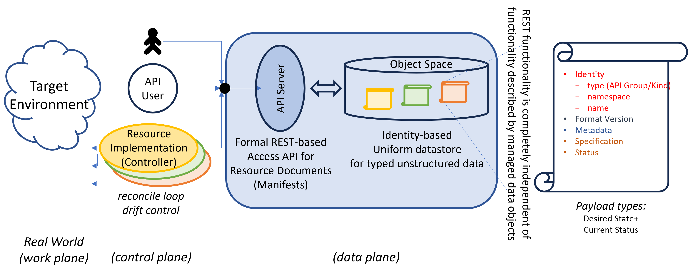

The underlying technical API is reduced to a functional-agnostic data plane only used to manage typed declarative configuration documents, the resource manifests, which just describe desired state, but no actions. The intended function is completely separated into active elements, the *controllers* (building the control-plane). They work on this API like regular users to implement the functionality by accessing those documents (called resource manifests). Their task is to map the described desired state to real-world elements in a target environment used to implement the described element. The resource manifest acts as a digital twin for those managed real world elements. This mapping is triggered by changes of the digital twins as well as changes in the real world (or work plane of a controller), which results in an ongoing alignment of the desired state described by the resource manifest with the reality. This process is called reconciliation or drift-control.

The declared desired state does not describe operations to be executed. The operations have to be determined on-the-fly by the controller by comparing the desired state with the actual state in the target environment. If implemented correctly the result is a reliable and resilient system design.

Because the set of resource types supported by the data-plane is extensible and not limited to the original usage scenario, this API model, called Kubernetes-Resource-Model (KRM), is ideally suited to all kinds of scenarios requiring the management of elements in a target environment, this means basically for almost all kinds of management scenarios. Thanks to the declarative, text-based nature it can easily be combined with GitOps mechanisms by keeping operator managed desired state in versioning systems. 

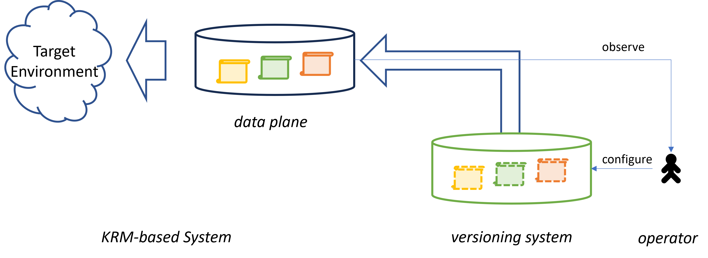

As a consequence the design of the resources and their relation to responsible controllers is extremely important for being applicable to a wide range of application scenarios (for example in the Apeiro context). The following sections will reconsider those relation patterns and describe possibilities and also requirements for the design of related resources and controllers.

## Patterns for the Resource-Controller Relations

The basic pattern is a simple one-to-one relation between resource type and controller. One controller is exclusively responsible for the complete mapping of resources of a particular type to elements in a target environment used to implement this resource.

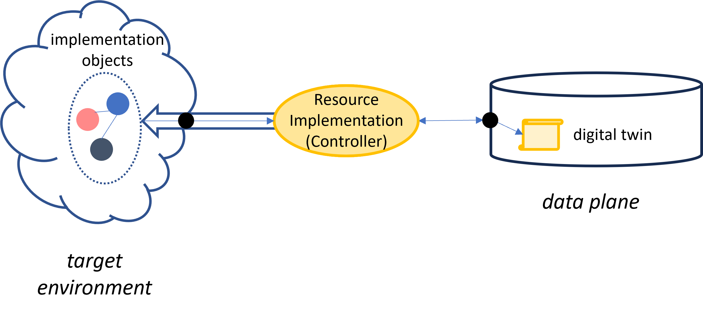

To do so, it might access other resources to gather additional information like credentials required to access the target environment. Those resources may be pure config containers not requiring any controller. They do not represent digital twins in some target environment and therefore there is no mapping to managed target implementation elements. In Kubernetes those resources are for example *Secrets* or *ConfigMaps*. The information contained in those resources may be used by any number of controllers
responsible for other resource types, they may contain shared information.

The controller is responsible for the mapping of one resource type, its *main resource* and uses multiple additional, potentially shared *side resources*.

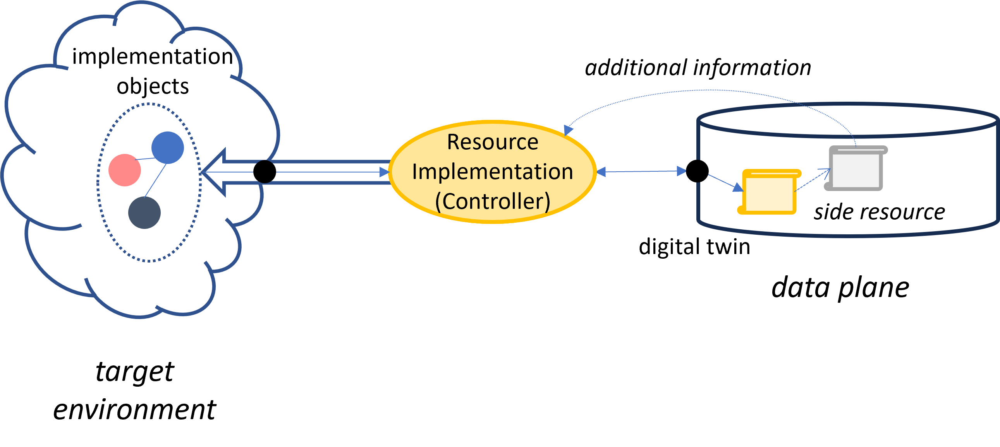

In this general pattern there is one implementation for the resource type, and the controller uses a dedicated API to access the target environment. This typically means that the controller and the target environment are singletons.

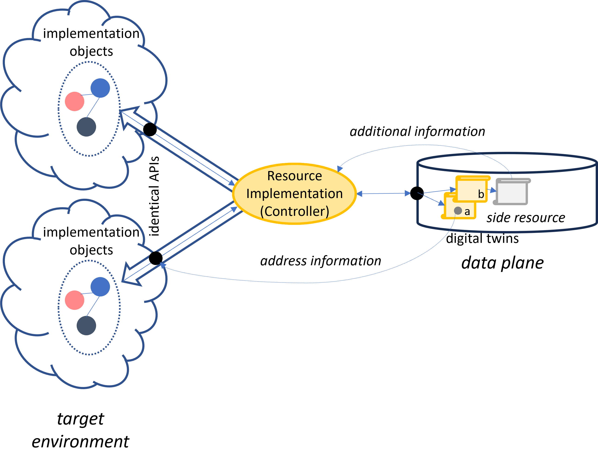

Nevertheless, there may be multiple instances of such a target environment intended to be handled by the same management layer.
This is possible as long as all those instance are providing the same technical API. The resource (or the side resource)
can be extended to additionally describe the intended target environment, for example by including the address of an API endpoint to use. If all such target environments are reachable from a single controller installation, the same controller can still be used to handle all resources, regardless which environment is intended to be used.

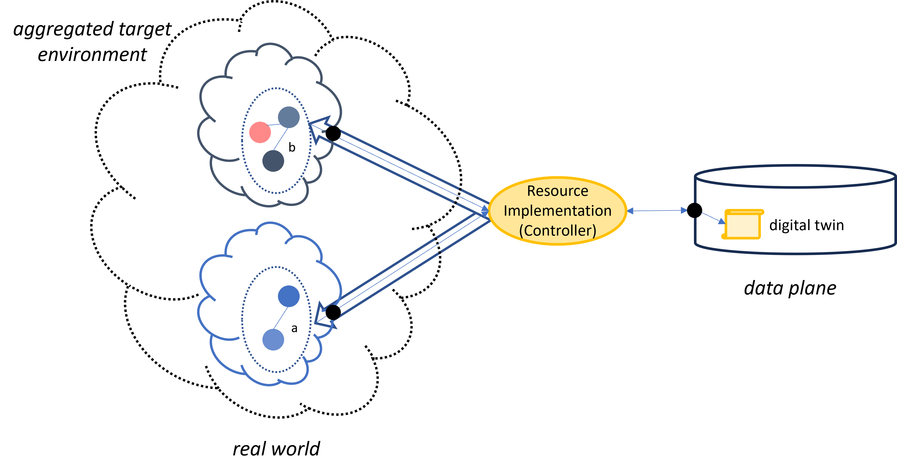

Basically, this looks like a shared target environment, with multiple potential endpoints. which might even be hidden behind a single global API endpoint. For example the AWS API hides the technical regional endpoint behind an API layer, where just the region has to be specified. The necessary information for the differentiation must in any case be part of the resource specification or the side resources.

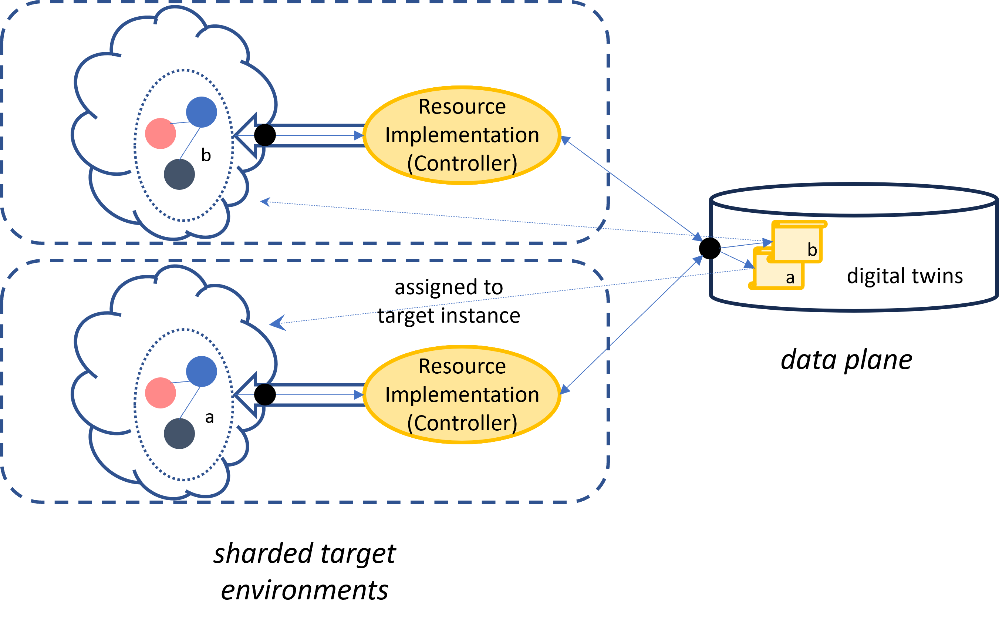

Depending on the nature of this API and its shielding against the runtime environment of the controller and the data plane, it might be useful or even required to run the controller near the intended target environment. In this case there might be multiple controller instances responsible for a single resource type.

This is one flavor of a *sharding* pattern and will be called *environment sharding pattern*: There is still a single resource type requiring the same kind of mapping into the same kind of target environments, but environment specific instances of the controller are required. This sharding might have technical or practical reasons. A typical appliance of this pattern in Kubernetes is the *kubelet*. All nodes of a Kubernetes cluster together build the work plane intended to be used to map *Pod* resources to. The kubelet is a controller running on every *Node*. It uses the local Operating System/container API to manage the containers implementing Pods on this node.

Any case of sharding requires the availability of information sufficient to establish a unique relation between a resource and a controller instance. This is basically the same information already required for our former multi-environment scenario with one controller instance. For Pods in Kubernetes this is the name of the Node stored as attribute in the specification of the Pod. For a fixed assignment this information must be immutable (like for Pods), but it might be modifiable, also, if it should be possible to switch the target environment on demand.

In those sharding scenarios the mapping between resource and target environment is identical, therefore the same kind of controller is used. The resource represents a particular technical functionality in the given context. But it might happen that different implementations are possible or even required, because the same functionality/semantics (described by the resource) should be mapped to different technical environments featuring different APIs requiring a different mapping. In this pattern the resource type represents some kind of abstract functionality or element, which not necessarily implies a uniform implementation. 

Here, we have two sub flavors:
The implementation is fixed for the context of the usage of the data plane, but depending on the kind of general target environment used for the given context. In this scenario, there is still one controller implementation, but it differs from context to context. In Kubernetes an example for this pattern is the Cloud Controller Manager. It hosts controllers responsible for the mapping of (the same kind of) resources to the functionality provided by the underlying cloud infrastructure, like load balancers. In one cluster this mapping is always the same, but it might differ from cluster to cluster, depending on the cloud infrastructure the cluster is running on. This will be called *context-sharding*.

  

  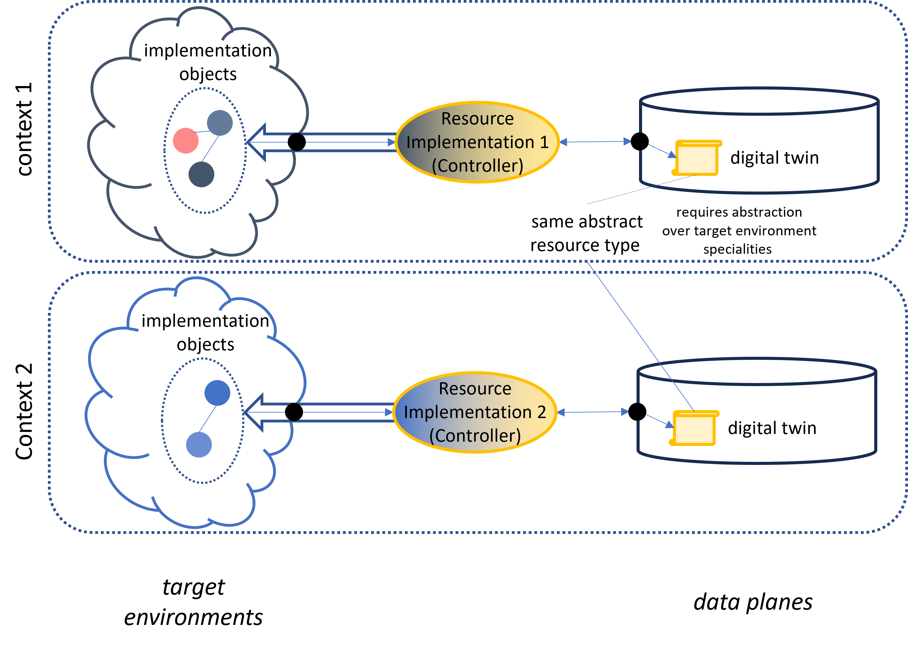
  

Technically it is basically the standard scenario when considering a single data plane, but we already require different controller implementations. Like this it does not require sharding information in the resource. But it requires to identify a common uniform specification applicable for all potential environment types. Sometimes it is required to provide an extension mechanism to extend the specification part by environment specific information (see below for more details).

An interesting second sharding flavor is given by the wish to be able to choose among multiple alternative implementations in a single data plane context. It will be called *implementation sharding pattern*. In Kubernetes, you can have in parallel multiple *Ingress* implementations, which share the same semantics. Therefore, all variants are represented by the same resource type describing the abstract features, which might be implemented in different ways. Again, we need a hook in the resource specification, which can uniquely assign a resource to an implementation variant (represented by the controller). If not foreseen by the resource, in Kubernetes this is typically achieved by using dedicated annotations like a class field.

This mechanism is also used to add few simple target environment specific configuration attributes, but it prohibits format value checks.

  

  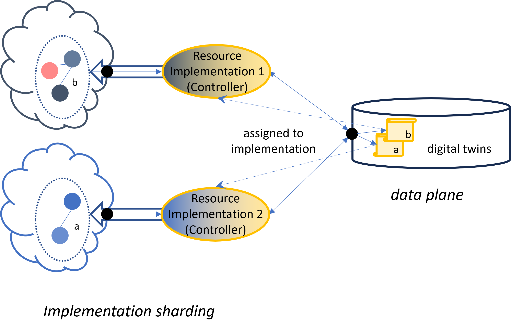
  

This pattern is basically an expression of *polymorphism*, resources using the same specification type might feature different implementations provided by different controllers, and thus through prescribed responsibilities. Another example for this pattern outside the core Kubernetes functionality can be a resource specifying an SQL database. There might be many providers able to offer an SQL database and the requester (the one who creates the resource) should be able to decide which one to use.

  

  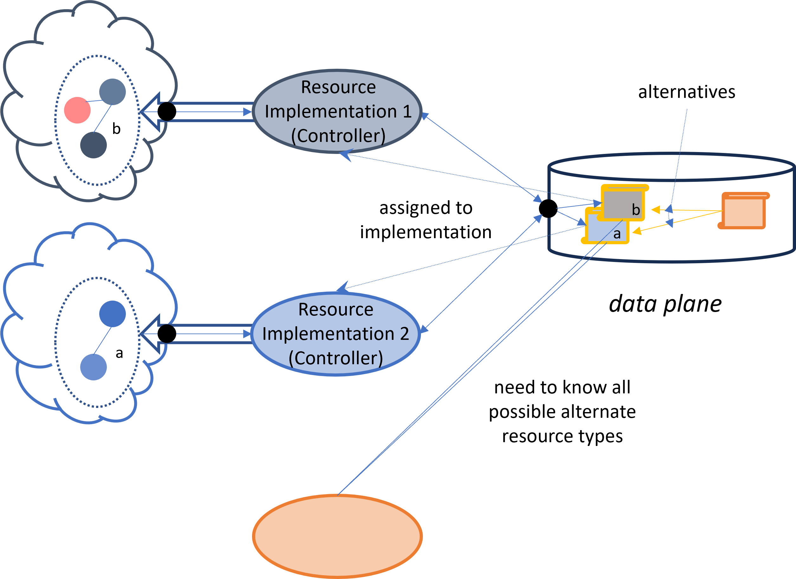
  

A simple solution for such a scenario not requiring this kind of polymorphism would be to use different resource types for each provider. This works fine for mapping such a resource to its implementation, but it might cause problems for other players, which want to refer to such resources as side resources to gain information for their own functionality. Because there is potentially an arbitrary number of such implementations, there would be an arbitrary number of resource types, also. To implement actions based on changes of those resources a dynamic number of resource types must be watched which is complex as well as expensive for the overall system. Therefore, it seems to be necessary to gracefully provide a solution for polymorphism when using the KRM approach for more general management scenarios.

All applications of the basic pattern imply, that all aspects of an implementation of a resource are handled by the same controller. But this does not need necessarily to be the case. A typical example for this in Kubernetes is again the Pod. There are several aspects of a Pod, all described by the Pod manifest, but handled by different parts of the system:
- The container orchestration,
- the attaching and mounting of configured volumes and
- network configurations.

Even before a Pod can be implemented at all, it must be assigned to a Node, which is also done by a separate controller, the (Pod) scheduler. It looks for Nodes with free capacity and taints applicable to the Pod requirements and assigns a matching Node by setting an appropriate attribute in the Pod specification.

  

  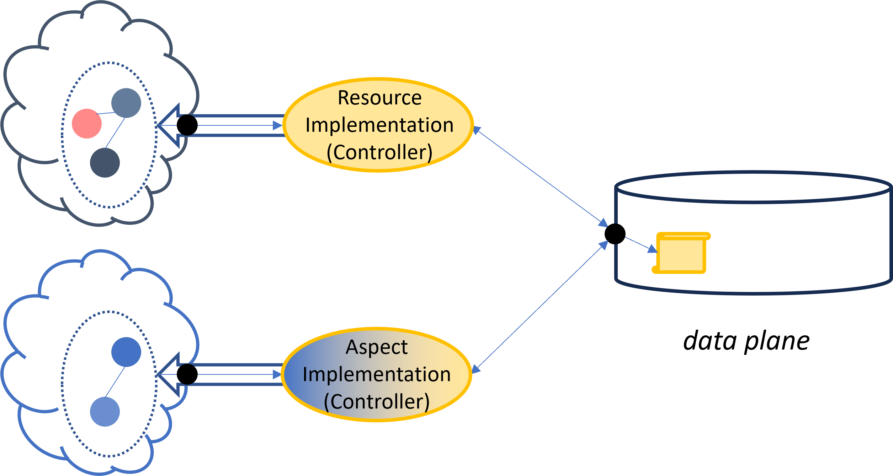
  

The general pattern will be called *aspect controller pattern*, where multiple different controllers are responsible for different aspects of a resource.

But there are basically two ways aspects of a resource can be handled by a controller.
The Kubernetes example shown above already illustrates both of them:

- a controller is used to *implement* a particular aspect of a resource in a target environment. The controller is responsible for this *aspect of a resource*, not for the entire resource implementation. This pattern will be called *aspect implementation pattern* and the controller is a *aspect controller* (because it implements only part of a resource in a particular target environment).

  

  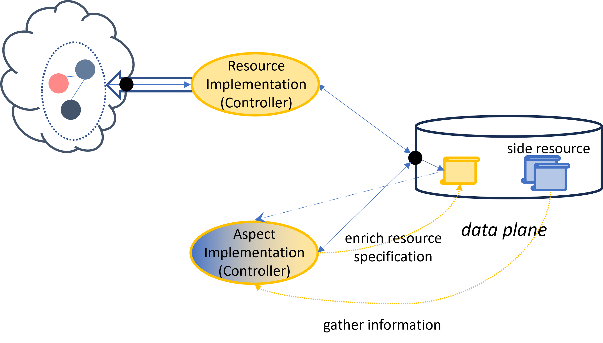
  

- a controller used to *enrich* a resource by additional information. In Kubernetes, for example, the scheduler is a controller modifying Pods (The Node aspect) (by assigning them to a Node) based on information provided by the Pod and the available Node objects used as side resources. It does not implement a resource, but it *provides information* for the specification of a resource required by the main controller responsible for it. This pattern will be called *aspect enrichment pattern* and the controller is a *attribute controller* (because particular attributes of a resource will be maintained, but not implemented).

  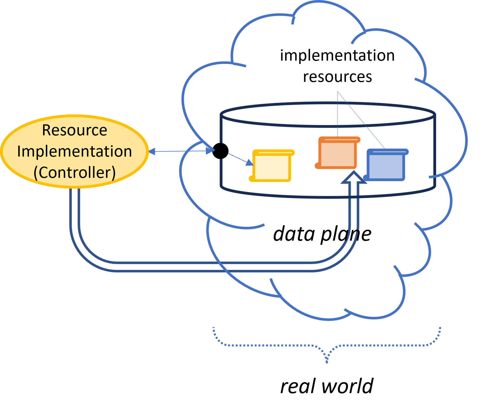
  

This directy leads to another kind of controller, *logical controllers* Instead of mapping a resource to some implementation elements using an API of some external target environment, a controller might provide the required functionality by falling back to the data plane, again. It just creates or manipulates other resources, which together are used to implement the resource. This is some kind of cascading. We will see more about this in the next section. An example in Kubernetes for such a cascading are *Deployments*. They are implemented by *ReplicaSets*, which are then finally implemented by *Pods*. Only the last element is implemented in a real physical environment, as containers on a container engine using the operating system of a node. The two upper layers just manage other resources by creating, deleting and modifying them in a coordinated way over time to achieve scaling or a rolling update.

All those patterns can be combined, for example, the scheduler combines the usage of side resources with the aspect enrichment pattern. Another example are the network plugins in Kubernetes, which are responsible for implementing the chosen flavor of the Pod-to-Pod networking (for example calico). This also is an appliance of the aspect implementation pattern in combination with the environment sharding pattern, because there is again one instance of the controller per node (*DaemonSets*), responsible for the network configuration on this node.

Am more comprehensive classification of controller types can be found in [Basic Kubernetes Concepts](../kubeconcept/README.md). Here I focus on the aspects relevant for the resource layout. 

## Target Environments

In the basic pattern resources in a data plane are used as a digital twin for a group of elements in a target environment, which are managed by a responsible controller. Hereby, the target environment does not necessarily be a uniform system with a dedicated API.

  

  
  

As we have seen in the previous section, a resource may feature several aspects targeting different environments with potentially different APIs, or even different target environments of the same type (like Nodes). This means, a target environment is typically structured and composed of different technical basic environments. A single controller or multiple aspect controllers may use completely different target environments to map a single resource.
For example, to implement Pods in Kubernetes, the local Operating system, the configured container engine and the underlying IaaS layer is used by different controllers.

  

  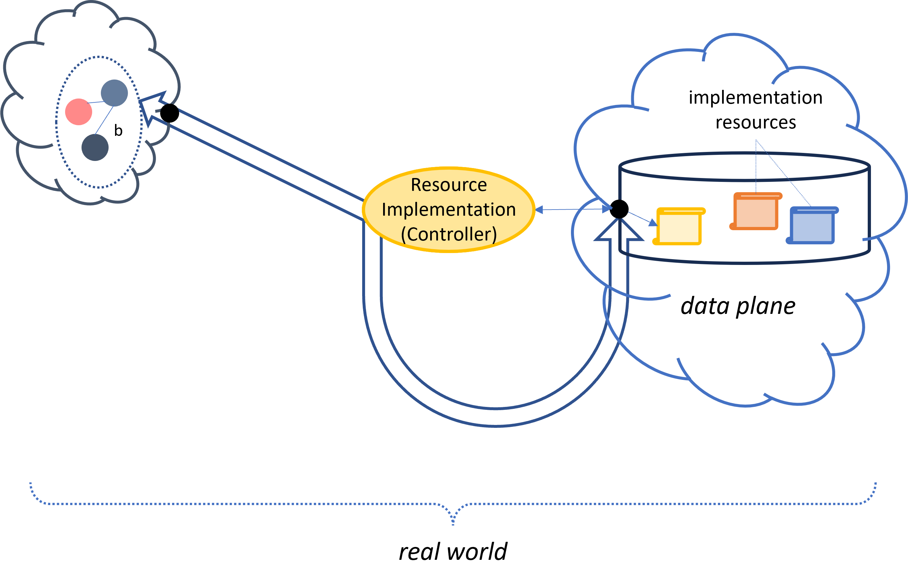
  

Such a target environment must even not necessarily be an external environment. It can again be the same data plane the managed resources are taken from. This way a controller can fall back to more low-level resource types to implement its resource. The result is some kind of cascading, building more high-level elements based on other more low-level elements.

  

  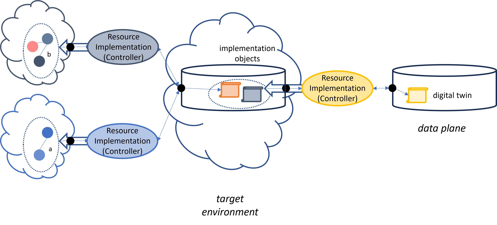
  

But this cascading is not limited to the own data plane. Like any API of an external target environment, the API can again be a data plane API, but for a different data plane.
This way a controller can implement a resource in a data plane by managing  resources in some other data plane(s), which are finally implemented again by controllers working on some other target environment. This way specialized environments offering a data plane as API for its users and used to offer some kind of service can be aggregated to a common aggregating data plane, whose resources are forwarded or even arbitrarily implemented by connected environments. This is the idea behind the Apeiro project for connecting multiple service providers to a common marketplace offering a single API for managing any kind of resource.

  

  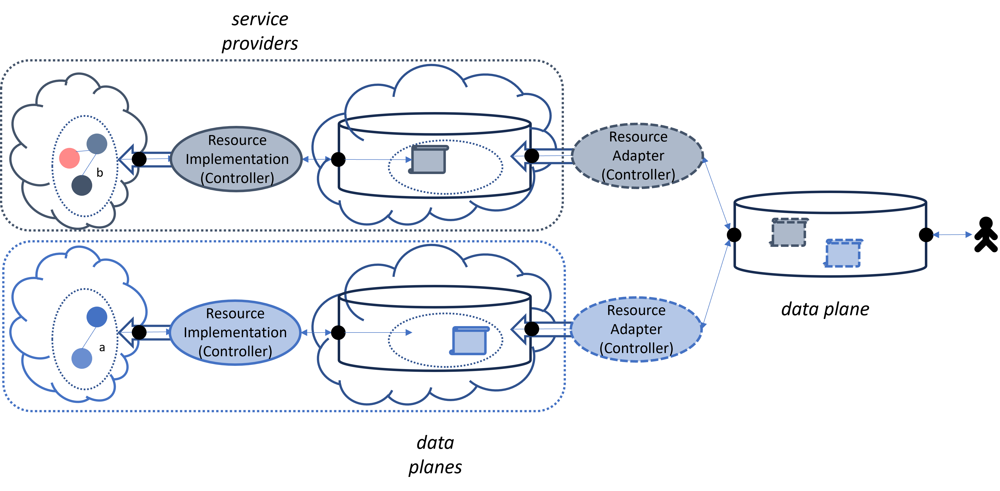
  

## Patterns for the Resource Layout

The KRM model itself as well as the chosen implementation pattern for the involved controllers have significant consequences for the design of the layout of a resource document.

Already the most simple basic scenario influences this layout. The task of the controller for a resource type is the mapping of the resource specification to elements in a target environment. This mapping is not unidirectional in two senses:
- changes on both sides may trigger operations of the controller, and 
- the digital twin in the data plane should reflect information about this mapping into the target environment, to provide valuable information for the users or other system components.

This mapping therefore also involves providing feedback from the target environment to be consumable by other users of the resource manifest. The resource is the interaction element both sides have access to. There are basically three information categories for such a feedback:

1. Information about elements in the target environment (state)
2. Information about the progress of the mapping, or its status including valuable error information (status) including the version of the resource observed so far by the controller.
3. Information about detected changes and actions executed by the controller because of changes of the desired state or the target environment.

  

  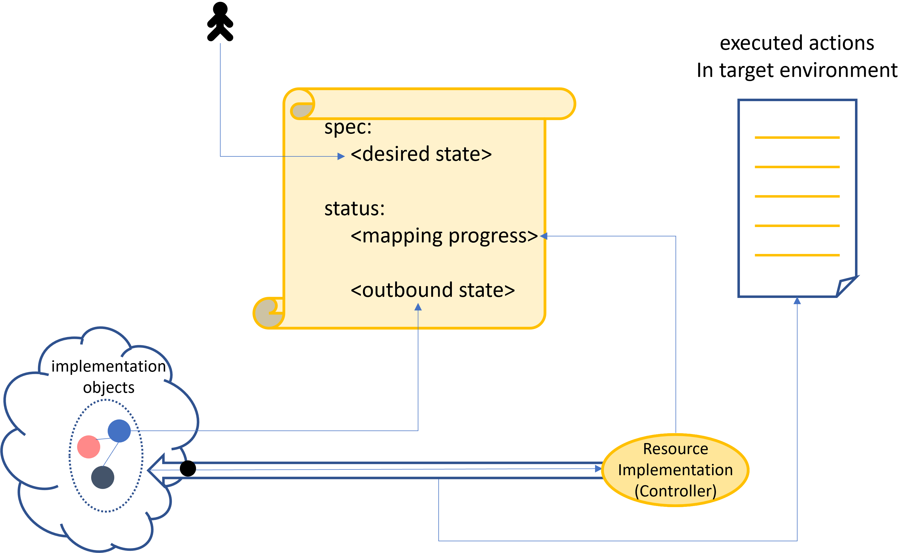
  

For this reason a resource manifest typically features a *spec* and a *status* section. The spec sections describe the configuration attributes managed by the owner of a resource (the *inbound* or desired state). It is used by the controller to parameterize the mapping steps.

When creating elements in the target environment selected attributes from those elements are reported back into the status section of the resource. In Kubernetes, for example, the controller for the *Service* resources reports back the network address of an optionally created load balancer.

Additionally, information about the status of the mapping process will be exposed (the second category). This typically results in an observed version,  message and a status or phase field. This information is used by owners or consumers of the resource to gain information about the mapping state and potentially influences own processes. The phase follows a state diagram, typically consisting at least of the states, *initial*, *in progress*, *ready* and *error*.  This seems to be useful during the creation/setup of a resource, but causes problems during the drift-control done after the resource has finally been created. Here, it typically switches between ready (as long as it is basically functional) and error. And it requires a possibility to derive an overall status of a resource from potentially multiple parties involved in the implementation mapping.

This is the reason for the third category. Information here has the flavor of some kind of simple log, which lists formal actions (and detected problems), executed by the controller during the lifetime of a resource. This kind of information is handled by a sequence of so-called *events* in Kubernetes. This kind of information has strictly to be distinguished from the second category. It does not show the actual status, but the history of actions. In oversimplified cases this might be reduced to the list of status changes, but basically it should offer more fine-grained information about concrete actions done by the controller to align the desired state and the actual state in the target environment.

Because there is an endless flow of events, they are not kept as part of the resource manifest, but as separate kind of resource. In Kubernetes a limited lifetime applies to events, which has the undesirable effect, that after some time with no actions it is not possible anymore to see anything. More appropriate would be a combination of lifetime and amount of events. For example, always keep the last 10 events, but all events not older than 20 minutes. This would even be useful for Kubernetes, but would be crucial for the application of this model to more general management scenarios. This is the first point of information for operators to gain an impression what happened in the system.

The logging output of the involved controller(s) is not necessarily accessible a regular user creating a resource. And it is much harder to read and correlate with the resource, because:
- the log contains information of all actions done by a controller, not only the ones related to the resource in question
- the log is only from one controller, but there may be multiple parts of the system involved in the handling a resource (see aspect controller patterns)
- 
For sure, the events are no replacement for a log, but they are very helpful to quickly figure out what has happened. Logging stacks like ELK (Elasticsearch/Logstash/Kibana) can help to gather, correlate and filter logs from all system components. They are useful for detailed analysis, but are no replacement for a simple action log directly provided at resource level intended to be understandable by the owner of a resource.

Things for the first two categories covered by the status section of a resource get more complicated, when considering more complex controller/resource patterns. A central role here play aspects of a resource. Every aspect might have its own status information. In such scenarios it might not be possible to synthesize a simple status value.
In the most simple case there is a fixed set of aspects, for example for the implementation of Pods in Kubernetes. In such a scenario there may be dedicated feedback fields in the status section of a resource. But if variadic implementations are required for aspects or even different sets of aspects depending on the environment or chosen implementation a fixed field structure does not seem to be applicable.

To solve this problem, *conditions* have been introduced. This is a list of typed entries. Every aspect contributor independently manages own condition types following the same basic field structure. This allows combining a completely typed resource structure with a dynamic number of aspects with independent feedback information. Typical fields here are:
- type (formal)
- status (formal)
- lastTransitionTime
- message (arbitrary)
- reason (formal)

The values of formal fields are part of the API, which enables other components to reliably react on those condition values. A global phase attribute then makes no sense anymore, because it is better covered by conditions. Every specific aspect, which could be executed in parallel by different controllers should be expressed by separate conditions.
This approach also covers the introduction of arbitrary aspects implemented by more controllers. For example an *Account* resource might be used as hook to create local accounts in an arbitrary number of interconnected external environments, each handled by a separate controller. For every environment there is a condition reflecting the state for this environment. Additionally, the condition list then reflects the set of connected foreign environments.

The problem with this approach is, that it is limited to the second feedback category, because here all formal fields can be identical. This is not the case for the first category, because every aspect might feature different fields. For a fixed number of aspects fixed fields can be used again, but this is not applicable for a dynamic aspect set.

The same or similar problems arise for the specification section. For environment specific implementations different attributes might be required to configure the aspect. A typical solution here is to embed a dedicated field for the involved aspect, which again hosts a field structure with a type field. The value of this field determines the structure (not the meaning) of the complete aspect field. This mechanism can be used for feedback fields, also.

For polymorphic implementations this should be sufficient, but there might also be additional potentially arbitrary aspects requiring special additional fields.
For an arbitrary set of aspects, an appropriate list of typed attributes sets can be used, again for the specification part as well as for the status section. This would be similar to the condition model, but without a fixed structure of the involved fields. A static typing of the variadic field is not possible, if there is not a fixed set of aspects.

The polymorphism problem from the last section is also covered by such a solution by using one resource type with arbitrarily typed and structured extension fields.

Because aspects play a central role for more complex scenarios it seems to be useful to have a closer look, here.

## Aspects reconsidered

Independent of the shown patterns for designing a resource structure, it is worth having a closer look at the various aspect flavors.
It is possible to distinguish three feature dimensions for aspects:

- *intrinsic for a resource type or attachable*

  an aspect can be an integral part of a resource type. For example, a database resource requires credentials for accessing the database API. Or it might be attached from the outside. For example, an Account resource may have projections to external systems. Neither the number of connected systems nor their types are necessarily known in advance.

- *specific for a resource type or applicable for multiple resource types*
  
  an aspect may be a unique feature of a dedicated resource type, for example, in Kubernetes Pods feature containers and no other resource type has this feature. Or the aspect may be offered or required by multiple resource types. For example in [Flux](https:fluxcd.io), there are multiple resource types, the source types, providing access to a filesystem-like snapshot. Other resource types, the deployers, can refer to those aspects to access the content intended to be deployed.

- *inbound or outbound*

  an aspect might require special configuration not derivable from common resource attributes. For example, access credentials are consumed via referenced Secret resources (which are also consumable by other resource types). Or the resource offers this aspect to be consumed by other resources. An example for this are again the source resource types in Flux.

As can be seen from the examples given, incarnations of the different dimensions can freely be combined.

All those combinations could be solved by introducing specific parts in the main resource manifest. This works well for a fixed set of aspects. For example, in Flux the exported snapshot aspect is implemented by a fixed set of attributes in the resource status.
But it does not work for an arbitrary number of aspects potentially unknown in advance. And there are even more problems with such an approach:

- in contrast to the simple status feedback (the conditions), aspect-specific fields cannot be standardized for all potential aspect types. Therefore, their structure cannot be defined as a list of named aspects with a fixed structure as part of the main resource.

  

  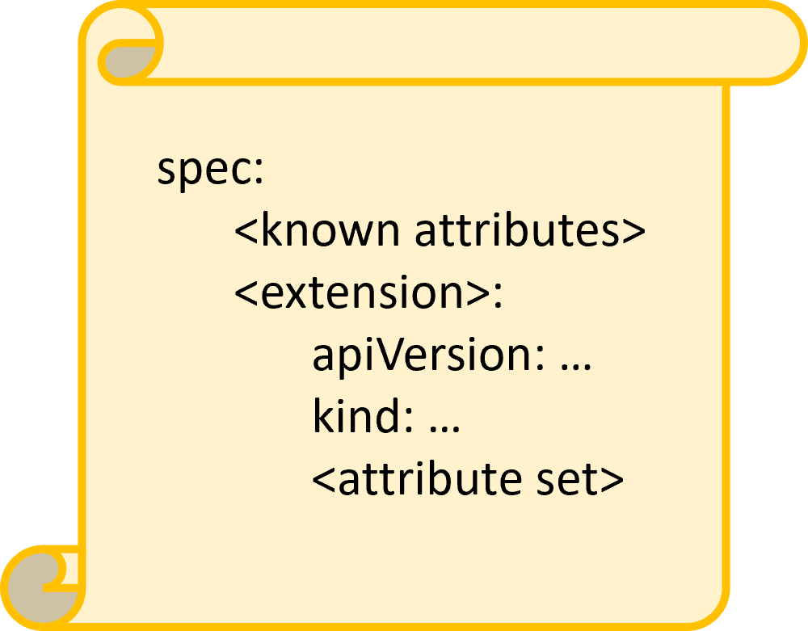
  

  A solution here could be to extend the OpenAPI model supported by the API server managing the data plane to support some kind of slave types, resources defined by CRDs only usable as typed extensions, but not for main resources. The type field of the extension then would be the typical type identity of a resource (in Kubernetes the API group, version and kind). Such a structure is already often used for such scenarios, for example by the [Gardener](https://gardener.cloud). In the main resource aspects can then be represented by raw extensions. either as a dynamic list or with fixed field names.

- when used as outbound aspects, there are consumers of this information, typically other resources. This requires the controllers of such consuming resources to know all the aspect providing resource types (and how the aspect is expressed in such resources), and to establish watches for them, which either prevents adding more combinations by configuration or requires dynamically establishing watches for changes of arbitrary resource types. The first is quite inflexible, and the second is quite complex and expensive for the overall system.

- especially if shared aspects are involved, status updates for multiple, potentially an arbitrary number of resource types have to be done by the controller responsible for the aspect.

There are always special scenarios where the simple usage of single main resources with dynamic fields are applicable, but this cannot be the general solution for all the other more complex scenarios.

Interestingly, Kubernetes has already chosen another way for a very special common scenario: credentials.
There are many resource types for which the controller requires credentials to handle the resource mapping. This led to the externalization of this aspect into an independent type of resource: *Secrets*. Instead of adding the attributes required for this kind of aspect to all resource types requiring access to credentials (inbound flavor), credentials are stored as specification of separate *Secret* resources. Secrets can be shared by multiple resources and even resource types by establishing resource references in the consuming resources. According to the classification above, such secrets are intrinsic, non-specific and inbound aspects of those resource types.

  

  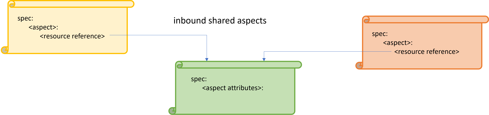
  

But they may also be used to expose access information for an external resource managed by a controller. Then they are outbound aspects of the resource the controller is working on, which might be connected to the origin resource by owner references.

Because of the *inbound/non-specific* combination, using resources must explicitly refer to them. But this basic idea can be generalized to be usable for other complex shared scenarios, also.

The aspect is implemented as a separate resource type. It can again provide specification and status information (if there is a managing controller). The aspect resource can be an informational resource (like Secrets) without a controller, or managing the aspect for an owning main resource in some target environment by a separate controller.

Designing the layout for interconnected resource types should not only focus on the layout of the main resource manifests, but include the possibility to split resources into multiple aspect resources.

Like secrets, such resources can be used as inbound or outbound aspects.
- For inbound resources they are referenced by the consuming resource. Or if they are attached to a resource, the aspect features such a reference back to the main resource.
- Outbound aspects can be assigned to their master resource by *owner references*, a concept supported by the Kubernetes API Server, which binds the lifecycle of a resource to the owner resource.  Such resources are typically maintained by the controller of the maon resource. But it might also be possible to split the controller.

  

  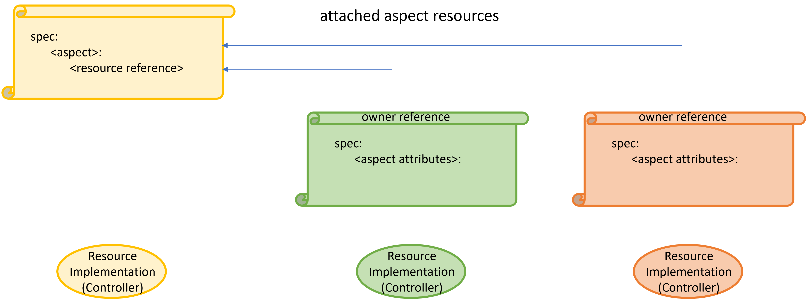
  

It would also be possible to use them for resource type specific aspects, but here the traditional aspect implementation seems to be preferable.
If aspects are used by multiple resource types, particular aspect resources could simplify the complete process handling and reduce the load on the data plane. Instead of watching an arbitrary number of resource types supporting this aspect, aspect controllers can focus on *their* resource and use the attached main resources as side resource. 

For outbound aspects provided by multiple resource types, controllers for consuming resource types can also benefit from such a layout. The consuming resource still references the intended (main) resource providing the expected aspect. This resource publishes this aspect by a separate resource. All the consuming controllers need only to watch this fixed resource type. Using the owner reference the relation to the appropriate main resource can be determined. By maintaining a corresponding index the original resource reference can be mapped to the assigned aspect resource to get access to the desired information without requiring to watch or even know the origin resource providing the aspect.

  

  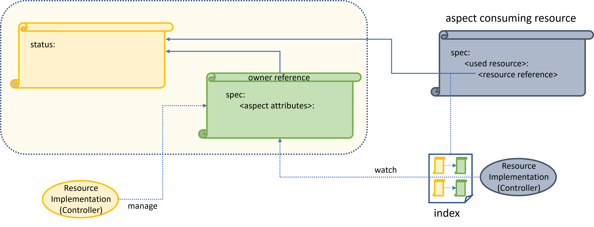
  

Especially for attachable aspects, such a particular aspect resource type makes sense, because the main resource does not necessarily know about this aspect, it even does not need to be prepared to handle aspects at all. Attachable aspects keep references to the object they are attached to.

And the common advantage is that aspect resources can make use of the complete features of the data plane, including access control and structure definitions via OpenAPI specifications.

In general, whenever some kind of shared behaviour is involved, dedicated aspect resource types seem very appropriate.

Let's return to our *Flux* example. The snapshot aspect is basically an intrinsic, outbound and shared aspect. It is implemented by special status attributes and all deployers need to know the supported source resource types, because they need to react on changes for those resource types. And they need to understand the status fields. The result is a completely hard-wired closed environment for a fixed number of resource types. It is not possible to just add new source resource types. And it is even impossible to introduce transformation-like resource types, which consume a snapshot and offer again a modified one for other consumers. Just by introducing some kind of *Snapshot* resource as a shared aspect could open up the scenario to evolve to a completely open ecosystem. It could arbitrarily be extended for any use case by adding new source types or actions.

Also, our account example can easily be implemented. New attachable systems could introduce an own aspect type specific for this kind of system. It has to feature a resource or owner reference to the intended main object, which is used as side resource for the controller responsible for this aspect resource. Its task is then to implement this aspect on the addressed system, aka creating a local account and attaching it to the main resource. If only outbound information is required, the aspect resources are then just created by the system controllers and attached to the main resource by setting an appropriate owner reference.

This way, aspect resources should be a standard layout for more complex, especially shared resource scenarios in a general management environment based on a Kubernetes-Resource-Model implementation.

## Self-Descriptive Environment

A Kubernetes data plane is extensible and mostly self-descriptive. New resource types can be configured via an own resource type, the Custom Resource Definitions (CRDs). They also include a structural definition of the resource manifest. The available types and formats can be queried from the data plane API provided by the API server.

Those extensions are used for various use cases shown before:
- implementation sharding (polymorphism)
- providing shared aspects to be used by other resources following the implementation sharding.

Unfortunately, this is not possible for typed sub-structures. Although it is a common pattern to use type information similar to the one used for resource manifests, appropriate type information is not available on the data plane level, at most on the client side on the library level of a controller. Therefore, there are no standard structural checks for used extensions, neither for externaled one (as aspect resources) nor for aspect descriptions embedded as raw extensions (although those extensions still have type information). 

For the implementation sharding, an additional mechanism is required to assign resources to dedicated implementations (controllers). This is either handled by an explicit field, for example by the type of extension field (if available) or by annotations as explained earlier. Those annotations are also used to configure some parameterization, if no extension field is foreseen (for example in Ingress resources in Kubernetes).

Those kinds of information are not part of the self-describing features of the Kubernetes data plane. It would be extremely helpful if the implementations for a polymorphic resource could be declared like new resource types (for example for ingress controller variants). Similar to CRDs this could be done by an *ImplementationClass* resource combined with a formalized extension field in the resource in question.

  

  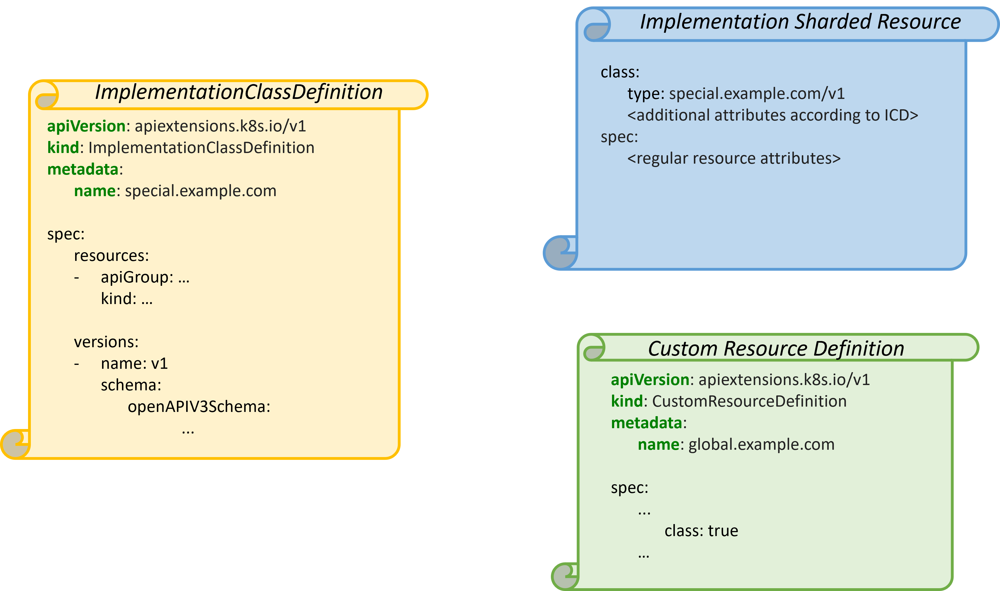
  

It would be possible to establish a standard to describe such a kind of implementation class, for example by defining a standard field `class`, which describes the intended implementation class. This field includes the specification of an implementation type. Basically the usual API group syntax can be used. In the example this is `special.example.com/v1`, where `v1` describes the used format version.

Similar to an CRD an `ImplemantationClassDefinition` resource type is introduced. It describes for every extension class, given by its name (`special.example.com`), where and how it can be used. In its specification it contains information for which resource type (or potentially, types) it is intended for, and it describes the supported format version using the usual OpenAPI specifications already known from the CRDs.

The main resource can then automatically be checked for valid (available) class types and their attributes as extension to the original CRD. Basically, it is a description of polymorphic formats for the main resource.

  

  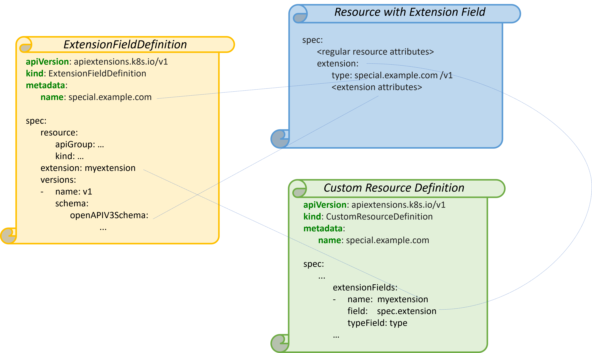
  

A similar mechanism could also be used to describe valid structures for extension fields for variable configuration fields (the second case from above). The CRD defines the set of extension fields and types supported by a resource by defining an extension name and assigning it to a field of the described resource. Like the `class` field from above, it must at least contain a type field (potentially configurable), it is used to identify the type of the configured extension, described by a separate *ExtensionFieldDefinition* resource. Those resources can dynamically be added like CRDs, and declare for which resource and extension field (given by the extension name from the CRD) it is intended, as well as the structure versions for the extension attributes. In the resource the type field of the extension field specifies the extension type to use, according to the name of the extension field definition.

This way the data plane would be completely self-descriptive and queryable. Especially it would be possible to determine which implementations are possible for a resource following the sharded implementation pattern (own extension field definitions). And variadic field content could be validated when applying manifests because all the combinations and OpenAPI definitions are known by the API server.

Both kinds of extensions could be brought together and described by the same mechanism, if a standard extension type, for example `class`, is used to define an implementation-class-like extension, which is then used to describe the extension attributes, as well as the selecting key for the implementation sharding.

