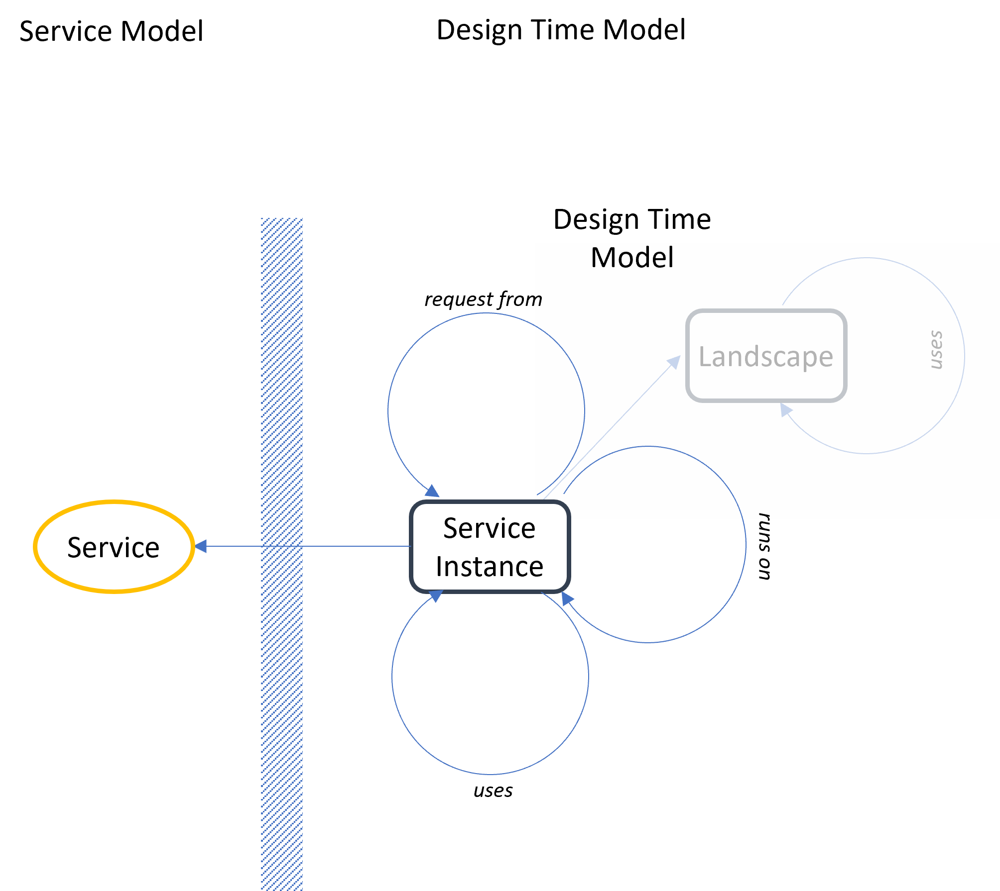
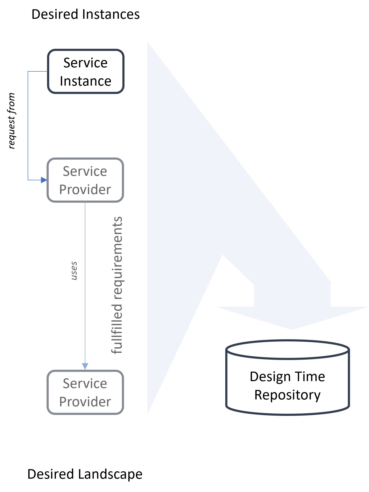
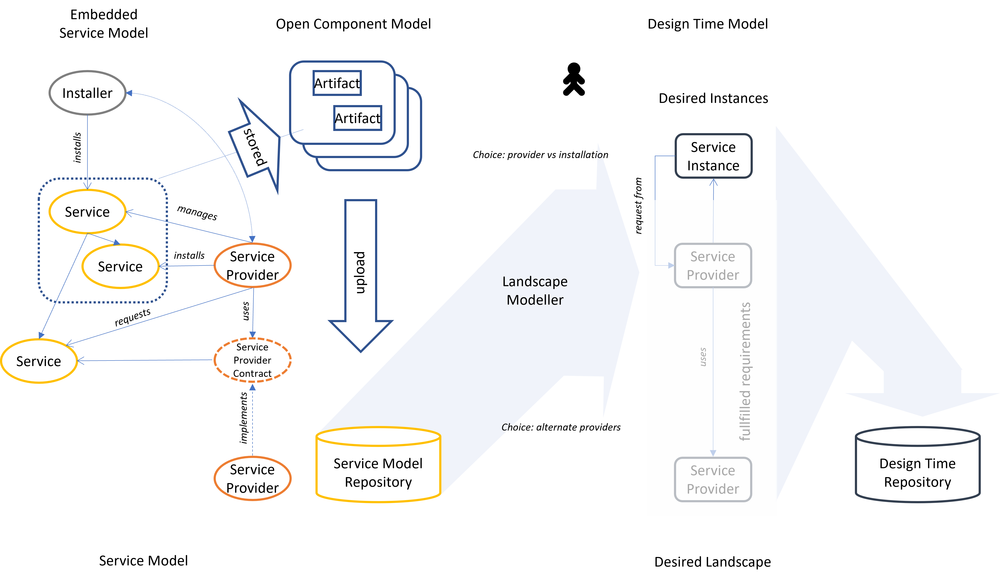

## The Design Time Model

In contrast to the [service model](svmodel.md), which deals with describing the features of service kinds, the design time model is intended to describe a concrete orchestrated service landscape (or service mesh). Therefore, it completely deals with service instances.

### The Model

Similar to the service model, the central and basically sole element of the design time model is the service instance. It features several kinds of relations:
- orchestration dependencies
- installation dependency to a service provider server or an installation service.
- dependency to a runtime (could be a regular service) if not handled by the installation.

The identities of the service instances are not bound to some upper model and can freely be chosen
by the used tooling. The identities must not be globally unique, only in the context
of the described landscape.

If it is intended to aggregate multiple landscape definitions into a larger one,
landscapes should be explicit model elements, which then require some kind of unique
identities in the context they are managed. Service dependencies are then paths following the landscape nesting down to the concrete service instance to use.

The landscape definition must be stored in some design time repository to be accessible
by other tools. It is recommended to follow the component repository pattern supporting
multiple technical stores, like a filesystem archive, a blobstore and additionally some relational database under a common API usable by tools.

The model may contain configuration settings for the modeled service instances
if a complete automation is intended, or the model is used to generate
a git-ops environment, where the missing information must be filled out by an
administrator.

A simple concreate model could then look like this:

The landscape should include a dedicated service instance. This is the intention
by the landscape designer. According to the service model, this implies some requirements, which have to be added by the landscape designer to finally have a valid and complete model. He decides to provide the desired service instance by a service provider using another service provider. For example, to provide required runtime services (greyed). The final design is then stored in a design time repository
to be usable by further tooling.

### Relation to the Component and Service Model

And here, there is the direct link to the service model. The service instance is directly related to a service of the service model. The definition here determines
which dependencies must be resolved to result in a valid design time model.

This information can be used to validate a given model or to assist in completing the model to fulfill all the requirements of the involved service instances.

To support configuration settings, the service model should be enriched by
a formal declaration of the required configuration (not yet part of the model).
This could be explicit elements, or it is mapped to annotation values.

To provide the possibility for a complete automation, there must also be tooling
able to apply such settings in a concrete setting. This could, for example, be
plugins for a landscape installation system (see below), which are again expressed as
artifacts in the component model referenced by the service model elements.

### The Tooling

The previous section just opens the door for some useful tool support.

#### Landscape Modeller
Besides the repository, a *landscape modeler* could be provided. It provides
and API (or UI) for the landscape designer assisting in providing a complete, valid and consistent landscape setup.
It uses the service model (available via the service model repository) to
offer choices for the intended service instances. In a second step
it can evaluate the dependencies and offer possibilities how to complete the
setup. Depending on the content of the service model repository, this could be
- directly implied services and installers, or
- it offers possibilities to resolve dependencies by service instances already existing in the landscape or to create new ones.
- to offer alternatives how to resolve contract dependencies.

In the example shown above, the service repository contains an installer and a service provider for the initially intended service instance. The designer now has the choice,
he decides for the provider solution, because there will be multiple such instances in the future. Now, this provider requires some other service, leaving the option for different implementations by describing a contract dependency. But the available service model
contains only one possible matching service, which can automatically be added.
Or the designed decides to make some other service option available, for example,
by browsing a marketplace to look for and buy some other solution. This one the  also contains a service model description, which will be added to the service model repository.
After this it is available for landscape modeler, which now can
offer multiple possibilities for resolving the contract dependency.

#### The Landscape Installation System

For the design time model to technically relevant, it must somehow automatically
be mapped to some operation environment. There might be several levels of support
- mapping the landscape model into a Git-Ops project setup, which must be completed by the landscape admin.
- directly mapping the landscape model into deployments,

The tool for the second possibility could be a *Landscape Installation System*.
The task is quite complex and heterogeneous, but it could significantly be simplified
by generally relying on some declarative ordering environment, as proposed by the *Apeiro Reference Architecture*.

A second simplication could be to rely on Kubernetes-like execution environments and standardize installers to be implemented by *Kubernetes Operators*.

The task of a generic installation system is then just to deploy operator and
resources to instruct the operator to deploy an instance. The latter part is basically
identical to ordering an instance from a service provider (see Apeiro).

So, required is the link from the service model referring to an appropriate
artifact in the component model (which is already formalized), and the plugins for the installation system used to map configurations into declarative request resources.

##### The Service Account Management

To be able to work, service providers must be able to interact with each other.
This typically requires authentication and permissions. A landscape installation system
must therefore fall back to another tool, a *service account management*. This must be standardized, to enable the installation system to request service accounts for service provides automatically passed to using services as part of the service provider orchestration.

#### Maintenace Optimizer

But the landscape installation system could do even more than just initially setting up a landscape.
It should keep the design time model in an own version describing the current state of the landscape. Whenever no the intended landscape is changed by the landscape designer,
it can determine a delta and apply appropriate changes to the real technical landscape.
Hereby, version constraints described by the service model can be used to propose
and schedule upgrade paths.

The result is then a deployment landscape consisting of the service instances described by the design time model plus implicitly creates service instances for implementation dependencies manged by the service providers, which could be described by the service model. It is important to note here that this description must be complete in terms
of the modeled service dependencies. But especially implementation dependencies must not necessarily be modeled in all details.

### Summary

The design time model is able to completely describe an intended service landscape.
Together with the [service model](svmodel.md) it allows validating the completenes and consistency of such a landscape. The service model information ca also be used to
get all the necessary dependencies and find implementation proposals for services required to resolve them. Together with the [component model](swmodel.md) it is possible
to derive installation guidelines or even complete installations using such environments like a landscape installation system and a service account management.

Even without a runtime model, it is possible to gain information what software will be or should be part of a described landscape description, why it is required and where it is used.