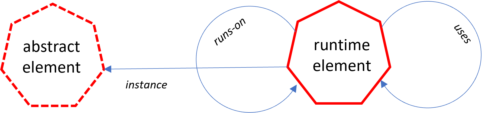
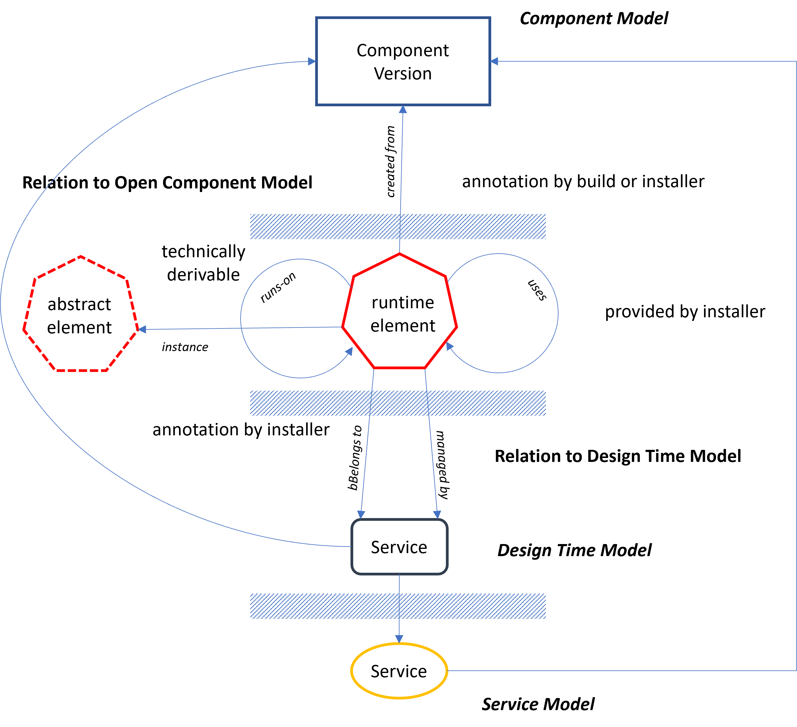
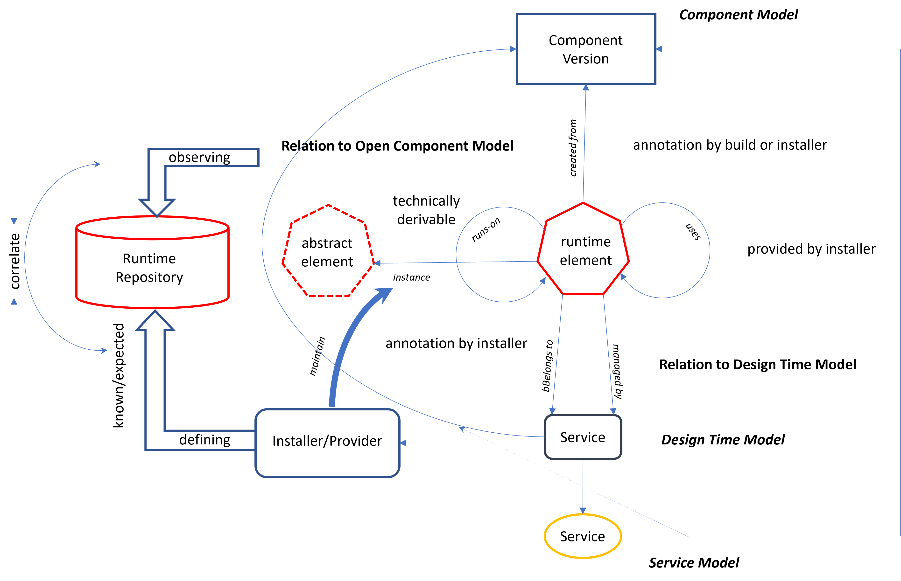

## The Runtime Model

The last section just shows some gap between the definitions in a service model and the final technical landscape: not all implementations dependencies managed by a service provider must be (and potentially will not be) completely covered by the service model to avoid unnecessary complexity.

Other reasons for diverging landscapes are operators at the end of the definition level, which might create, exchange or extend runtime entities on the fly. For example,
Kubernetes `Deployment`s results in a sequence of `ReplicaSet`s, which dynamically
create `Pod`s for scaling or failure handling.

Those elements will never (and cannot) be modeled at the level of the service or design time model. Nevertheless, it would be extremely helpful to be able to judge on
an actual landscape state, whether it still meets the intended landscape, or whether
there are elements not expected. This is proving extremely difficult.

But even there, the described model hierarchy can help. First, a formal description
of the effective technical landscape must be provided. This directly leads to an additional model level: the runtime model.

### The Model

The runtime model must be able to model all relevant runtime elements at an appropriate detail level. The general observation here is that every element in question is
determined by another element it is embedded into, stopping at some base elements, for which there is a conscious decision not to dive deeper. For example, we stop modeling at a VM level, deciding not to model hypervisors.

This again results in a very simple model design.

It is basically oriented on the initial definition of a service (instance).

There is one central element, the *Runtime Element* which runs on another element and may use other elements. All those elements are formally typed. For example, it can be a VM, a Pod, or a Database Scheme.

Additionally, there is an *Abstract Element*, which reflects an expected type of runtime element. Any dynamically maintained element can be related, directly or indirectly to such an element to reflkect the reason for its existence.
For example, in Kubernetes it could represent a set of Pods or active execution unit of a service, created via the generation chain Deployment/ReplicatSet/Pod. The relations inside the chain are technically provided by the system and can be used to derive the relation to the expected abstract element of a service deployment.

This directly leads to a tool environment required to derive such a model from concreate landscape elements. And here we found several possibilities to relate the runtime model with the upper model layers.

### Relation to upper Model

Any runtime element can be related to a service instance described by the design time model used to instantiate the landscape. This is the most obvious relation.
Such a relation could, for example, be established by annotations on the technical elements (if supported). Even a relation to artifacts of the component model is partly possible. For example, an image intended to be published via the component model could be enriched already during the build process by appropriate metadata.

So, every runtime element must be relatable to either a component, service or design time model element. This information can later be used by outer tools to relate the runtime elements to appropriate design time model elements.

But those relations are not always generally possible, the only relations directly derivable from the landscape are the runs-on-relations. So, to set up a complete runtime model and correlate it with the desired design time model requires extensive tool support, heuristics and specialized analysis functionality.

### The Tooling

First of all, the elements of the runtime model must be held in a runtime repository to be directly  accessible by the required tooling
It is fed by different sources:
- specialized runtime observers report the existence of technical elements and their runs-on relation
- the observer extracts relations part of the metadata.
- directly generated or expected abstract elements can directly be created by the installation environment.
- the installation environments tries to enrich directly deployed elements with appropriate metadata usable to establish a link to the design time model elements they are created for.

On-top of this, analysis tools can be used trying to use the available information to establish relations to abstract runtime elements or even elements of higher models.
For example, if a pod is created from an image known to be provided by a dedicated component version of the component model, which is deployed as part of a service described by the service model, it must belong to a particular service kind. If then the deployment of a service instance according to the design time model is using a separate namespace in Kubernetes, the Pod can be assigned to this service. The more assignment paths are found the more plausible is such a derived relation.

This analysis environment must be highly configurable and extensible. This could, for example, be achieved by using plugin artifacts described as part of the component model and assigned by the service model.

### Summary

The run time model is derived by various tools and from various sources:
- the elements itself and their runtime-embedding directly from the landcape
- installers providing link information
- installers directly handle explicitly created runtime elements
- analysis tools following generations chains or
- correlating combinations of elements with desired design time elements

The result is a runtime model usable to find unrelated runtime elements and following up the model hierarchy to relate runtime elements with delivery artifacts and components.
Using the enhanced analysis and reporting capabilities of the analysis gear on top of the component model, it is then possible to figure out involved software, including libraries, versions, vulnerabilities and triage information.
