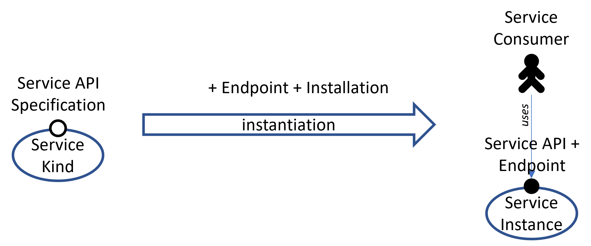
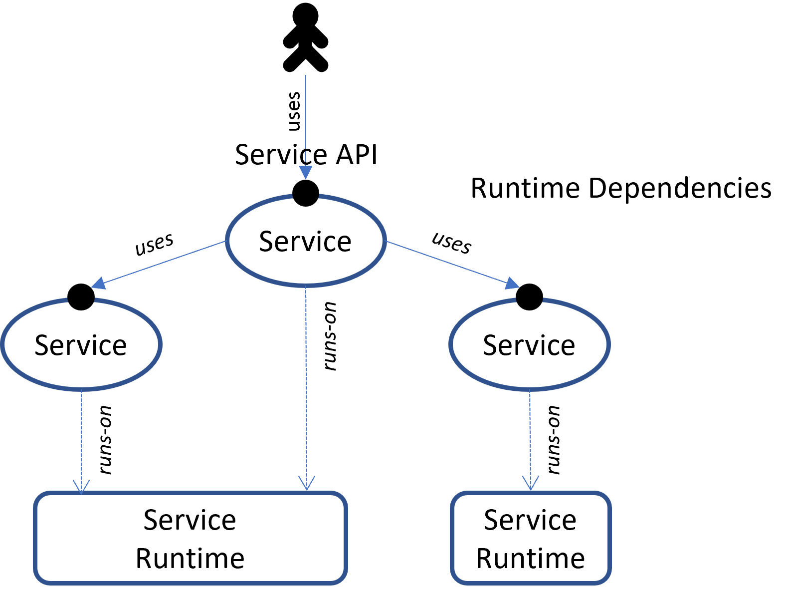
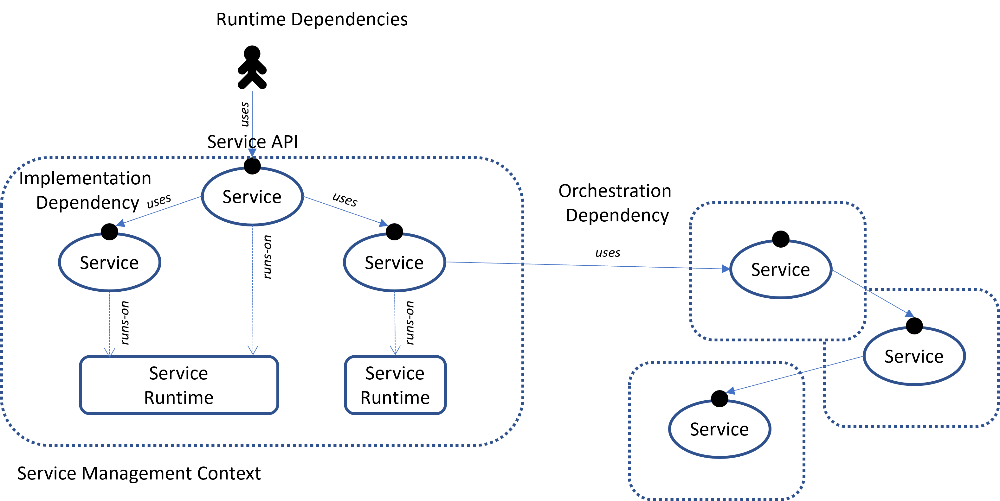
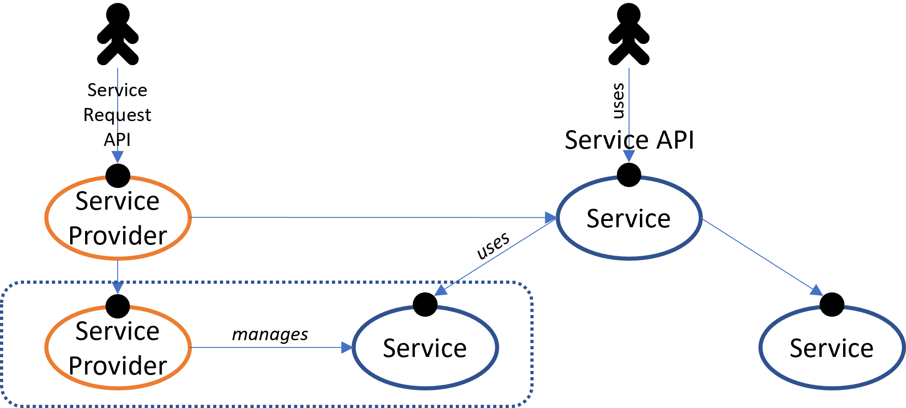
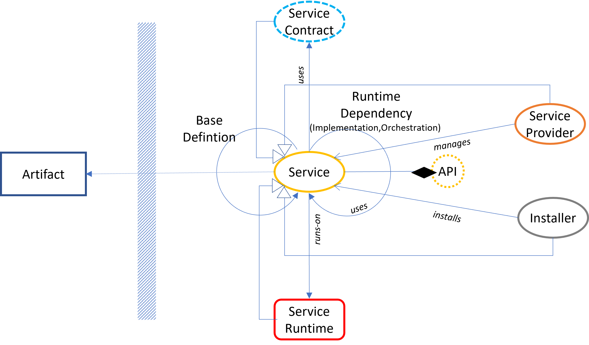
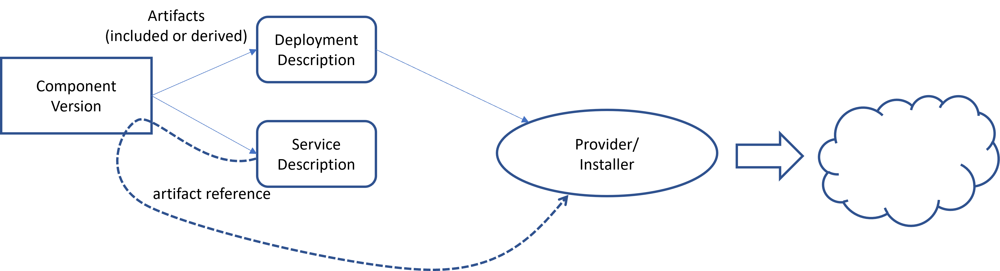
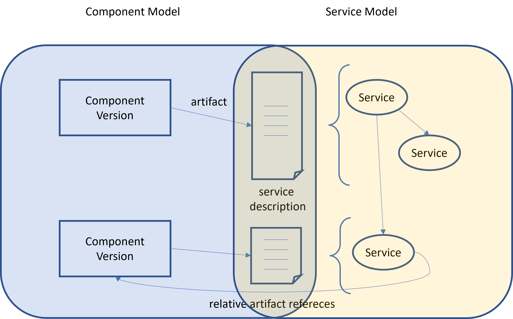

## The Service Model

The [component model](swmodel.md) describes software artifacts grouped
by hierarchically organized components representing a dedicated meaning or purpose.
But this is not enough to gain information what runtime entities
are required to establish an orchestrated service mesh or service landscape. A more high-level model is required dealing with elements relevant for landscape operators, a service model.

### The Service Term

The term service is highly overloaded and used with different meanings in certain contexts. Here, it is used in a very general way.

*A **service** in its most general form is just an entity, which offers some API to its consumers.*

This spans a wide range of interpretations. It might be a software module like a Go package offering some API used as part of an application program, it can be some service offering a REST API to be used over a public or private network like an OCI registry, or it is a runtime environment like Kubernetes or Cloud Foundry used to run other services. But it might also be some logical view of some other more general service, like a tenant in a software system.

#### Service Kinds

A service may be an *Instance* of some service kind.

*A **Service Kind** describes the common features shared by all its instances.*

Basically, the features of a service can always be described in an abstract manner by a service kind. For example, the API specification must be identical, but every instance may have another formal instance endpoint to reach the concrete service. A closer look 
reveals that there is an additional level with a relation like component and component version. Because a service kind can be instantiated, it is basically a version and there must be a component like term.

*A **service component** is an abstract entity describing a particular meaning of a set of service kinds*

For example, *Kubernetes* is a specialized meaning for a particular type of distributed runtimes using a declarative resource model, *Kubernetes version 1.31* is a decicated version for such component, for which a arbitrary number of concrete *Kubernetes Clusters* can be created.

Interestingly, most of the features exist on all levels below the abtract component level. Similar to concrete dependencies among service instances, a service (version) kind describes which dependencies must be resolved to concrete other service instances to finally set up an instance of this kind. These properties only become available from versioned elements onwards, as they can differ between versions. However, the outermost layer then determines (as kind of requirements) the model on the next layer (the concreate instantiation of the requirements). This feature can be used to describe an abstract service model on the kind level, as in the next section, usable to describe requirements for a concrete landscape setup.

This might be the reason why the terms service, service component, service kind and service instance are often used interchangeable. If a dedicated meaning is intended, which is not evident from the usage context, the explicit terms will be used, here. Although it must be distinguished among those meanings to exactly know what is really meant, in most of the cases just the general term service is used to simplify the language.

A service (instance) typically lives on a service runtime. For example, a VM lives on a hypervisor, a Kubernetes Pod on a Kubernetes cluster or node, or even a database scheme is living on a database.
The last example shows that not necessarily active elements can be modeled as service, it could also be structural or organizational units. A database scheme is a service in the sense of the definition of a service used here, because it is an entity with dedicated users, permissions and maintained nested state (like tables) separated from elements in other schemes. It has an own API, and it formally has an own endpoint, although it is typically reachable over the common API of the database. This is comparable to objects and classes in an object-oriented environment. Technically, the methods and their implementations are bound to the classes. But formally they belong to the objects, the access point is not the class (like for abstract data types), but the object identity.

#### Service Runtimes

*A **service runtime** is a service used to embed other services and their APIs*.

Basically a service runtime is again a service with an API and a version. So, service landscapes can be modelled in an hierarchical manner.

Those service/runtime relations are many fold, like VM/Hypervisor, Process/VM or even Tenant/Application.

Note: As expected, all these and the following statements and definitions are valid at both the kind and instantaneous levels.

#### Service Dependencies 

If we take a closer look at such a service, it can be decomposed into multiple other (micro) services. I
In general, it may consist of a set of other services, which are integral part of it (like a composition). Those services are typically part of its installation or its installation target and are required to run the service, Their lifetimes are coupled with the service. Those dependencies are called implementation or composition dependencies.

<em>**Implementation dependencies** are dependencies to other services which describe an internal decomposition of the service into smaller services with a coupled lifetime.</em>

Besides those implementation dependencies, a service may be orchestrated in an external mesh of interconnected services to finally provide its functionality towards its users (aggregation). Those services are required to fulfill API requests but are not part of its decomposition. They can exist independently and their lifetime is not coupled. Typically, this set of services is building some kind of business context. The business context binds together (orchestrates) a set of services, which share a common interpretation context for elements like business partners, customers, overall related state, or cost centers.
The particular dependencies are called orchestration dependencies.

[

<em>**Orchestration dependencies** are dependencies of a service to separately maintained independent services used to embed the service into some kind of business context.</em>

#### Service Providers

A typical standard on-premise landscape is just a net of interconnected top-level services building the business or landscape context according to the orchestration dependencies of the involved services.
Every service may additionally be decomposed into a set of subsequent other services according to the implementation dependencies of these services.

A typical service description model for such a realm just describes the orchestration dependencies of all involved services. Additionally, implementation dependencies are used for all those services as long as their lifecycles are not covered by the installation procedure of the particular service.

For a cloud-based environment this is not sufficient because a completely new class of action must be handled. While in on-premise scenarios dedicated service instances are explicitly installed per landscape context, cloud means an arbitrary number of business contexts are created on-demand by customers of the cloud landscape. This requires a completely new class of service: Services managing the lifecycle of other (managed) services and orchestrate them on demand.

*A **service provider service** (or short just **service provider**) is a service offering a lifecycle API for service instances of one or more other kinds.*

*A **managed service instance** (or short **managed service**) is a service (instance) whose lifecycle is managed by a service provider.*

Compared to a typical on-premise landscape, the service providers are able to create the managed services finally used to orchestrate a dedicated intended usage context.

This requires three different features:
-	A service provider is used to manage services for a dedicated consumer. It is somehow like an installer but more dynamic. Therefore, it requires consumer-specific tenants or accounts.
-	The service provider API can again be decomposed into two different APIs:
    -	Tenant/account creation
    -	Lifecycle API as part of a particular tenant. If subaccounts are supported (preferred), the account is a further resource manageable by resources in an account.
-	To support the orchestration of managed services in a business context the configuration of service requests must include the dependencies used to embed a service instance into its interconnected orchestration context. The consumer placing an order for an instance must include the intended orchestration dependencies (used to connect the new instance with other services in the business context) in the specification of the order.

Dependencies to a service provider are used to maintain digital twins for managed service instances. For example, a service provider could use another service provider to
maintain runtime services for the own managed service instances (This is not shown by the image for simplicity, because basically runtimes are again services)

The same is valid for regular installers. They could use a service provider to create services required to fulfill implementation dependencies of the service to be installed. THis leads to the next type of service: installers.

In any way, every service must come into life before it can be orchestrated and used by its consumer. In on-premise scenarios this is typically handled by an installer, which is executed by the landscape administrator.

*An **Installer** is a service capable to create and maintain the lifecycle of some other kind of service.*

It is configured with the orchestration dependencies required by the installed service instance. Additionally, some implementation dependencies of the service instance to be installed must be given, as long as they are not yet covered by the installer itself (for example, the chosen runtime service instance). They are covered by the installer, if it maintains those instances as part of the installation process or if they are implicitly given by the runtime of the installer.

In a cloud-based scenario, this must be completely automated. This task is handled by the service provider behind its lifecycle management API. This way any number and kind of customer business landscape can be created on-demand.

Nevertheless, instead of explicitly installing the service instances participating in an on-premise business context by an installer, now the service providers used to manage service instances for an arbitrary number of business contexts must be installed. The services building the cloud landscape (the orchestration of service providers) must be installed to create a new cloud instance. There will typically never be a single instance of some kind of public cloud. Instead, there will be several sovereign cloud instances to fulfill legal and other requirements. The complete picture is hierarchical and ends with installers at the bottom level.

So, we still need explicit installers even in cloud-based scenarios and an automation to set up and maintain such landscapes. All this must be describable by the intended service description model.

As mentioned above, even an installer might have service dependencies. In on-premise scenarios they are used to determine the service runtime and to orchestrate the intended business context, in cloud scenarios they are used to connect the various service managements.

### The Model

All those elements described by the previous section must be describable by the service model. Here, we still use the term service. But the purpose is not to describe a concrete service landscape with service instances, but requirements for instantiating
a landscape and patterns for its layout. Therefore, the term service does not denote particular instances, it just describes the features of an arbitrary instance, a service (version) kind.
For the model elements service means the kind of service, not a particular instance. The instance terms are lifted to the kind level. This way dependencies will describe requirements instead of concrete usage relations among service instances.

Similar to the component model mainly describing component versions, the service model describes service (version) kinds.
The service component level is not explicitly described. It is left to the component model which is used to embed the service model, as we will see later.

Naturally, the central element of the service model is the Service.

*A **Service** is identified by a globally unique name and describes the features of arbitrary instances of a particular version of this service component, a service kind.*

One such feature is to describe the API (or potentially multiple APIs) of its service instances. Other ones are the required implementation and orchestration dependencies.

The model distinguishes between three different service subtypes which have different additional features:
- ordinary services
- service providers
- installation services

And a fourth type, which is not really a service, but more something like a service variable, is reduced to its API specification: a service contract.

*A **Service Contract** is some kind of placeholder for a concrete service, which defines some constraints a service must meet to be substitutable for the contract.*

This basically reflects the semantic of an intended service mainly expressed by its API.
Because it includes the API it is again a versioned element like a regular service.

Every service has an API and therefore also an service contract. Potentially,
all services could refer to an externalized formal service contract element to describe its API. But, the contract element is main menat as some kind of placeholder for
a concrete service. It is used if it is intended to describe the possibility to resolve dependencies possibly different alternate services. So, typically the API is modeled as part of the service ement. Nevertheless, the specification of the API might be shared among different service descriptions, as we will see later.

*A **Service Provider** is a service offering a lifecycle API for managed services.*

In addition to an ordinary service, it declares the managed services and how their
dependencies are resolved. It can decide whether such a dependency is resolved by the provider (for example, by using one of its dependencies to an appropriate service provider) or exposed as an orchestration dependency for the required instance configuration at the lifecycle API.

*An **Installer* is a service usable to install another service.*

More details about the model elements can be found in the [model specification on github](https://github.com/open-component-model/service-model/blob/main/docs/ServiceModel.docx)

### Relation to the Component Model

Now let's consider how this service model is linked to the component model.
One important feature of the service model is not yet defined, so far. The identity
scheme for service elements.

The elements of this model are basically development objects like the software artifacts
used to run services. As such, a textual description format is defined to describe services as part of the development. This way it can directly be linked to other development artifacts. To emphasize this property, service descriptions will be stored along with other software artifacts as artifacts in component versions.

The elements of the model now use identities derived from the component model identities,
and the versioning is directly connected. The service identity is created as a composition of the identity of the component version, which contains the description and a name that is unique within the component version.
Like artifact names, this local name expresses the meaning of the service (the service component), and should be kept among different component versions.
The identity of the service component is then the component identity followed by the service name.

Together with the explicitly typed model description artifacts part of a component version,
this allows looking up the definition of model elements in a component model repository  directly from their identity.

A second relation is given by artifact references. Model elements might be linked
to appropriate artifacts by *relative artifact references*, evaluated relative to the component version hosting the model definition holding the reference.
This is at least required for an installation service. It defines the installer
artifact(s) required to execute the installation process. This way the software artifacts and the description artifacts are bound together.
Another possibility is to link implementation artifacts to service definitions.
But this is problematic because it would not have technical relevance. It just contains
informational content which tends to get outdated as soon as it has been established.
A better solution is to let the installer provide this information as will be seen
in the section about the runtime model.

The installer (or the artifacts used for a service provider) requires information
about the artifacts required for the deployments anyway. This can be explicit configuration artifacts for the installer/provider delivered together with the component version, or explicilty uses relative resource references in the code directly extracting the required artifacts from the component version. Here, we have technically relevant information, which always reflects the reality. But it must dynamically be provided or consumed by the installer to control the deployment process. The price is that this kind of information is not statically available as part of the service model, but only dynamically in a runtime repository or by some specialized tooling knowning those artifact types and formats. But anyway, it is still
completely defined by the content of the component model, because it holds the service model artifacts, which define the installer, which again refers to descriptions and/or code stored as component model elements.

### The Tooling

Like for the component model, some tooling is useful. There should be standard tools
for extracting model elements from a component repository. One solution here is an
appropriate plugin for the ocm-cli.

For a given context the information from a component repository can be transferred into
a dedicated service model repository. It makes the elements and navigating their
relations directly accessible and queryable, without the need of scanning a
component repository not optimized for relational access.

### Summary

The service model is an independent dederated description model to describe service kinds with their requirements. Its descriptions are separated into independently 
developed artifacts located near the artifacts used to implement the described model.

It is linked to the [component model](swmodel.md) by deriving its model element identities from the component model, use this model to store and deliver
its description artifacts, and refer to other delivery artifacts. This way, model descriptions
can directly be accessed from a component repository using the model identities reduced to component model identities. All the features of the component model, like signing and transporting software among different repository landscapes can be reused.