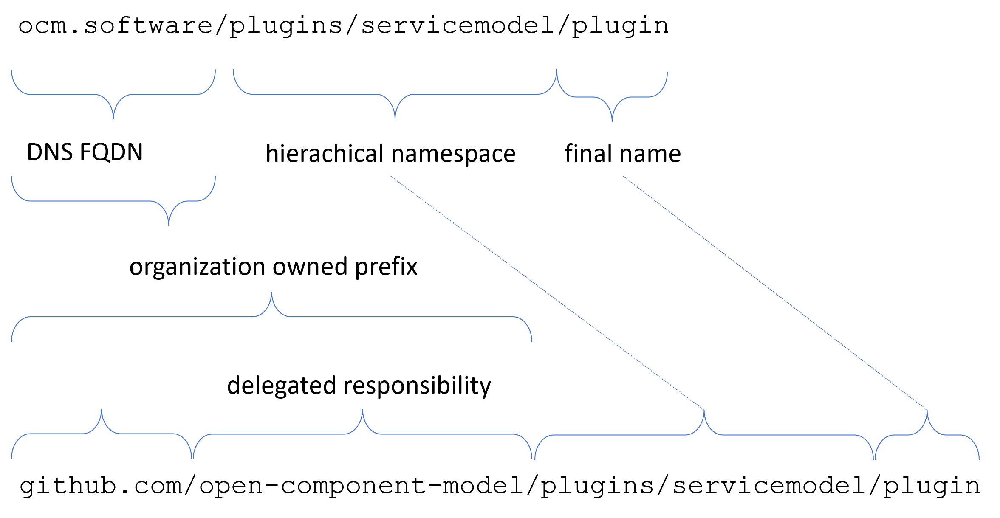
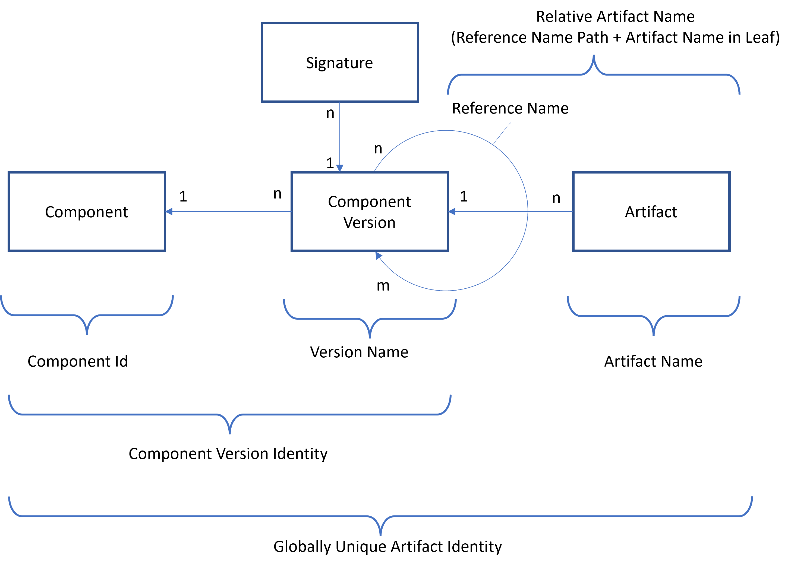
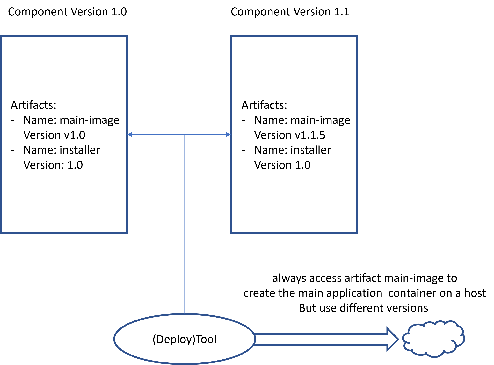
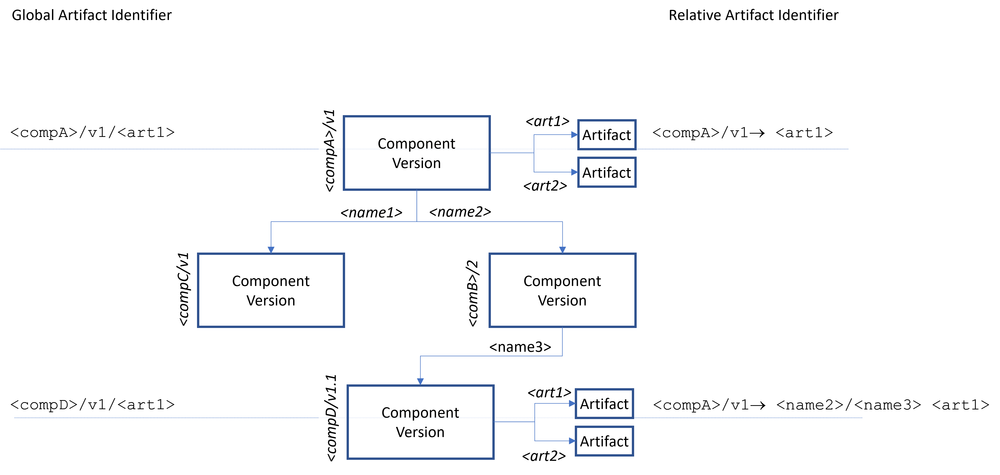
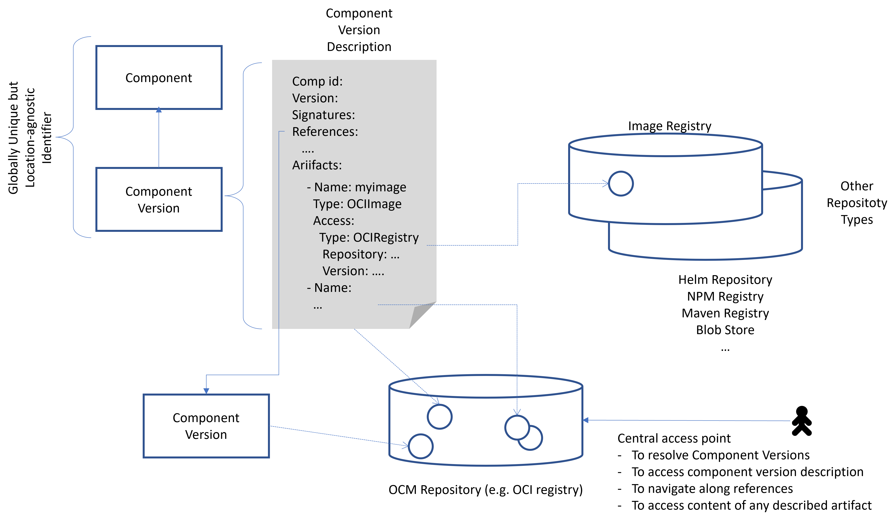
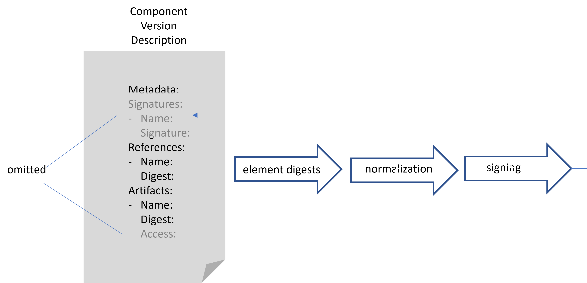
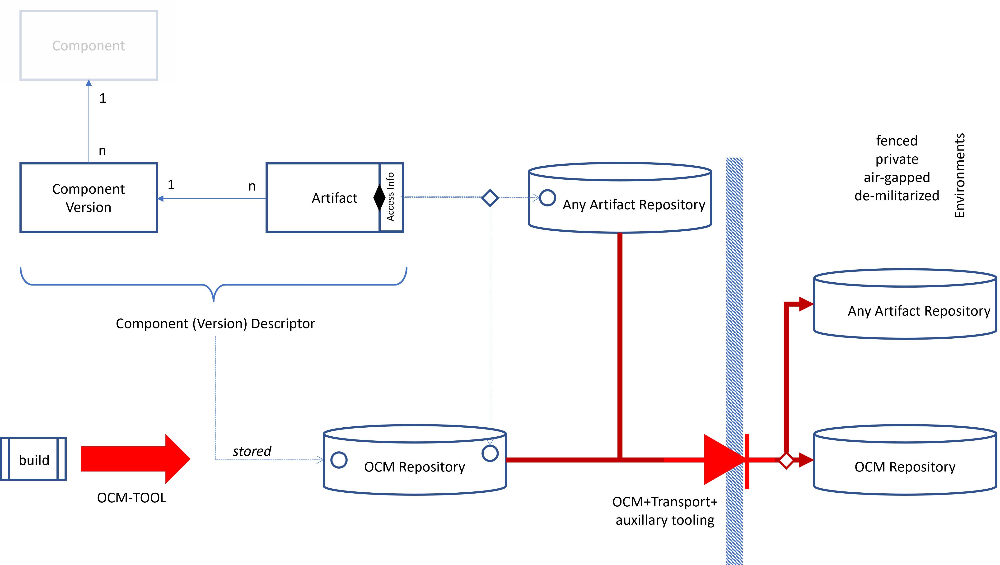
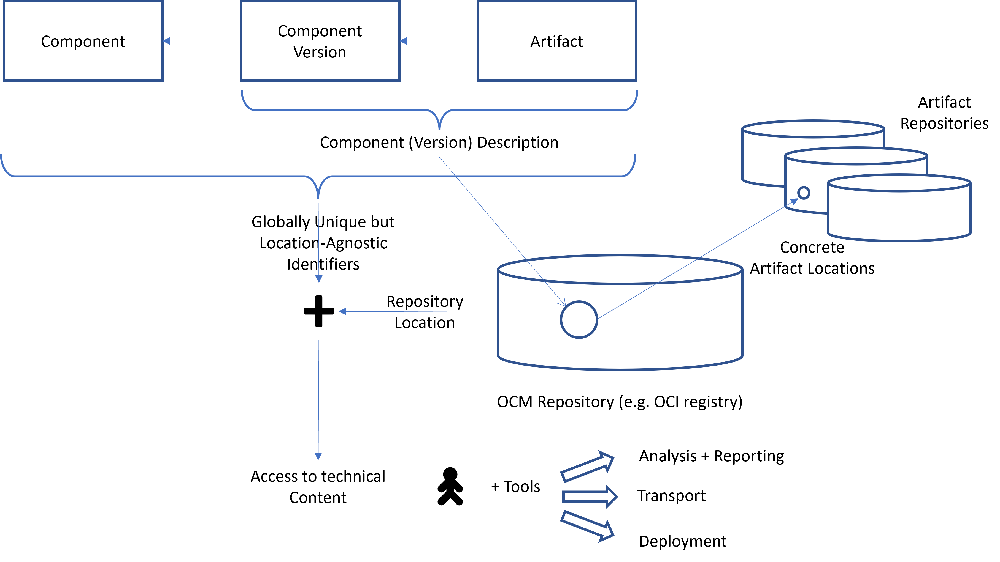

## The Software Model

Describing software artifacts with their features is the base functionality for the complete model hierarchy. It has to provide everything required to link together all the following models and
to provide information and content required by those models and related tools.

Such a model must therefore meet some requirements:
- It must be able to describe aggregated software units at any granularity
- It must be applicable to any kind of artifact to be content technology-agnostic.
- It must provide a globally unique naming scheme to offer a common language understandable to all related tools and models to be able to talk about the same things (lingua france).
- It must relate to the reality, the effective artifacts provided by build processes, delivered to customers and finally used to install software or complete landscapes.
- It must provide information needed to ensure the authenticity of described content.
- It must combine a location-agnostic description with the possibility to keep track of artifact locations along with transport chains to always describe valid information also for private and fenced environments
- It should be able to express related artifact structures across multiple versions.

To be technically relevant, describing software is not enough. It must also offer all information required by tools working on it
to technically access the described content. And a standard tooling is required to work with content and descriptions.

### The Model

Typically, software is organized by components. A component is an entity with a particular meaning, for example, single programs/executables as tools or as the basis for services. But a component might even represent a complete system, like Kubernetes.
Such a core model is the
[*Open Component Model*](https://ocm.software). The base element ere is the component.

*A **Component** is an entity reduced to a particular meaning*

It does not describe any tangible technical elements or software artifacts, just a common meaning shared by all the elements it aggregates, the versions of software. But before we can continue with versions, an important aspect of a component, and of all other involved elements must be considered.

A central feature for such a model is to provide a *globally unique and location-agnostic naming scheme*. Location-agnostic hereby means that such identities and descriptions following this model must be valid in any context, regardless, whether software has been copied into local environments, or not. 

Components are uniquely identified by a globally unique identifier, consisting of a FQDN followed by a hierarchically organized name (the path). Hereby, a providing organization must own the FQDN in combination with a path prefix to avoid conflicts.
This prefix then opens a namespace which can be maintained locally by the owning organization. For example, the owner of a FQDN can
manage its namespace directly under the DNS name. Or it delegates
ownership by assigning one or more levels to other (sub) organizations. For example, `github.com` delegates one project name level to another organization or person who owns the github project. This way, the prefix `github.com/<your-org>`can be used to span a local namespace for your components without conflicting with names used by other projects.

Below a component now an element is required describing real content.
Those elements are called component versions.

*A **Component Version** describes particular versions of a software whose meaning is defined by the component they are related to.*

A component may have any number of versions (even none, if it is
just in planning). A component version is a set of software artifacts, which together build a version of a component.

*An **Artifact** is concrete technical content represented as typed byte-sequence*

An artifact carries some metadata, like a type (e.g., a container image), a version and a formal description how to access technical content.

Such a set described by a component version may be described by listing directly the artifacts and/or by referring to versions of other components. In such a case the component version is composed by aggregating other component versions maintained independently. Hereby, it is possible to refer to multiple versions of a used component in parallel. For example, The Gardener
(a managed Kubernetes service) includes multiple Kubernetes versions, always all the versions directly supported by a Gardener version.

The result is a simple model as shown below:

All elements of a component version, like artifacts and references, have a local name, which identifies a particular entry in the context of this version. Such a name reflects the meaning of a nested
element in the context of a component. Therefore, successive versions should stick to this meaning and use the same names for elements with the same meaning as before. This enables tools
acting on the model to find artifacts across a range of versions
by referring to the persistent meaning of an artifact in the context of a component.

This way any artifact can be addressed either globally or locally. Globally any artifact is addressed by an identity
given by the component id, the component version and the name of the artifact as defined in this version. Relative to a component version, there is also a possibility to refer to any artifact. This is possible either by using directly its local name or by specifying a path of component version reference names to navigate down the nesting hierarchy followed by the artifact name as used in the containing component version (*relative artifact references*).

Besides the pure model element definitions, a textual description format for component versions is defined. It describes all the features and the content of a component version and can be persisted in some content repository as well as transported along with the artifacts into other repository landscapes.

*A **Component Model Repository** is some storage environment used to store component version descriptions and potentially artifacts, also.*

This description format is the basis for signing the content to ensure and validate the authenticity of provided content.
To ensure the validity of the described information even along a transport path of software as required to support private or even fenced environments, this must be reflected in the way artifacts are described.
One requirement was to provide information required to access the
technical artifacts behind the description. To be technology-agnostic, such artifacts may live in any kind of technical repository. For example, OCI registries or simple blob stores. This is formalized by introducing access types defining a set of attributes (the access specification) required to technically locate and access (not included are required credentials) the artifact in any repository. This information needs to be shared but can be modified by tools that transfer content from one repository landscape to another.

Signing a component version must omit such environment-specific information but include information identifying the technical content. This is typically a hash, either a binary hash, or a logical hash for content, which might require modification during a transport step.

To support this, a normalization of a component version description is defined together with a formal API to gain access to the technical artifact blob according to the actual access specification.

Using location agnostic descriptions accessing a component version content just by using a component version identity requires some kind of repository able to store
component version descriptions and to lookup those descriptions
just be using their identity. This is then avting a basis to further look up and access artifacts in a repository landscape bound to the component repository.

The model does not define an own technical repository specification for this, like OCI does for container images. Instead,
this is covered by including specifications for a mapping of the OCM model to existing technical repository types. Like the access specification, this is typed and can be extended by new types. The same is true for storing the artifacts. The component model
comes with a specification how to embed the access to any kind of repository technology.
For storing the model content a standard implementation is provided for OCI registries.

Open Container Image (OCI) registries are today widely accepted standards, just like a few decade ago maven was the standard for java, and other programming languages came with their own repository implementation. OCI may be continuously developed towards a unified future, but we may as well find a disrupting innovation (maybe InterPlanetary File System) to take the lead. Therefore, OCM is repository technology independent and spans multiple thereof. It functions without special indexing APIs or referential links from the repository technology (which e.g. OCI currently does not support, but is in process of developing).

Although content might be spread over multiple repositories, the transport of software sometimes requires storing all content, the descriptions plus described artifacts, in some archive format, which may act as OCM repository as well. Because it must be possible to host the artifacts without referring to external repositories, the repository specification as well as
the access specification must include the possibility to store artifacts along with the component version description (called *local access*). Transporting software means 
transporting artifacts described by a component version to another repository landscape. This might even be a completely fenced environment by using the transport archive feature. Besides the artifacts, the component version descriptions are also copied to a new local component repository by adapting the access information to reflect the new 
repository locations.

All this requires some core tooling as described by the next section. But the model is basically an enabler for many more use cases and specialized tooling. Because it combines an environment and technology-independent description of software, the technical access to described content and a globally unique
identification, independent tools can operate on the described content and maintain information bases on their own. The information is always bound together by using the common identity scheme.
This enables tools to easily correlate information found in multiple such information bases. For example, the *OCM Gear*
provides a scanning, reporting and triaging framework for vulnerabilities in the context of component version aggregation.
It is based on inbound identities, uses the artifact access feature to feed the scanners and stores the found information under the identities found in the component version descriptions.

Another example can be installers directly working on a component version to extract the required installation procedures delivered as part of the software and retrieving the required deployment artifacts or their locations in the actual repository landscape.

### The Tooling

The technology independence of the model requires a number of extension points, which need implementations to be provided for, to finally work with the model in a concreate environment. For example, different types for access specifications, signing algorithms and tools or OCM repository types.

To achieve all the goals defined at the beginning, the model and description format must be accompanied by a basic core-tooling.
based on an extensible library able to handle all those cases. It allows transparent access to component versions with all the described content stored in any supported OCM repository and external content repository, including a file-based (transport archive) one.

On-top an *ocm-cli* is provided able to do all the standard tasks
required to work with the model:
- composing new component versions and storing the content in
  a given repository landscape
- accessing any content adhering to the component model just be using the appropriate identities.
- signing and validation component versions
- transporting from one repository landscape to another (or into a archive file and vice versa)  adapting the access information by uploading the artifacts into an intended repository landscape.

### Summary

The component model enables the description of sets of technical artifacts representable as byte-sequence and given them globally unique identities. By providing access information for those artifacts for a local repository landscape, it enables users and tools to gain access to the real technical artifacts based on the global identities and a local component repository as an environment-specific access point to the model: Those tools can connect any kind of process:
- reporting
- analysis
- transport
- signing
- deployment

